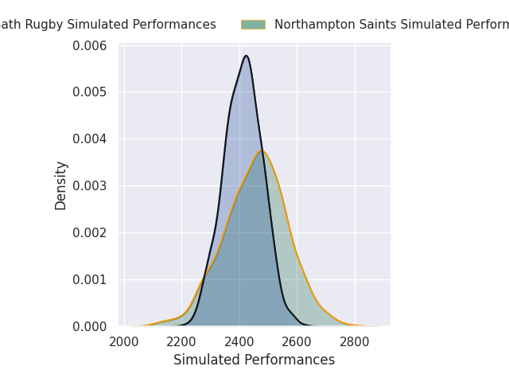
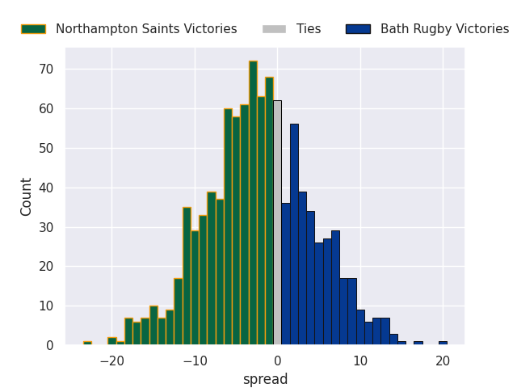
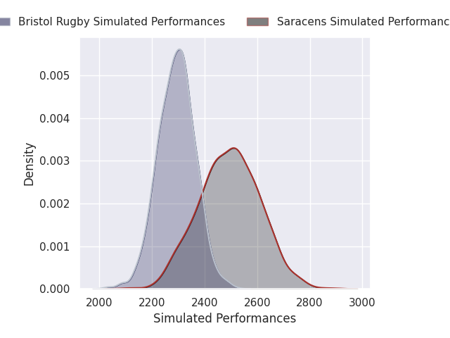
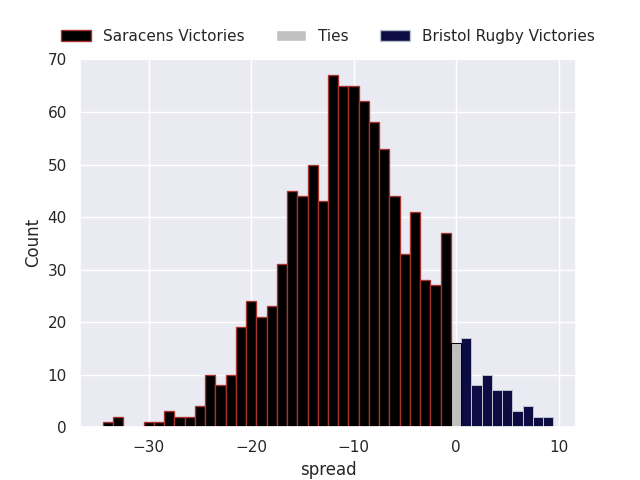
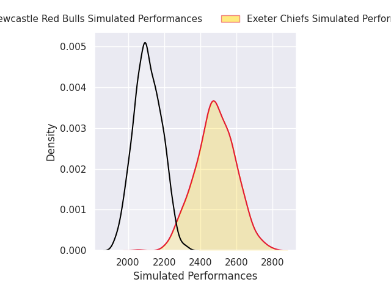
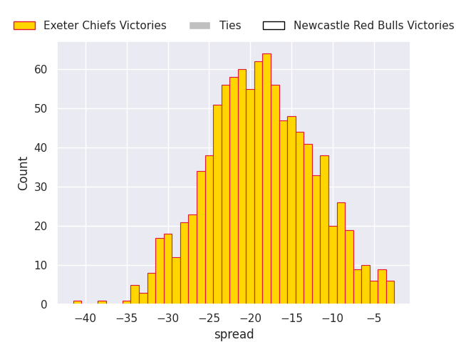
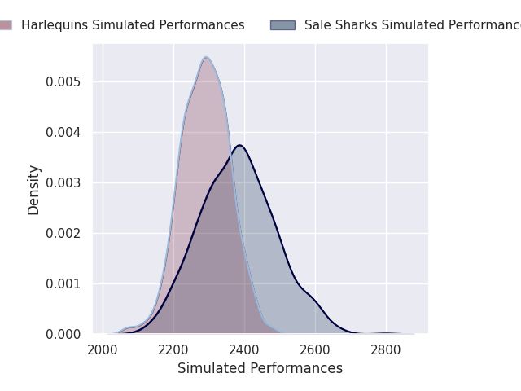
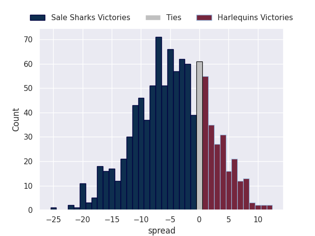

# Team Rankings

# Standings

## Current Standings

| Club                |   Played |   Wins |   Point Differential |   Losing Bonus Points |   Try Bonus Points |   Competition Points |
|:--------------------|---------:|-------:|---------------------:|----------------------:|-------------------:|---------------------:|
| Gloucester Rugby    |        2 |      2 |                   69 |                     0 |                  2 |                   10 |
| Bristol Rugby       |        2 |      2 |                   25 |                     0 |                  2 |                   10 |
| Bath Rugby          |        2 |      2 |                   22 |                     0 |                  2 |                   10 |
| Northampton Saints  |        2 |      1 |                   18 |                     0 |                  2 |                    6 |
| Leicester Tigers    |        2 |      1 |                    3 |                     1 |                  1 |                    6 |
| Saracens            |        2 |      1 |                   -2 |                     1 |                  1 |                    6 |
| Sale Sharks         |        2 |      1 |                   -6 |                     0 |                    |                    4 |
| Exeter Chiefs       |        2 |      0 |                  -27 |                     1 |                  2 |                    3 |
| Newcastle Red Bulls |        2 |      0 |                  -38 |                     1 |                    |                    1 |
| Harlequins          |        2 |      0 |                  -64 |                     0 |                    |                    0 |

## Projected Remaining Table

| Club                |   To Play |   Projected Wins |   Projected Differential |   Projected Losing Bonus Points | Projected Try Bonus Points   |   Projected Competition Points |
|:--------------------|----------:|-----------------:|-------------------------:|--------------------------------:|:-----------------------------|-------------------------------:|
| Exeter Chiefs       |        17 |           11.216 |                   83.923 |                           3.576 |                              |                         49.734 |
| Bath Rugby          |        17 |           11.01  |                   70.932 |                           3.713 |                              |                         49.193 |
| Saracens            |        17 |           10.682 |                   63.63  |                           3.832 |                              |                         47.896 |
| Northampton Saints  |        17 |            9.121 |                   18.285 |                           4.488 |                              |                         42.568 |
| Leicester Tigers    |        17 |            8.698 |                   20.738 |                           4.472 |                              |                         40.724 |
| Gloucester Rugby    |        17 |            8.654 |                   13.004 |                           4.365 |                              |                         40.409 |
| Sale Sharks         |        17 |            7.212 |                  -18.551 |                           4.867 |                              |                         35.243 |
| Bristol Rugby       |        17 |            7.202 |                  -19.06  |                           4.744 |                              |                         34.884 |
| Harlequins          |        17 |            6.487 |                  -33.995 |                           5.144 |                              |                         32.652 |
| Newcastle Red Bulls |        17 |            1.3   |                 -198.906 |                           3.68  |                              |                          9.578 |

## Projected Total Table

| Club                |   Played |   Wins |   Point Differential |   Losing Bonus Points |   Try Bonus Points |   Competition Points |
|:--------------------|---------:|-------:|---------------------:|----------------------:|-------------------:|---------------------:|
| Bath Rugby          |       19 | 13.01  |               92.932 |                 3.713 |                  2 |               59.193 |
| Saracens            |       19 | 11.682 |               61.63  |                 4.832 |                  1 |               53.896 |
| Exeter Chiefs       |       19 | 11.216 |               56.923 |                 4.576 |                  2 |               52.734 |
| Gloucester Rugby    |       19 | 10.654 |               82.004 |                 4.365 |                  2 |               50.409 |
| Northampton Saints  |       19 | 10.121 |               36.285 |                 4.488 |                  2 |               48.568 |
| Leicester Tigers    |       19 |  9.698 |               23.738 |                 5.472 |                  1 |               46.724 |
| Bristol Rugby       |       19 |  9.202 |                5.94  |                 4.744 |                  2 |               44.884 |
| Sale Sharks         |       19 |  8.212 |              -24.551 |                 4.867 |                    |               39.243 |
| Harlequins          |       19 |  6.487 |              -97.995 |                 5.144 |                    |               32.652 |
| Newcastle Red Bulls |       19 |  1.3   |             -236.906 |                 4.68  |                    |               10.578 |

# Completed Match Review

| Model | Percent Correct Predictions | Spread Error |
| ------ | ------ | ------ |
| Club Level | 81.1% | 5.2 |
| Player Level: Lineup | nan% | nan |
| Player Level: Minutes | nan% | nan |

# Future Predictions

## Week 3

### Leicester Tigers V Gloucester Rugby on 2026/09/01

Average Margin: Leicester Tigers by 12.4

## Week 4

### Northampton Saints V Bath Rugby on 2026/10/01

Average Margin: Northampton Saints by 2.2

### Saracens V Bristol Rugby on 2026/10/01

Average Margin: Saracens by 10.1

## Week 5

### Leicester Tigers V Gloucester Rugby on 2026/10/09

Average Margin: Leicester Tigers by 4.6

### Saracens V Bristol Rugby on 2026/10/10

Average Margin: Saracens by 8.1

### Northampton Saints V Bath Rugby on 2026/10/10

Average Margin: Northampton Saints by 1.3

### Sale Sharks V Harlequins on 2026/10/11

Average Margin: Sale Sharks by 5.1

### Exeter Chiefs V Newcastle Red Bulls on 2026/10/11

Average Margin: Exeter Chiefs by 18.9

## Week 6

### Gloucester Rugby V Bath Rugby on 2026/10/23

Average Margin: Gloucester Rugby by 1.3

### Newcastle Red Bulls V Sale Sharks on 2026/10/23

Average Margin: Sale Sharks by 4.1

### Leicester Tigers V Northampton Saints on 2026/10/24

Average Margin: Leicester Tigers by 3.7

### Bristol Rugby V Exeter Chiefs on 2026/10/24

Average Margin: Bristol Rugby by 1.0

### Harlequins V Saracens on 2026/10/25

Average Margin: Saracens by 1.2

## Week 7

### Bristol Rugby V Leicester Tigers on 2026/10/30

Average Margin: Bristol Rugby by 3.2

### Exeter Chiefs V Harlequins on 2026/10/31

Average Margin: Exeter Chiefs by 10.0

### Bath Rugby V Sale Sharks on 2026/10/31

Average Margin: Bath Rugby by 10.1

### Saracens V Newcastle Red Bulls on 2026/10/31

Average Margin: Saracens by 18.5

### Northampton Saints V Gloucester Rugby on 2026/10/31

Average Margin: Northampton Saints by 5.1

### Exeter Chiefs V Newcastle Red Bulls on 2026/11/01

Average Margin: Exeter Chiefs by 18.8

### Sale Sharks V Harlequins on 2026/11/01

Average Margin: Sale Sharks by 4.6

## Week 8

### Bath Rugby V Bristol Rugby on 2026/12/04

Average Margin: Bath Rugby by 8.6

### Gloucester Rugby V Newcastle Red Bulls on 2026/12/05

Average Margin: Gloucester Rugby by 16.2

### Saracens V Northampton Saints on 2026/12/05

Average Margin: Saracens by 6.2

### Harlequins V Leicester Tigers on 2026/12/05

Average Margin: Harlequins by 1.4

### Sale Sharks V Exeter Chiefs on 2026/12/06

Average Margin: Sale Sharks by 0.4

## Week 9

### Newcastle Red Bulls V Bath Rugby on 2026/12/18

Average Margin: Bath Rugby by 10.6

### Northampton Saints V Exeter Chiefs on 2026/12/19

Average Margin: Northampton Saints by 3.0

### Gloucester Rugby V Saracens on 2026/12/19

Average Margin: Gloucester Rugby by 3.3

### Leicester Tigers V Sale Sharks on 2026/12/19

Average Margin: Leicester Tigers by 7.8

### Bristol Rugby V Harlequins on 2026/12/20

Average Margin: Bristol Rugby by 5.5

## Week 10

### Sale Sharks V Gloucester Rugby on 2026/12/26

Average Margin: Sale Sharks by 2.1

### Bath Rugby V Leicester Tigers on 2026/12/26

Average Margin: Bath Rugby by 7.5

### Bristol Rugby V Newcastle Red Bulls on 2026/12/26

Average Margin: Bristol Rugby by 13.9

### Exeter Chiefs V Saracens on 2026/12/27

Average Margin: Exeter Chiefs by 5.7

## Week 11

### Harlequins V Northampton Saints on 2026/12/28

Average Margin: Harlequins by 0.3

### Gloucester Rugby V Bristol Rugby on 2027/01/01

Average Margin: Gloucester Rugby by 6.6

### Leicester Tigers V Exeter Chiefs on 2027/01/02

Average Margin: Leicester Tigers by 2.8

### Newcastle Red Bulls V Harlequins on 2027/01/02

Average Margin: Harlequins by 4.9

### Saracens V Bath Rugby on 2027/01/02

Average Margin: Saracens by 3.4

### Northampton Saints V Sale Sharks on 2027/01/03

Average Margin: Northampton Saints by 7.5

## Week 12

### Sale Sharks V Leicester Tigers on 2027/01/23

Average Margin: Sale Sharks by 2.6

### Newcastle Red Bulls V Saracens on 2027/01/23

Average Margin: Saracens by 9.0

### Harlequins V Gloucester Rugby on 2027/01/23

Average Margin: Harlequins by 1.2

### Exeter Chiefs V Bristol Rugby on 2027/01/23

Average Margin: Exeter Chiefs by 8.6

### Bath Rugby V Northampton Saints on 2027/01/23

Average Margin: Bath Rugby by 6.3

## Week 13

### Bath Rugby V Gloucester Rugby on 2027/03/20

Average Margin: Bath Rugby by 7.4

### Leicester Tigers V Newcastle Red Bulls on 2027/03/20

Average Margin: Leicester Tigers by 15.5

### Exeter Chiefs V Northampton Saints on 2027/03/20

Average Margin: Exeter Chiefs by 6.8

### Saracens V Harlequins on 2027/03/20

Average Margin: Saracens by 8.7

### Bristol Rugby V Sale Sharks on 2027/03/20

Average Margin: Bristol Rugby by 5.6

## Week 14

### Harlequins V Exeter Chiefs on 2027/03/27

Average Margin: Exeter Chiefs by 1.0

### Gloucester Rugby V Leicester Tigers on 2027/03/27

Average Margin: Gloucester Rugby by 5.4

### Northampton Saints V Saracens on 2027/03/27

Average Margin: Northampton Saints by 3.1

### Sale Sharks V Bath Rugby on 2027/03/27

Average Margin: Bath Rugby by 0.9

### Newcastle Red Bulls V Bristol Rugby on 2027/03/27

Average Margin: Bristol Rugby by 5.2

## Week 15

### Bristol Rugby V Gloucester Rugby on 2027/04/17

Average Margin: Bristol Rugby by 2.8

### Bath Rugby V Newcastle Red Bulls on 2027/04/17

Average Margin: Bath Rugby by 17.6

### Saracens V Leicester Tigers on 2027/04/17

Average Margin: Saracens by 6.9

### Exeter Chiefs V Sale Sharks on 2027/04/17

Average Margin: Exeter Chiefs by 9.9

### Northampton Saints V Harlequins on 2027/04/17

Average Margin: Northampton Saints by 7.3

## Week 16

### Harlequins V Bristol Rugby on 2027/04/24

Average Margin: Harlequins by 2.7

### Leicester Tigers V Bath Rugby on 2027/04/24

Average Margin: Leicester Tigers by 1.1

### Newcastle Red Bulls V Exeter Chiefs on 2027/04/24

Average Margin: Exeter Chiefs by 8.0

### Gloucester Rugby V Northampton Saints on 2027/04/24

Average Margin: Gloucester Rugby by 4.6

### Sale Sharks V Saracens on 2027/04/24

Average Margin: Sale Sharks by 0.9

## Week 17

### Gloucester Rugby V Sale Sharks on 2027/05/08

Average Margin: Gloucester Rugby by 7.8

### Exeter Chiefs V Bath Rugby on 2027/05/08

Average Margin: Exeter Chiefs by 4.4

### Bristol Rugby V Saracens on 2027/05/08

Average Margin: Bristol Rugby by 1.2

### Northampton Saints V Leicester Tigers on 2027/05/08

Average Margin: Northampton Saints by 5.4

### Harlequins V Newcastle Red Bulls on 2027/05/08

Average Margin: Harlequins by 11.7

## Week 18

### Saracens V Exeter Chiefs on 2027/05/15

Average Margin: Saracens by 4.9

### Leicester Tigers V Bristol Rugby on 2027/05/15

Average Margin: Leicester Tigers by 5.8

### Bath Rugby V Harlequins on 2027/05/15

Average Margin: Bath Rugby by 9.4

### Sale Sharks V Northampton Saints on 2027/05/15

Average Margin: Sale Sharks by 1.9

### Newcastle Red Bulls V Gloucester Rugby on 2027/05/15

Average Margin: Gloucester Rugby by 6.4

## Week 19

### Saracens V Gloucester Rugby on 2027/05/29

Average Margin: Saracens by 6.5

### Newcastle Red Bulls V Northampton Saints on 2027/05/29

Average Margin: Northampton Saints by 6.8

### Bristol Rugby V Bath Rugby on 2027/05/29

Average Margin: Bath Rugby by 0.7

### Exeter Chiefs V Leicester Tigers on 2027/05/29

Average Margin: Exeter Chiefs by 7.5

### Harlequins V Sale Sharks on 2027/05/29

Average Margin: Harlequins by 3.7

## Week 20

### Sale Sharks V Newcastle Red Bulls on 2027/06/05

Average Margin: Sale Sharks by 13.0

### Gloucester Rugby V Exeter Chiefs on 2027/06/05

Average Margin: Gloucester Rugby by 3.6

### Northampton Saints V Bristol Rugby on 2027/06/05

Average Margin: Northampton Saints by 6.4

### Bath Rugby V Saracens on 2027/06/05

Average Margin: Bath Rugby by 5.6

### Leicester Tigers V Harlequins on 2027/06/05

Average Margin: Leicester Tigers by 7.0

