# Team Rankings

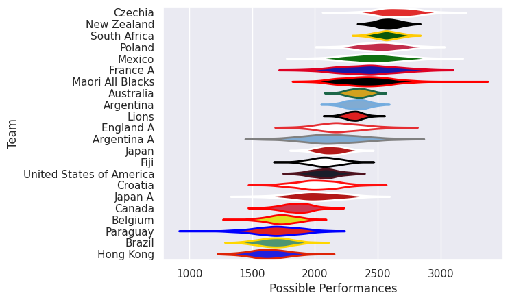
# Standings

## Current Standings

| Club                     |   Played |   Wins |   Point Differential |   Losing Bonus Points |   Try Bonus Points |   Competition Points |
|:-------------------------|---------:|-------:|---------------------:|----------------------:|-------------------:|---------------------:|
| Australia                |        4 |      3 |                   48 |                     0 |                  3 |                   17 |
| Japan                    |        3 |      1 |                    3 |                     1 |                  2 |                    7 |
| New Zealand              |        1 |      1 |                    6 |                     0 |                  1 |                    5 |
| Argentina                |        3 |      0 |                  -13 |                     2 |                  1 |                    5 |
| France A                 |        1 |      1 |                   16 |                     0 |                    |                    4 |
| Poland                   |        1 |      1 |                   14 |                     0 |                    |                    4 |
| Czechia                  |        2 |      1 |                   13 |                     0 |                    |                    4 |
| Maori All Blacks         |        1 |      1 |                    7 |                     0 |                    |                    4 |
| South Africa             |        1 |      1 |                    7 |                     0 |                    |                    4 |
| United States of America |        1 |      1 |                    1 |                     0 |                    |                    4 |
| Mexico                   |        2 |      1 |                  -11 |                     0 |                    |                    4 |
| Lions                    |        1 |      0 |                   -6 |                     1 |                  1 |                    2 |
| Argentina A              |        1 |      0 |                   -1 |                     1 |                    |                    1 |
| Japan A                  |        1 |      0 |                   -7 |                     1 |                    |                    1 |
| Croatia                  |        1 |      0 |                  -16 |                     0 |                    |                    0 |
| England A                |        1 |      0 |                  -16 |                     0 |                    |                    0 |
| Canada                   |        1 |      0 |                  -45 |                     0 |                    |                    0 |

## Projected Remaining Table

| Club         |   To Play |   Projected Wins |   Projected Differential |   Projected Losing Bonus Points | Projected Try Bonus Points   |   Projected Competition Points |
|:-------------|----------:|-----------------:|-------------------------:|--------------------------------:|:-----------------------------|-------------------------------:|
| New Zealand  |         2 |            1.735 |                   21.539 |                           0.16  |                              |                          7.178 |
| Japan        |         1 |            0.853 |                   11.564 |                           0.086 |                              |                          3.544 |
| Paraguay     |         1 |            0.857 |                   18.449 |                           0.063 |                              |                          3.527 |
| South Africa |         1 |            0.808 |                    8.076 |                           0.115 |                              |                          3.421 |
| Belgium      |         1 |            0.788 |                   11.16  |                           0.111 |                              |                          3.299 |
| Australia    |         3 |            0.381 |                  -29.615 |                           0.744 |                              |                          2.42  |
| Hong Kong    |         1 |            0.194 |                  -11.16  |                           0.178 |                              |                          0.99  |
| Fiji         |         1 |            0.124 |                  -11.564 |                           0.187 |                              |                          0.729 |
| Brazil       |         1 |            0.125 |                  -18.449 |                           0.116 |                              |                          0.652 |

## Projected Total Table

| Club                     |   Played |   Wins |   Point Differential |   Losing Bonus Points |   Try Bonus Points |   Competition Points |
|:-------------------------|---------:|-------:|---------------------:|----------------------:|-------------------:|---------------------:|
| Australia                |        7 |  3.381 |               18.385 |                 0.744 |                  3 |               19.42  |
| New Zealand              |        3 |  2.735 |               27.539 |                 0.16  |                  1 |               12.178 |
| Japan                    |        4 |  1.853 |               14.564 |                 1.086 |                  2 |               10.544 |
| South Africa             |        2 |  1.808 |               15.076 |                 0.115 |                    |                7.421 |
| Argentina                |        3 |  0     |              -13     |                 2     |                  1 |                5     |
| France A                 |        1 |  1     |               16     |                 0     |                    |                4     |
| Poland                   |        1 |  1     |               14     |                 0     |                    |                4     |
| Czechia                  |        2 |  1     |               13     |                 0     |                    |                4     |
| Maori All Blacks         |        1 |  1     |                7     |                 0     |                    |                4     |
| United States of America |        1 |  1     |                1     |                 0     |                    |                4     |
| Mexico                   |        2 |  1     |              -11     |                 0     |                    |                4     |
| Paraguay                 |        1 |  0.857 |               18.449 |                 0.063 |                    |                3.527 |
| Belgium                  |        1 |  0.788 |               11.16  |                 0.111 |                    |                3.299 |
| Lions                    |        1 |  0     |               -6     |                 1     |                  1 |                2     |
| Argentina A              |        1 |  0     |               -1     |                 1     |                    |                1     |
| Japan A                  |        1 |  0     |               -7     |                 1     |                    |                1     |
| Hong Kong                |        1 |  0.194 |              -11.16  |                 0.178 |                    |                0.99  |
| Fiji                     |        1 |  0.124 |              -11.564 |                 0.187 |                    |                0.729 |
| Brazil                   |        1 |  0.125 |              -18.449 |                 0.116 |                    |                0.652 |
| Croatia                  |        1 |  0     |              -16     |                 0     |                    |                0     |
| England A                |        1 |  0     |              -16     |                 0     |                    |                0     |
| Canada                   |        1 |  0     |              -45     |                 0     |                    |                0     |

# Completed Match Review

| Model | Percent Correct Predictions | Spread Error |
| ------ | ------ | ------ |
| Club Level | 78.9% | 9.7 |
| Player Level: Lineup | nan% | nan |
| Player Level: Minutes | nan% | nan |

# Future Predictions

## Week 5

### Australia V South Africa on 2026/09/27

Average Margin: South Africa by 8.1

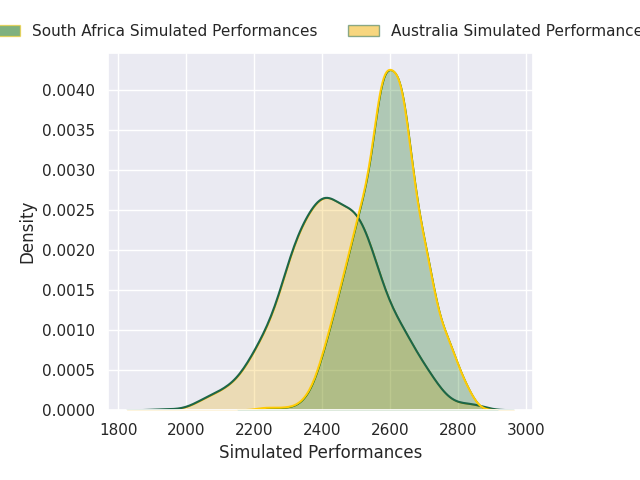
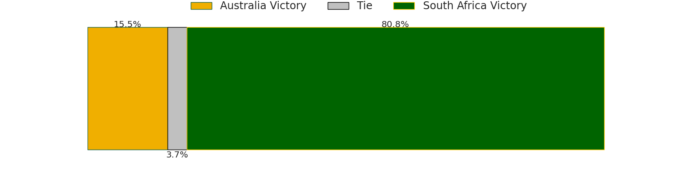
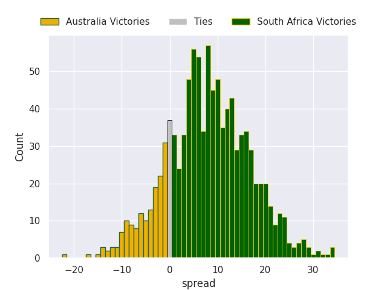

## Week 6

### New Zealand V Australia on 2026/10/10

Average Margin: New Zealand by 14.6

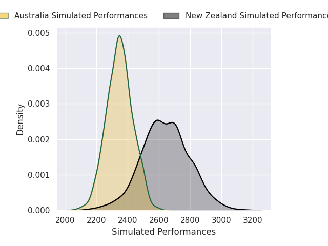
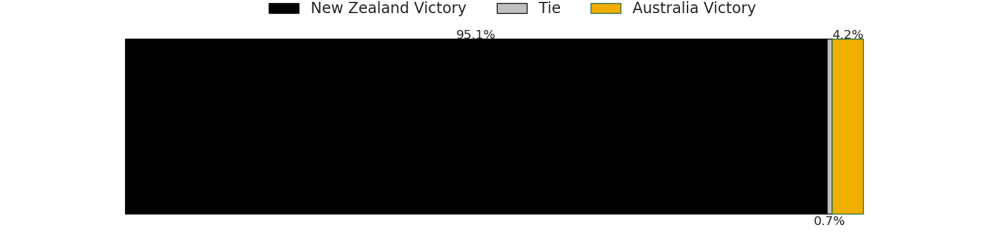
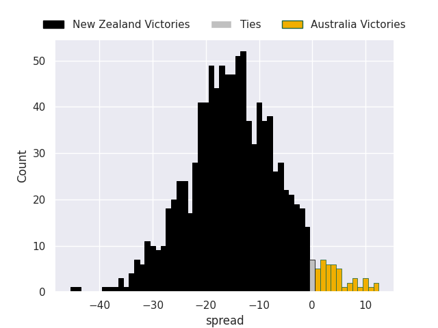

## Week 7

### Australia V New Zealand on 2026/10/17

Average Margin: New Zealand by 6.9

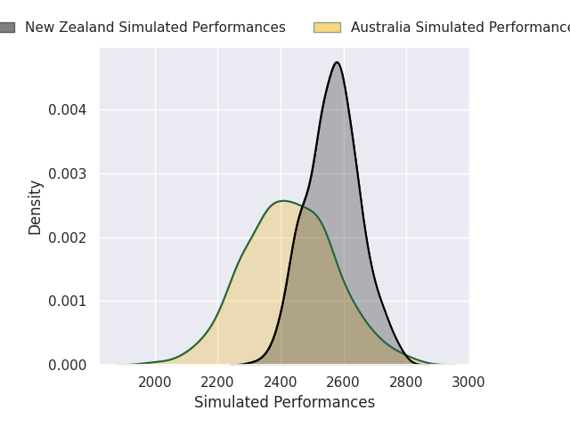
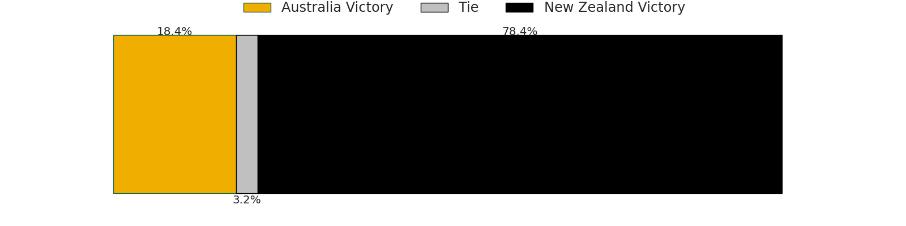
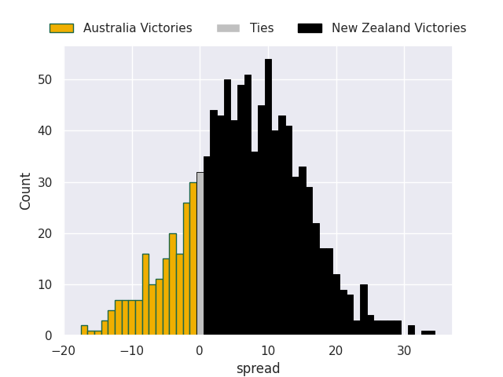

## Week 8

### Japan V Fiji on 2026/10/24

Average Margin: Japan by 11.6

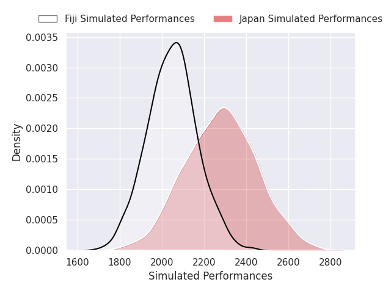
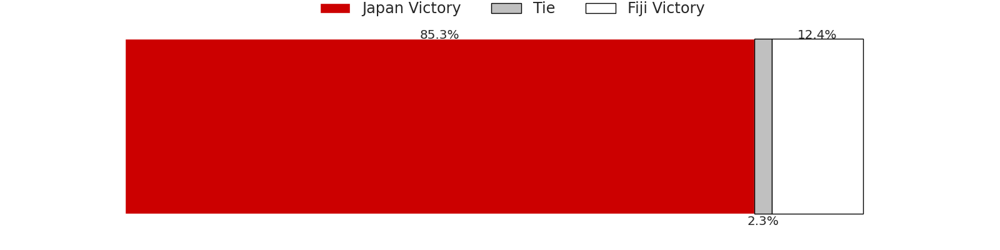
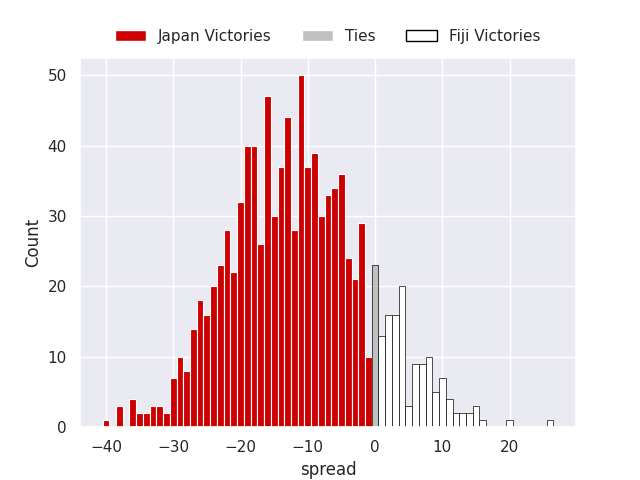

## Week 9

### Belgium V Hong Kong on 2026/10/31

Average Margin: Belgium by 11.2

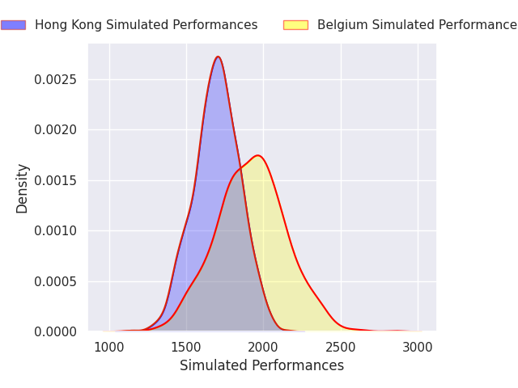
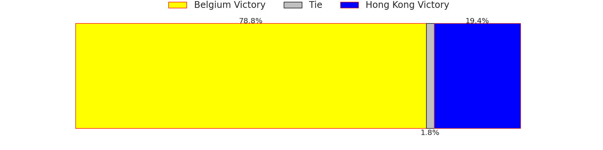
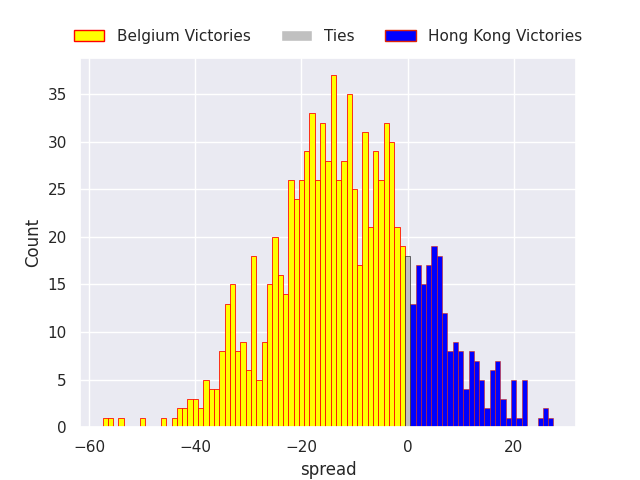

## Week 10

### Paraguay V Brazil on 2026/11/13

Average Margin: Paraguay by 18.4

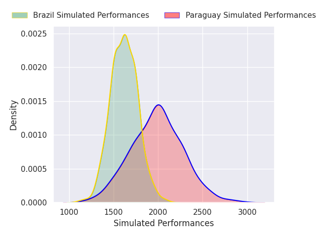
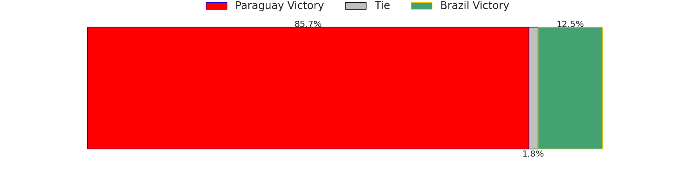
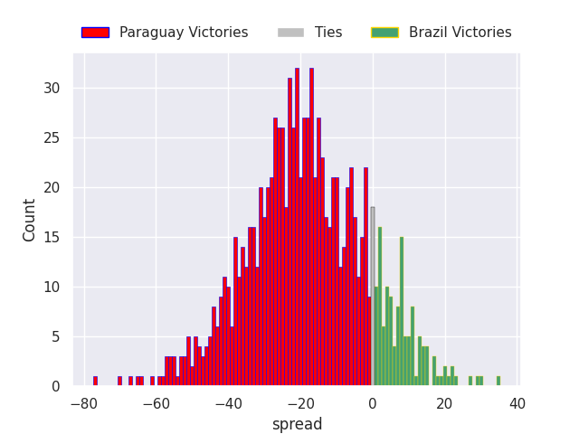

