# Team Rankings

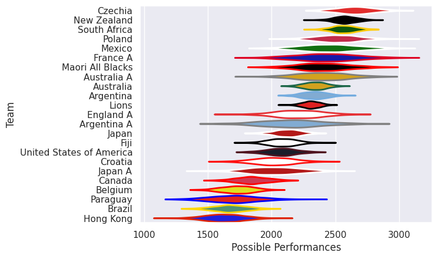
# Standings

## Current Standings

| Club                     |   Played |   Wins |   Point Differential |   Losing Bonus Points |   Try Bonus Points |   Competition Points |
|:-------------------------|---------:|-------:|---------------------:|----------------------:|-------------------:|---------------------:|
| Australia                |        5 |      4 |                   52 |                     0 |                  4 |                   22 |
| Japan                    |        3 |      1 |                    3 |                     1 |                  2 |                    7 |
| South Africa             |        2 |      1 |                    3 |                     1 |                  1 |                    6 |
| New Zealand              |        1 |      1 |                    6 |                     0 |                  1 |                    5 |
| Argentina                |        3 |      0 |                  -13 |                     2 |                  1 |                    5 |
| France A                 |        1 |      1 |                   16 |                     0 |                    |                    4 |
| Poland                   |        1 |      1 |                   14 |                     0 |                    |                    4 |
| Czechia                  |        2 |      1 |                   13 |                     0 |                    |                    4 |
| Maori All Blacks         |        1 |      1 |                    7 |                     0 |                    |                    4 |
| United States of America |        1 |      1 |                    1 |                     0 |                    |                    4 |
| Mexico                   |        2 |      1 |                  -11 |                     0 |                    |                    4 |
| Lions                    |        1 |      0 |                   -6 |                     1 |                  1 |                    2 |
| Argentina A              |        1 |      0 |                   -1 |                     1 |                    |                    1 |
| Japan A                  |        1 |      0 |                   -7 |                     1 |                    |                    1 |
| Croatia                  |        1 |      0 |                  -16 |                     0 |                    |                    0 |
| England A                |        1 |      0 |                  -16 |                     0 |                    |                    0 |
| Canada                   |        1 |      0 |                  -45 |                     0 |                    |                    0 |

## Projected Remaining Table

| Club                     |   To Play |   Projected Wins |   Projected Differential |   Projected Losing Bonus Points | Projected Try Bonus Points   |   Projected Competition Points |
|:-------------------------|----------:|-----------------:|-------------------------:|--------------------------------:|:-----------------------------|-------------------------------:|
| New Zealand              |         3 |            2.593 |                   32.932 |                           0.276 |                              |                         10.79  |
| Australia A              |         2 |            1.813 |                   37.149 |                           0.105 |                              |                          7.403 |
| Paraguay                 |         1 |            0.877 |                   19.056 |                           0.058 |                              |                          3.59  |
| Japan                    |         1 |            0.849 |                   11.001 |                           0.093 |                              |                          3.537 |
| Belgium                  |         1 |            0.791 |                   10.756 |                           0.109 |                              |                          3.301 |
| England A                |         1 |            0.731 |                   10.845 |                           0.088 |                              |                          3.046 |
| Australia                |         3 |            0.336 |                  -32.932 |                           0.66  |                              |                          2.146 |
| Argentina A              |         1 |            0.252 |                  -10.845 |                           0.149 |                              |                          1.191 |
| Hong Kong                |         1 |            0.195 |                  -10.756 |                           0.186 |                              |                          0.994 |
| United States of America |         2 |            0.164 |                  -37.149 |                           0.219 |                              |                          0.921 |
| Fiji                     |         1 |            0.127 |                  -11.001 |                           0.202 |                              |                          0.758 |
| Brazil                   |         1 |            0.111 |                  -19.056 |                           0.12  |                              |                          0.588 |

## Projected Total Table

| Club                     |   Played |   Wins |   Point Differential |   Losing Bonus Points |   Try Bonus Points |   Competition Points |
|:-------------------------|---------:|-------:|---------------------:|----------------------:|-------------------:|---------------------:|
| Australia                |        8 |  4.336 |               19.068 |                 0.66  |                  4 |               24.146 |
| New Zealand              |        4 |  3.593 |               38.932 |                 0.276 |                  1 |               15.79  |
| Japan                    |        4 |  1.849 |               14.001 |                 1.093 |                  2 |               10.537 |
| Australia A              |        2 |  1.813 |               37.149 |                 0.105 |                    |                7.403 |
| South Africa             |        2 |  1     |                3     |                 1     |                  1 |                6     |
| Argentina                |        3 |  0     |              -13     |                 2     |                  1 |                5     |
| United States of America |        3 |  1.164 |              -36.149 |                 0.219 |                    |                4.921 |
| France A                 |        1 |  1     |               16     |                 0     |                    |                4     |
| Poland                   |        1 |  1     |               14     |                 0     |                    |                4     |
| Czechia                  |        2 |  1     |               13     |                 0     |                    |                4     |
| Maori All Blacks         |        1 |  1     |                7     |                 0     |                    |                4     |
| Mexico                   |        2 |  1     |              -11     |                 0     |                    |                4     |
| Paraguay                 |        1 |  0.877 |               19.056 |                 0.058 |                    |                3.59  |
| Belgium                  |        1 |  0.791 |               10.756 |                 0.109 |                    |                3.301 |
| England A                |        2 |  0.731 |               -5.155 |                 0.088 |                    |                3.046 |
| Argentina A              |        2 |  0.252 |              -11.845 |                 1.149 |                    |                2.191 |
| Lions                    |        1 |  0     |               -6     |                 1     |                  1 |                2     |
| Japan A                  |        1 |  0     |               -7     |                 1     |                    |                1     |
| Hong Kong                |        1 |  0.195 |              -10.756 |                 0.186 |                    |                0.994 |
| Fiji                     |        1 |  0.127 |              -11.001 |                 0.202 |                    |                0.758 |
| Brazil                   |        1 |  0.111 |              -19.056 |                 0.12  |                    |                0.588 |
| Croatia                  |        1 |  0     |              -16     |                 0     |                    |                0     |
| Canada                   |        1 |  0     |              -45     |                 0     |                    |                0     |

# Completed Match Review

| Model | Percent Correct Predictions | Spread Error |
| ------ | ------ | ------ |
| Club Level | 73.9% | 10.3 |
| Player Level: Lineup | nan% | nan |
| Player Level: Minutes | nan% | nan |

# Future Predictions

## Week 6

### New Zealand V Australia on 2026/10/01

Average Margin: New Zealand by 13.4

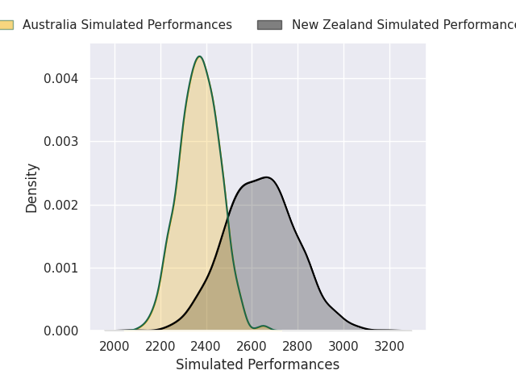

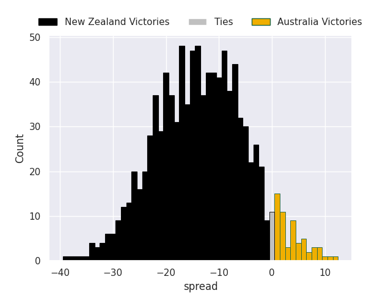

## Week 7

### New Zealand V Australia on 2026/10/10

Average Margin: New Zealand by 13.8

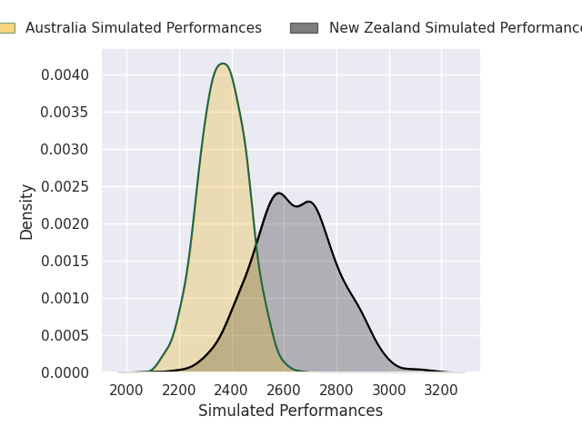
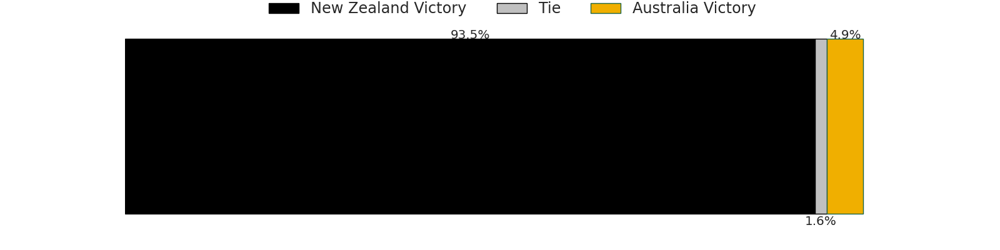
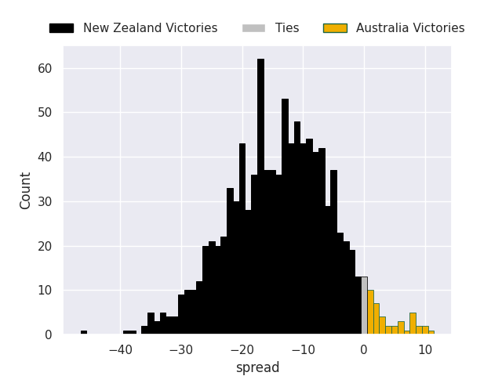

## Week 8

### Australia V New Zealand on 2026/10/17

Average Margin: New Zealand by 5.7

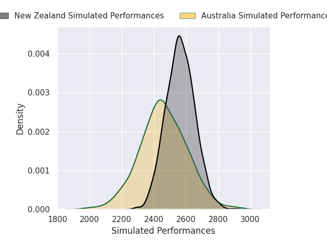
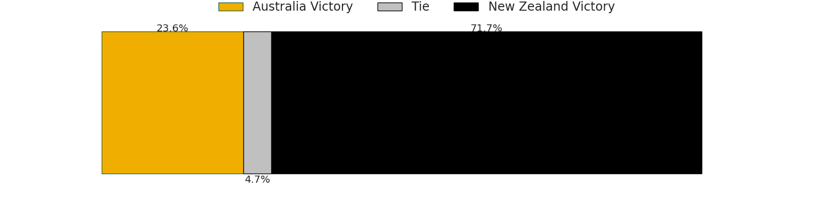
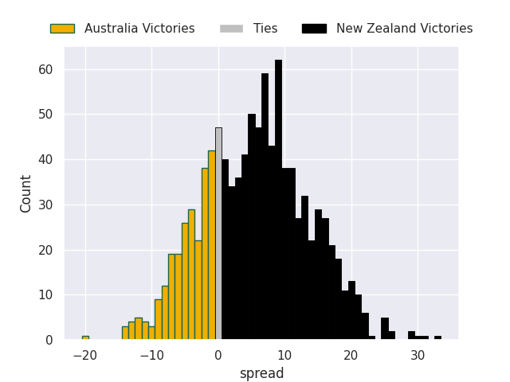

## Week 9

### Japan V Fiji on 2026/10/24

Average Margin: Japan by 11.0

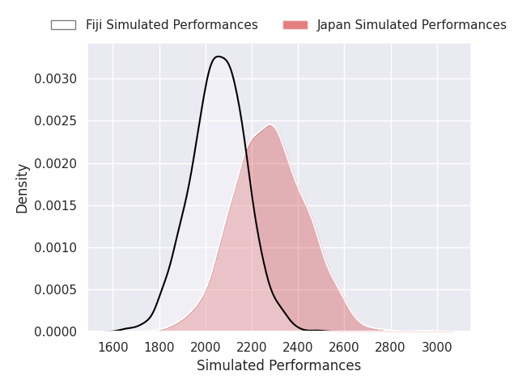
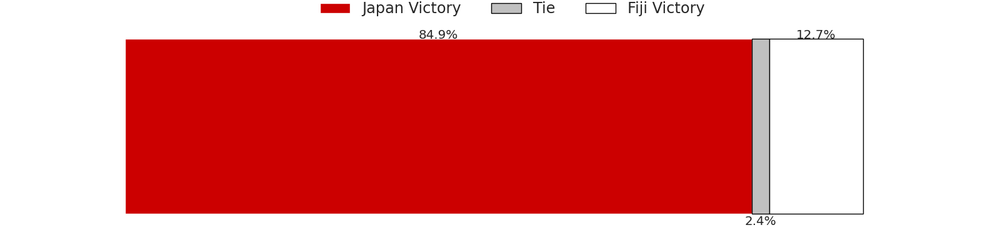
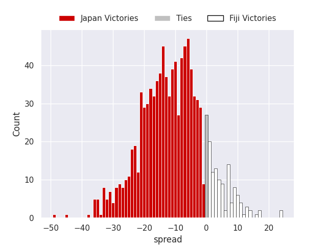

### United States of America V Australia A on 2026/10/25

Average Margin: Australia A by 18.5

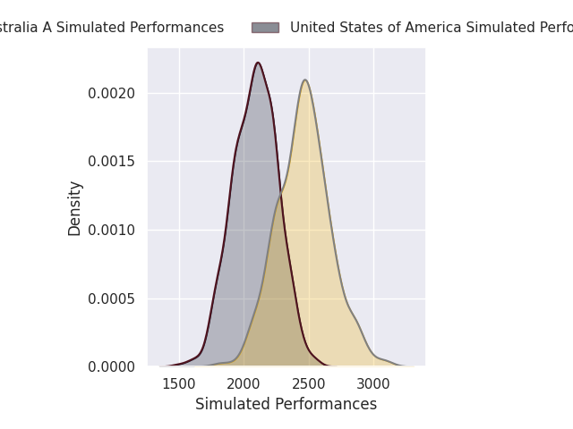

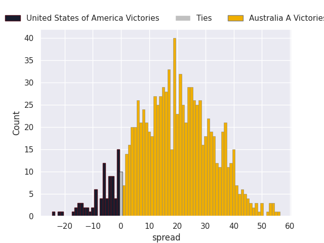

## Week 10

### United States of America V Australia A on 2026/10/31

Average Margin: Australia A by 18.6

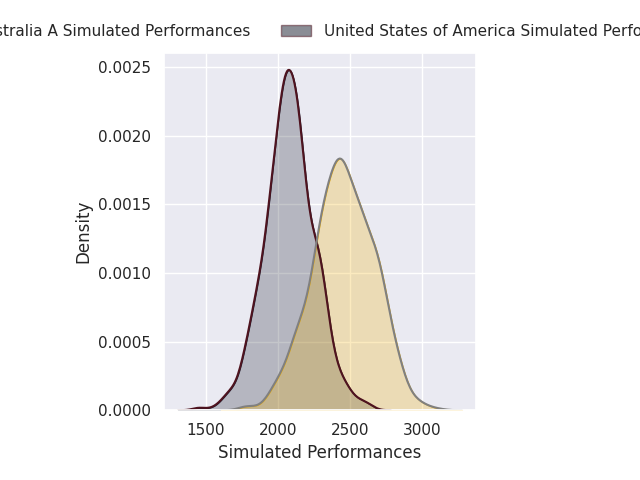
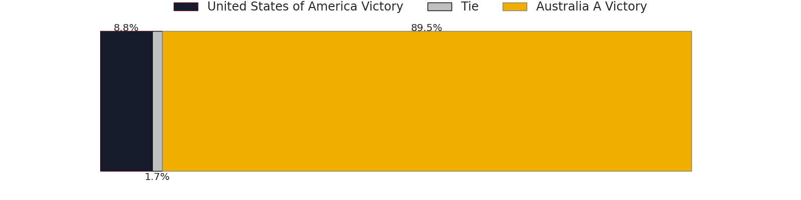
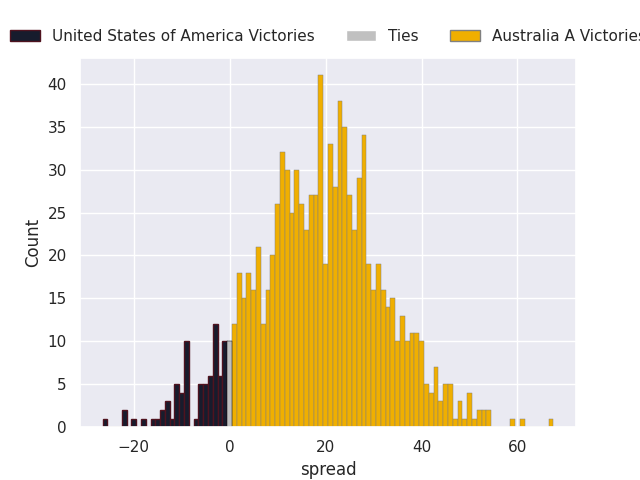

### Belgium V Hong Kong on 2026/10/31

Average Margin: Belgium by 10.8

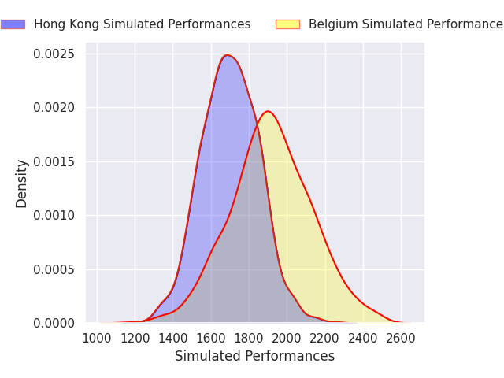
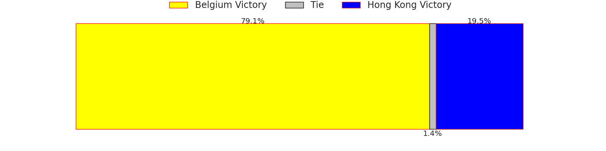
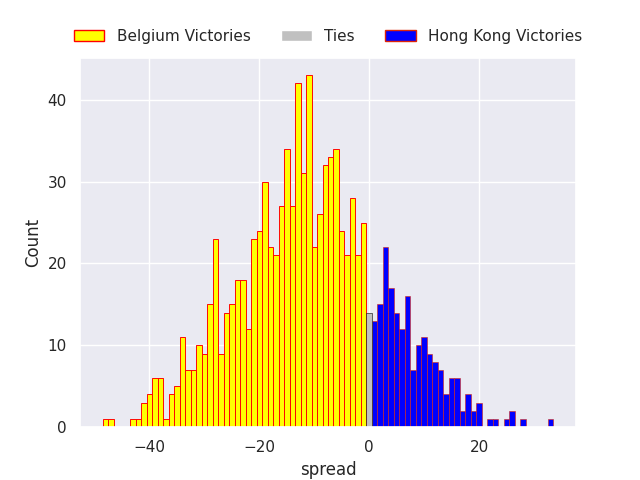

## Week 11

### England A V Argentina A on 2026/11/06

Average Margin: England A by 10.8

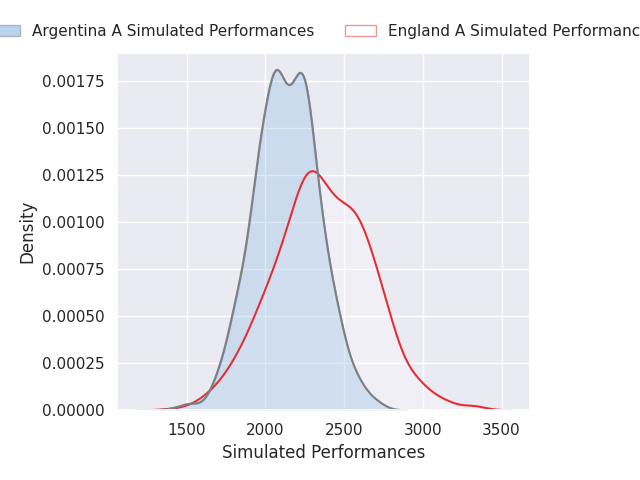
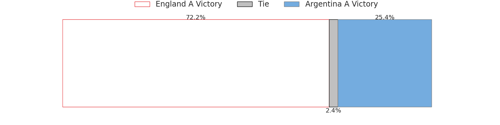
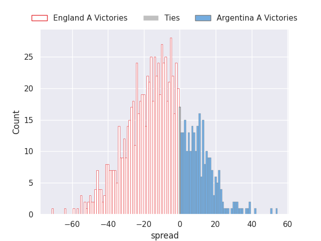

## Week 12

### Paraguay V Brazil on 2026/11/13

Average Margin: Paraguay by 19.1

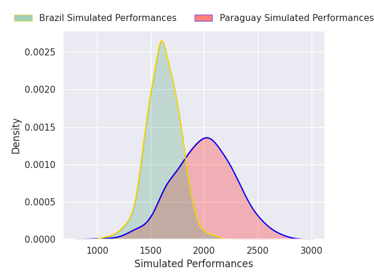
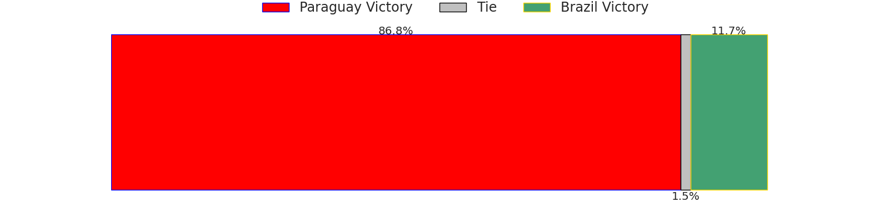
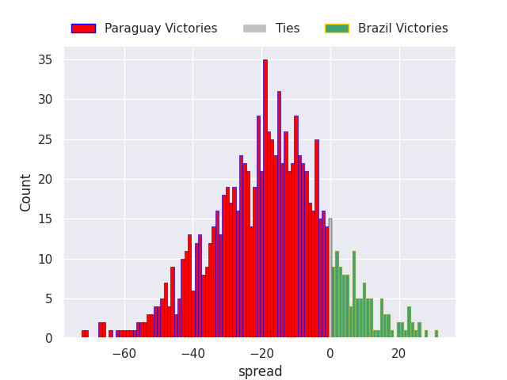

