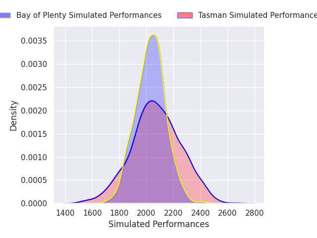
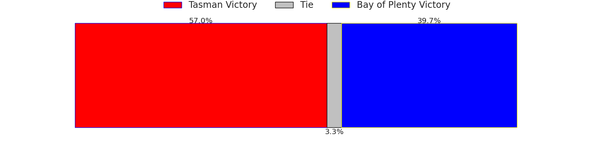
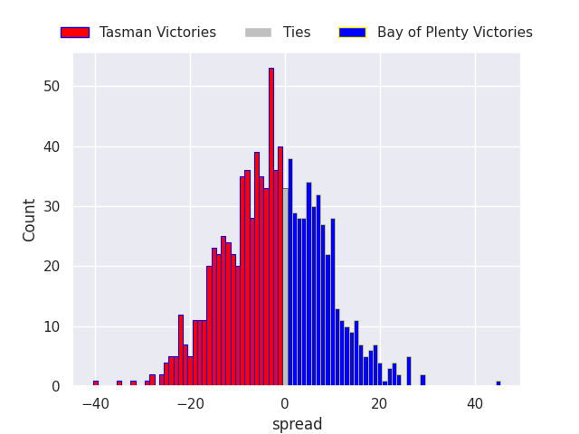

# Team Rankings

# Standings

## Current Standings

| Club             |   Played |   Wins |   Point Differential |   Losing Bonus Points |   Try Bonus Points |   Competition Points |
|:-----------------|---------:|-------:|---------------------:|----------------------:|-------------------:|---------------------:|
| Northland        |        8 |      6 |                  125 |                     1 |                  7 |                   32 |
| Otago            |        8 |      6 |                  111 |                     1 |                  7 |                   32 |
| Hawke's Bay      |        8 |      6 |                  109 |                     1 |                  7 |                   32 |
| North Harbour    |        8 |      5 |                  104 |                     3 |                  8 |                   31 |
| Canterbury       |        8 |      6 |                   48 |                     0 |                  6 |                   30 |
| Taranaki         |        8 |      4 |                   27 |                     3 |                  5 |                   24 |
| Waikato          |        8 |      4 |                   15 |                     2 |                  6 |                   24 |
| Tasman           |        8 |      4 |                   -7 |                     1 |                  5 |                   22 |
| Bay of Plenty    |        8 |      4 |                  -40 |                     1 |                  5 |                   22 |
| Manawatu         |        8 |      4 |                  -56 |                     1 |                  3 |                   20 |
| Auckland         |        8 |      3 |                  -32 |                     2 |                  4 |                   18 |
| Southland        |        8 |      2 |                  -99 |                     1 |                  4 |                   13 |
| Counties Manukau |        8 |      2 |                 -108 |                     0 |                  4 |                   12 |
| Wellington       |        8 |      0 |                 -197 |                     1 |                  5 |                    6 |

## Projected Remaining Table

| Club             |   To Play |   Projected Wins |   Projected Differential |   Projected Losing Bonus Points | Projected Try Bonus Points   |   Projected Competition Points |
|:-----------------|----------:|-----------------:|-------------------------:|--------------------------------:|:-----------------------------|-------------------------------:|
| Northland        |         2 |            1.839 |                   35.12  |                           0.104 |                              |                          7.5   |
| Waikato          |         2 |            1.593 |                   17.865 |                           0.231 |                              |                          6.721 |
| Hawke's Bay      |         2 |            1.553 |                   17.215 |                           0.271 |                              |                          6.603 |
| Canterbury       |         2 |            1.562 |                   21.778 |                           0.258 |                              |                          6.584 |
| Otago            |         2 |            1.319 |                   13.615 |                           0.273 |                              |                          5.659 |
| North Harbour    |         2 |            1.217 |                    6.738 |                           0.408 |                              |                          5.418 |
| Taranaki         |         2 |            1.199 |                   13.237 |                           0.247 |                              |                          5.105 |
| Tasman           |         2 |            0.802 |                   -4.733 |                           0.493 |                              |                          3.831 |
| Manawatu         |         2 |            0.772 |                   -6.152 |                           0.477 |                              |                          3.693 |
| Bay of Plenty    |         2 |            0.722 |                   -6.393 |                           0.534 |                              |                          3.548 |
| Auckland         |         2 |            0.611 |                  -13.663 |                           0.371 |                              |                          2.911 |
| Counties Manukau |         2 |            0.183 |                  -31.764 |                           0.286 |                              |                          1.096 |
| Southland        |         2 |            0.161 |                  -30.862 |                           0.28  |                              |                          0.97  |
| Wellington       |         2 |            0.133 |                  -32.001 |                           0.307 |                              |                          0.901 |

## Projected Total Table

| Club             |   Played |   Wins |   Point Differential |   Losing Bonus Points |   Try Bonus Points |   Competition Points |
|:-----------------|---------:|-------:|---------------------:|----------------------:|-------------------:|---------------------:|
| Northland        |       10 |  7.839 |              160.12  |                 1.104 |                  7 |               39.5   |
| Hawke's Bay      |       10 |  7.553 |              126.215 |                 1.271 |                  7 |               38.603 |
| Otago            |       10 |  7.319 |              124.615 |                 1.273 |                  7 |               37.659 |
| Canterbury       |       10 |  7.562 |               69.778 |                 0.258 |                  6 |               36.584 |
| North Harbour    |       10 |  6.217 |              110.738 |                 3.408 |                  8 |               36.418 |
| Waikato          |       10 |  5.593 |               32.865 |                 2.231 |                  6 |               30.721 |
| Taranaki         |       10 |  5.199 |               40.237 |                 3.247 |                  5 |               29.105 |
| Tasman           |       10 |  4.802 |              -11.733 |                 1.493 |                  5 |               25.831 |
| Bay of Plenty    |       10 |  4.722 |              -46.393 |                 1.534 |                  5 |               25.548 |
| Manawatu         |       10 |  4.772 |              -62.152 |                 1.477 |                  3 |               23.693 |
| Auckland         |       10 |  3.611 |              -45.663 |                 2.371 |                  4 |               20.911 |
| Southland        |       10 |  2.161 |             -129.862 |                 1.28  |                  4 |               13.97  |
| Counties Manukau |       10 |  2.183 |             -139.764 |                 0.286 |                  4 |               13.096 |
| Wellington       |       10 |  0.133 |             -229.001 |                 1.307 |                  5 |                6.901 |

# Completed Match Review

| Model | Percent Correct Predictions | Spread Error |
| ------ | ------ | ------ |
| Club Level | 64.3% | 13.6 |
| Player Level: Lineup | nan% | nan |
| Player Level: Minutes | nan% | nan |

# Future Predictions

## Week 9

### Tasman V Bay of Plenty on 2026/09/24

Average Margin: Tasman by 2.1

### Auckland V Manawatu on 2026/09/25

Average Margin: Auckland by 2.4

### Northland V Counties Manukau on 2026/09/25

Average Margin: Northland by 22.3

### North Harbour V Otago on 2026/09/26

Average Margin: North Harbour by 2.4

### Canterbury V Southland on 2026/09/26

Average Margin: Canterbury by 18.0

### Wellington V Waikato on 2026/09/26

Average Margin: Waikato by 11.0

### Hawke's Bay V Taranaki on 2026/09/27

Average Margin: Hawke's Bay by 7.7

## Week 10

### Otago V Auckland on 2026/10/01

Average Margin: Otago by 16.0

### Manawatu V Canterbury on 2026/10/02

Average Margin: Canterbury by 3.8

### Southland V Northland on 2026/10/02

Average Margin: Northland by 12.8

### Waikato V Tasman on 2026/10/03

Average Margin: Waikato by 6.8

### Taranaki V Wellington on 2026/10/03

Average Margin: Taranaki by 21.0

### Counties Manukau V Hawke's Bay on 2026/10/03

Average Margin: Hawke's Bay by 9.5

### Bay of Plenty V North Harbour on 2026/10/04

Average Margin: North Harbour by 4.3

