# Team Rankings

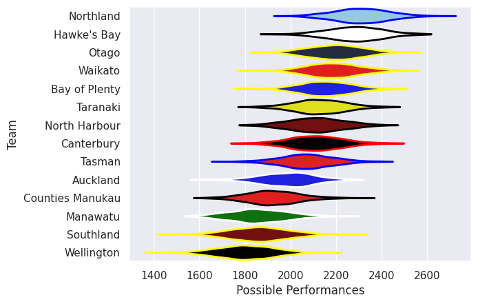
# Standings

## Current Standings

| Club             |   Played |   Wins |   Point Differential |   Losing Bonus Points |   Try Bonus Points |   Competition Points |
|:-----------------|---------:|-------:|---------------------:|----------------------:|-------------------:|---------------------:|
| Northland        |        8 |      6 |                  125 |                     1 |                  7 |                   32 |
| Otago            |        8 |      6 |                  111 |                     1 |                  7 |                   32 |
| Hawke's Bay      |        8 |      6 |                  109 |                     1 |                  7 |                   32 |
| North Harbour    |        8 |      5 |                  104 |                     3 |                  8 |                   31 |
| Canterbury       |        8 |      6 |                   48 |                     0 |                  6 |                   30 |
| Tasman           |        9 |      5 |                   12 |                     1 |                  6 |                   27 |
| Taranaki         |        8 |      4 |                   27 |                     3 |                  5 |                   24 |
| Waikato          |        8 |      4 |                   15 |                     2 |                  6 |                   24 |
| Bay of Plenty    |        9 |      4 |                  -59 |                     1 |                  6 |                   23 |
| Manawatu         |        8 |      4 |                  -56 |                     1 |                  3 |                   20 |
| Auckland         |        8 |      3 |                  -32 |                     2 |                  4 |                   18 |
| Southland        |        8 |      2 |                  -99 |                     1 |                  4 |                   13 |
| Counties Manukau |        8 |      2 |                 -108 |                     0 |                  4 |                   12 |
| Wellington       |        8 |      0 |                 -197 |                     1 |                  5 |                    6 |

## Projected Remaining Table

| Club             |   To Play |   Projected Wins |   Projected Differential |   Projected Losing Bonus Points | Projected Try Bonus Points   |   Projected Competition Points |
|:-----------------|----------:|-----------------:|-------------------------:|--------------------------------:|:-----------------------------|-------------------------------:|
| Northland        |         2 |            1.843 |                   35.001 |                           0.098 |                              |                          7.52  |
| Canterbury       |         2 |            1.591 |                   22.65  |                           0.224 |                              |                          6.658 |
| Hawke's Bay      |         2 |            1.531 |                   16.012 |                           0.267 |                              |                          6.499 |
| Waikato          |         2 |            1.491 |                   15.253 |                           0.287 |                              |                          6.379 |
| Otago            |         2 |            1.354 |                   14.614 |                           0.288 |                              |                          5.774 |
| North Harbour    |         2 |            1.275 |                    7.867 |                           0.394 |                              |                          5.606 |
| Taranaki         |         2 |            1.206 |                   14.063 |                           0.273 |                              |                          5.179 |
| Manawatu         |         2 |            0.755 |                   -6.304 |                           0.474 |                              |                          3.616 |
| Auckland         |         2 |            0.601 |                  -14.423 |                           0.382 |                              |                          2.866 |
| Tasman           |         1 |            0.305 |                   -4.396 |                           0.286 |                              |                          1.584 |
| Bay of Plenty    |         1 |            0.252 |                   -5.972 |                           0.281 |                              |                          1.345 |
| Counties Manukau |         2 |            0.194 |                  -31.322 |                           0.278 |                              |                          1.106 |
| Wellington       |         2 |            0.165 |                  -31.795 |                           0.274 |                              |                          0.998 |
| Southland        |         2 |            0.156 |                  -31.248 |                           0.289 |                              |                          0.965 |

## Projected Total Table

| Club             |   Played |   Wins |   Point Differential |   Losing Bonus Points |   Try Bonus Points |   Competition Points |
|:-----------------|---------:|-------:|---------------------:|----------------------:|-------------------:|---------------------:|
| Northland        |       10 |  7.843 |              160.001 |                 1.098 |                  7 |               39.52  |
| Hawke's Bay      |       10 |  7.531 |              125.012 |                 1.267 |                  7 |               38.499 |
| Otago            |       10 |  7.354 |              125.614 |                 1.288 |                  7 |               37.774 |
| Canterbury       |       10 |  7.591 |               70.65  |                 0.224 |                  6 |               36.658 |
| North Harbour    |       10 |  6.275 |              111.867 |                 3.394 |                  8 |               36.606 |
| Waikato          |       10 |  5.491 |               30.253 |                 2.287 |                  6 |               30.379 |
| Taranaki         |       10 |  5.206 |               41.063 |                 3.273 |                  5 |               29.179 |
| Tasman           |       10 |  5.305 |                7.604 |                 1.286 |                  6 |               28.584 |
| Bay of Plenty    |       10 |  4.252 |              -64.972 |                 1.281 |                  6 |               24.345 |
| Manawatu         |       10 |  4.755 |              -62.304 |                 1.474 |                  3 |               23.616 |
| Auckland         |       10 |  3.601 |              -46.423 |                 2.382 |                  4 |               20.866 |
| Southland        |       10 |  2.156 |             -130.248 |                 1.289 |                  4 |               13.965 |
| Counties Manukau |       10 |  2.194 |             -139.322 |                 0.278 |                  4 |               13.106 |
| Wellington       |       10 |  0.165 |             -228.795 |                 1.274 |                  5 |                6.998 |

# Completed Match Review

| Model | Percent Correct Predictions | Spread Error |
| ------ | ------ | ------ |
| Club Level | 62.9% | 14.0 |
| Player Level: Lineup | nan% | nan |
| Player Level: Minutes | nan% | nan |

# Future Predictions

## Week 10

### Auckland V Manawatu on 2026/09/25

Average Margin: Auckland by 2.1

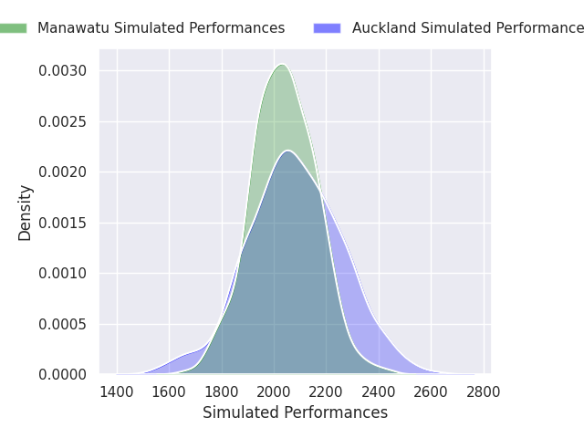

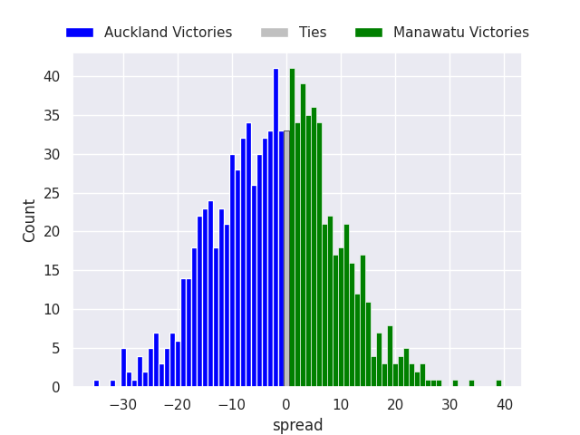

### Northland V Counties Manukau on 2026/09/25

Average Margin: Northland by 22.2

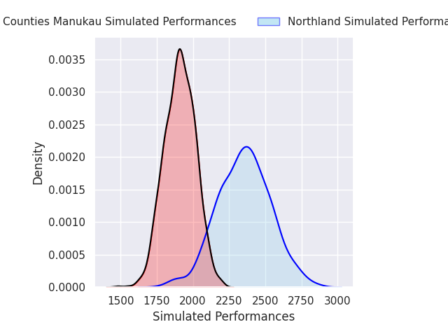
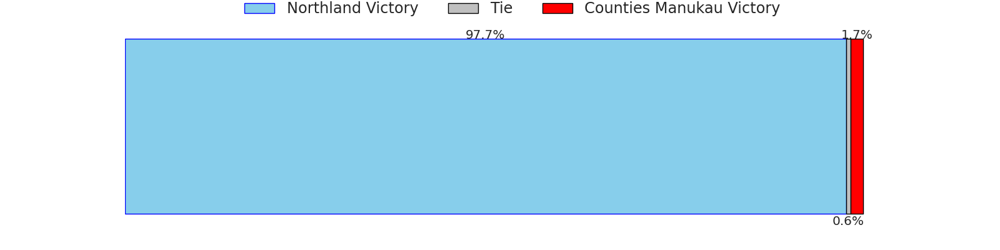
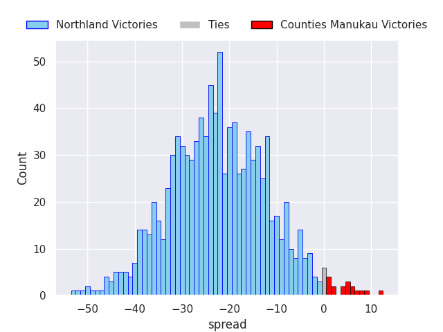

### North Harbour V Otago on 2026/09/26

Average Margin: North Harbour by 1.9

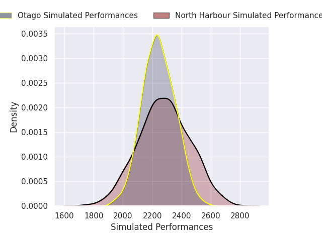

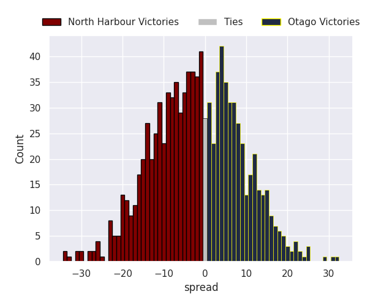

### Canterbury V Southland on 2026/09/26

Average Margin: Canterbury by 18.4

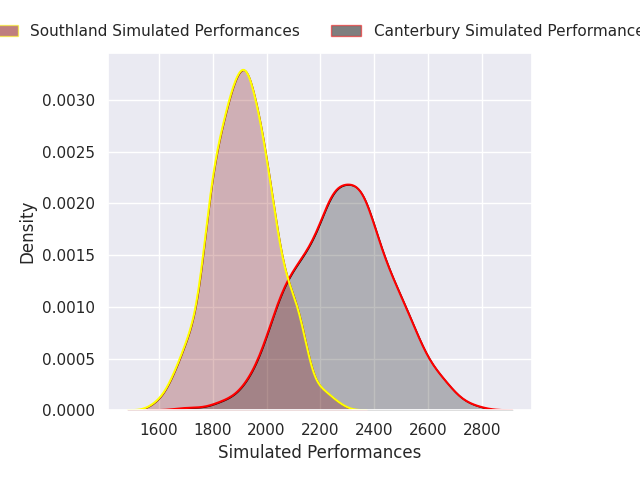
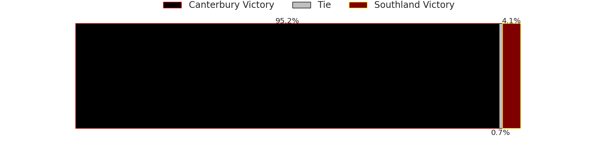
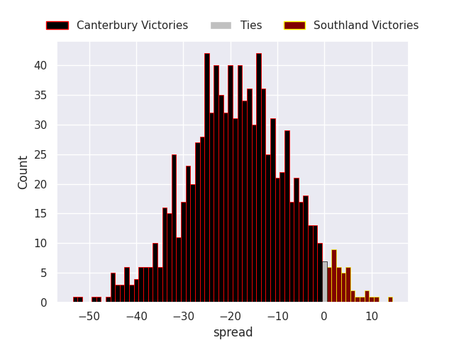

### Wellington V Waikato on 2026/09/26

Average Margin: Waikato by 10.9

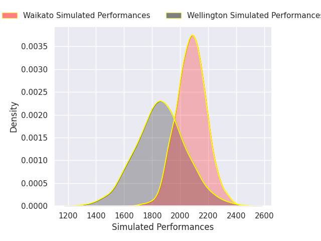
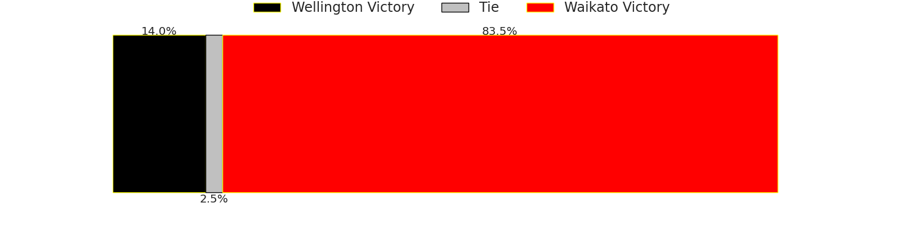
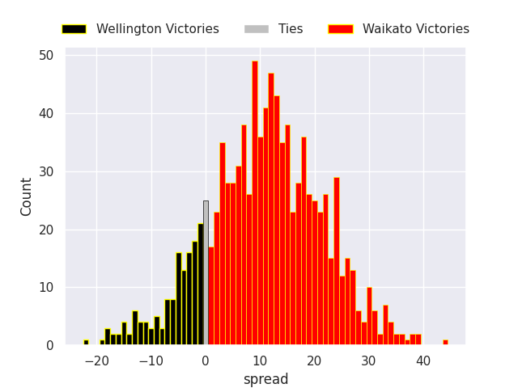

### Hawke's Bay V Taranaki on 2026/09/27

Average Margin: Hawke's Bay by 6.9

## Week 11

### Otago V Auckland on 2026/10/01

Average Margin: Otago by 16.5

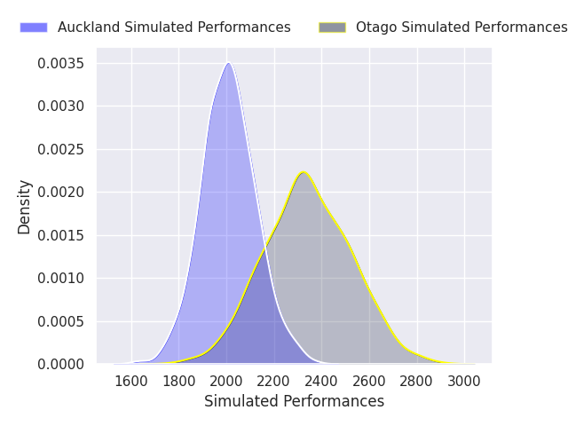
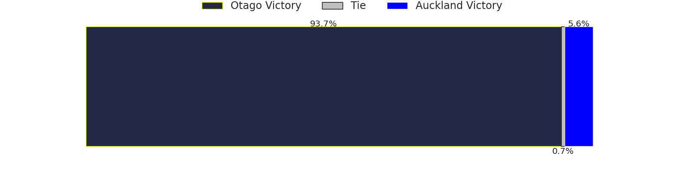
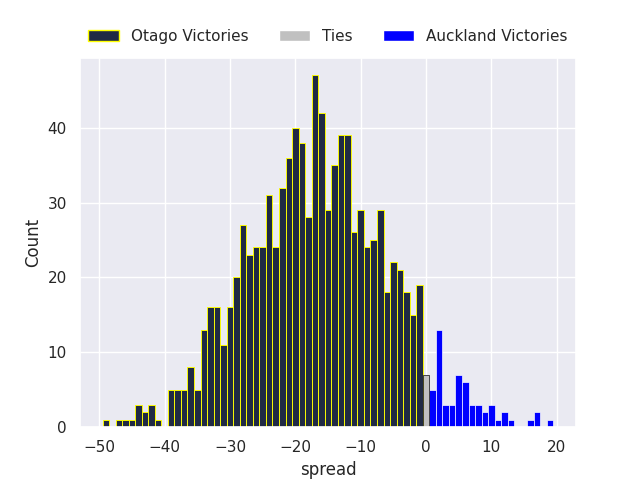

### Manawatu V Canterbury on 2026/10/02

Average Margin: Canterbury by 4.2

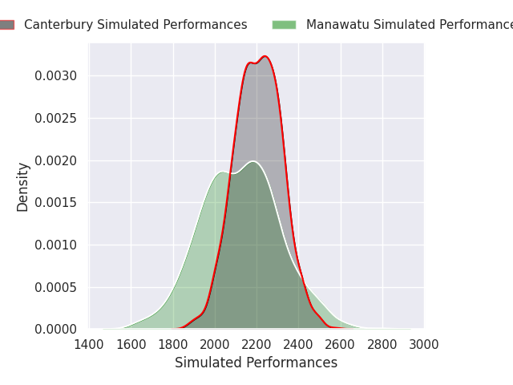
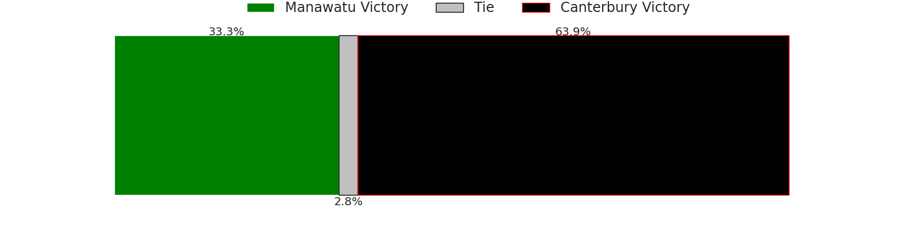
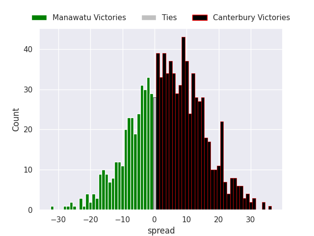

### Southland V Northland on 2026/10/02

Average Margin: Northland by 12.8

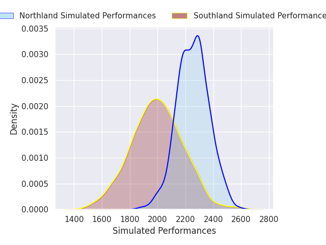
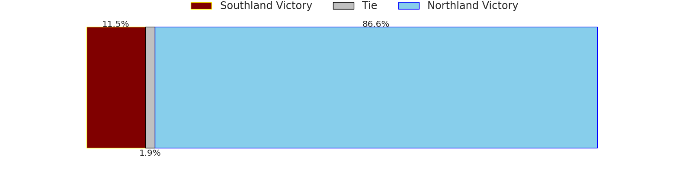
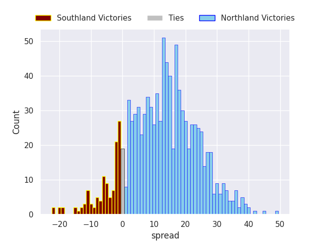

### Taranaki V Wellington on 2026/10/03

Average Margin: Taranaki by 20.9

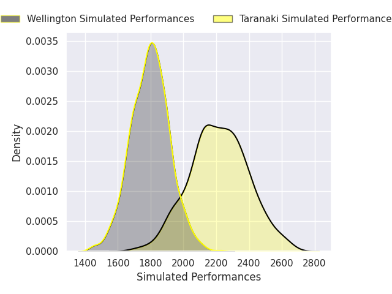
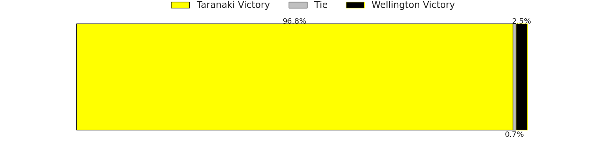
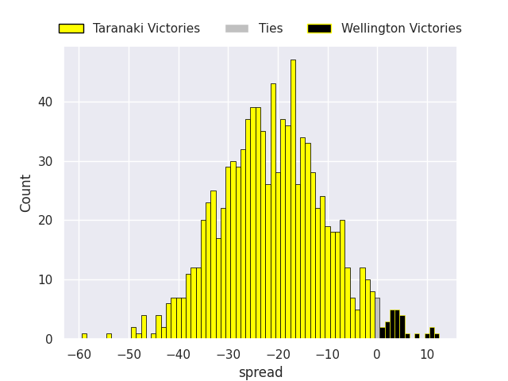

### Counties Manukau V Hawke's Bay on 2026/10/03

Average Margin: Hawke's Bay by 9.1

### Waikato V Tasman on 2026/10/03

Average Margin: Waikato by 4.4

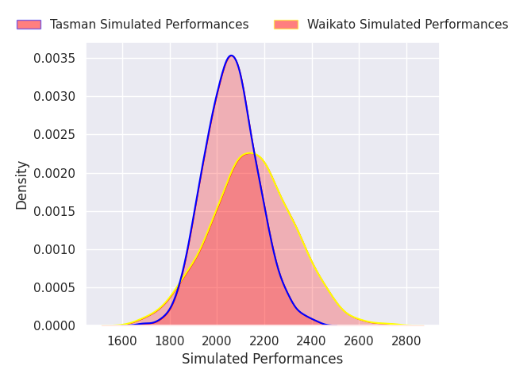
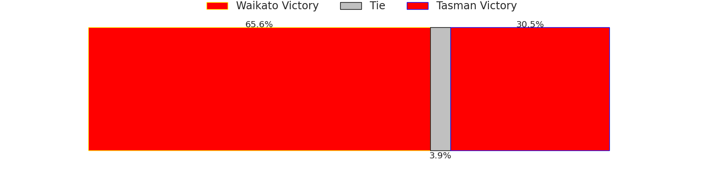
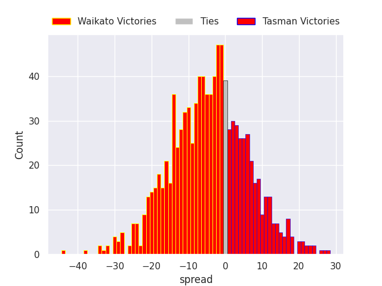

### Bay of Plenty V North Harbour on 2026/10/04

Average Margin: North Harbour by 6.0

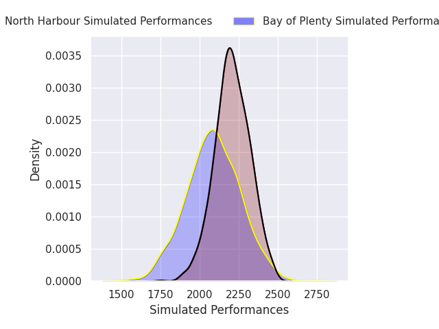
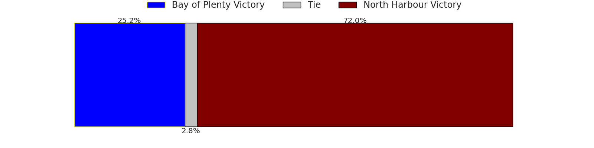
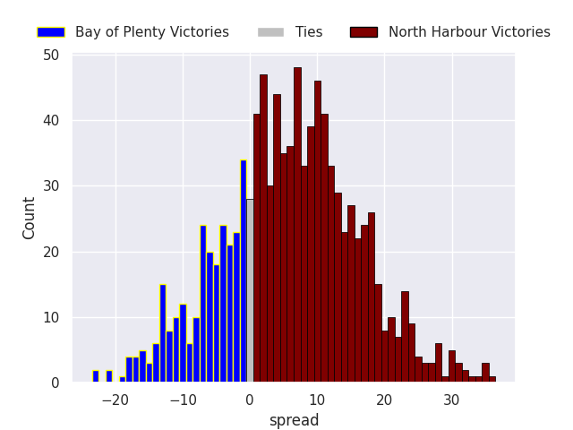

