# Team Rankings

# Standings

## Current Standings

| Club             |   Played |   Wins |   Point Differential |   Losing Bonus Points |   Try Bonus Points |   Competition Points |
|:-----------------|---------:|-------:|---------------------:|----------------------:|-------------------:|---------------------:|
| Canterbury       |       11 |      9 |                   81 |                     0 |                  8 |                   44 |
| Northland        |       11 |      8 |                  150 |                     2 |                  8 |                   42 |
| Otago            |       11 |      8 |                  106 |                     1 |                  8 |                   41 |
| Taranaki         |       11 |      7 |                  147 |                     3 |                  7 |                   38 |
| North Harbour    |       11 |      6 |                   81 |                     3 |                  9 |                   36 |
| Tasman           |       11 |      7 |                   46 |                     1 |                  7 |                   36 |
| Hawke's Bay      |       11 |      6 |                   63 |                     3 |                  6 |                   33 |
| Bay of Plenty    |       11 |      6 |                  -25 |                     1 |                  7 |                   32 |
| Waikato          |       11 |      5 |                    5 |                     2 |                  8 |                   30 |
| Manawatu         |       11 |      5 |                  -70 |                     1 |                  4 |                   25 |
| Counties Manukau |       11 |      5 |                  -95 |                     0 |                  4 |                   24 |
| Auckland         |       11 |      3 |                  -44 |                     5 |                  6 |                   23 |
| Southland        |       11 |      2 |                 -140 |                     1 |                  4 |                   13 |
| Wellington       |       11 |      0 |                 -305 |                     1 |                  6 |                    7 |

## Projected Remaining Table

| Club          |   To Play |   Projected Wins |   Projected Differential |   Projected Losing Bonus Points | Projected Try Bonus Points   |   Projected Competition Points |
|:--------------|----------:|-----------------:|-------------------------:|--------------------------------:|:-----------------------------|-------------------------------:|
| Canterbury    |         2 |            1.726 |                   22.8   |                           0.176 |                              |                          7.156 |
| North Harbour |         2 |            1.134 |                    4.238 |                           0.446 |                              |                          5.132 |
| Taranaki      |         2 |            0.791 |                   -4.238 |                           0.536 |                              |                          3.85  |
| Northland     |         1 |            0.792 |                    8.768 |                           0.123 |                              |                          3.373 |
| Otago         |         1 |            0.799 |                    8.508 |                           0.117 |                              |                          3.373 |
| Waikato       |         2 |            0.236 |                  -22.8   |                           0.431 |                              |                          1.451 |
| Hawke's Bay   |         1 |            0.171 |                   -8.508 |                           0.252 |                              |                          0.996 |
| Tasman        |         1 |            0.167 |                   -8.768 |                           0.234 |                              |                          0.984 |

## Projected Total Table

| Club             |   Played |   Wins |   Point Differential |   Losing Bonus Points |   Try Bonus Points |   Competition Points |
|:-----------------|---------:|-------:|---------------------:|----------------------:|-------------------:|---------------------:|
| Canterbury       |       13 | 10.726 |              103.8   |                 0.176 |                  8 |               51.156 |
| Northland        |       12 |  8.792 |              158.768 |                 2.123 |                  8 |               45.373 |
| Otago            |       12 |  8.799 |              114.508 |                 1.117 |                  8 |               44.373 |
| Taranaki         |       13 |  7.791 |              142.762 |                 3.536 |                  7 |               41.85  |
| North Harbour    |       13 |  7.134 |               85.238 |                 3.446 |                  9 |               41.132 |
| Tasman           |       12 |  7.167 |               37.232 |                 1.234 |                  7 |               36.984 |
| Hawke's Bay      |       12 |  6.171 |               54.492 |                 3.252 |                  6 |               33.996 |
| Bay of Plenty    |       11 |  6     |              -25     |                 1     |                  7 |               32     |
| Waikato          |       13 |  5.236 |              -17.8   |                 2.431 |                  8 |               31.451 |
| Manawatu         |       11 |  5     |              -70     |                 1     |                  4 |               25     |
| Counties Manukau |       11 |  5     |              -95     |                 0     |                  4 |               24     |
| Auckland         |       11 |  3     |              -44     |                 5     |                  6 |               23     |
| Southland        |       11 |  2     |             -140     |                 1     |                  4 |               13     |
| Wellington       |       11 |  0     |             -305     |                 1     |                  6 |                7     |

# Completed Match Review

| Model | Percent Correct Predictions | Spread Error |
| ------ | ------ | ------ |
| Club Level | 67.5% | 14.3 |
| Player Level: Lineup | nan% | nan |
| Player Level: Minutes | nan% | nan |

# Future Predictions

## Week 12

### North Harbour V Taranaki on 2026/09/01

Average Margin: North Harbour by 2.3

## Week 13

### Canterbury V Waikato on 2026/10/01

Average Margin: Canterbury by 9.8

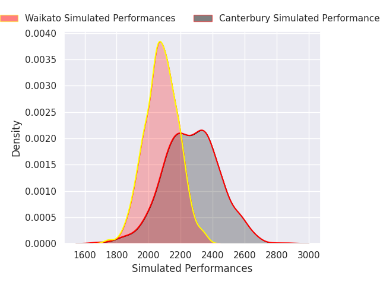
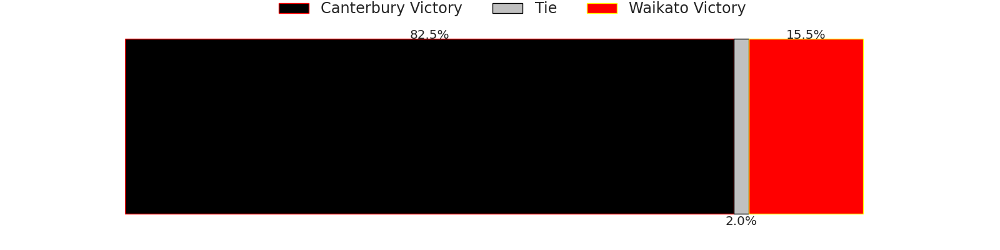
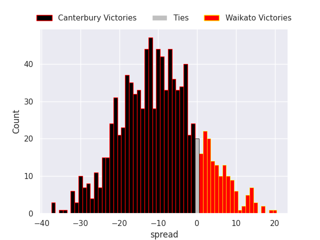

## Week 14

### North Harbour V Taranaki on 2026/10/09

Average Margin: North Harbour by 1.9

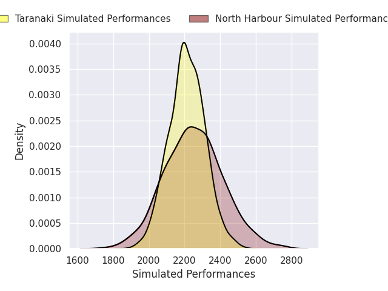
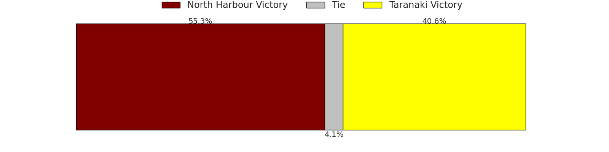
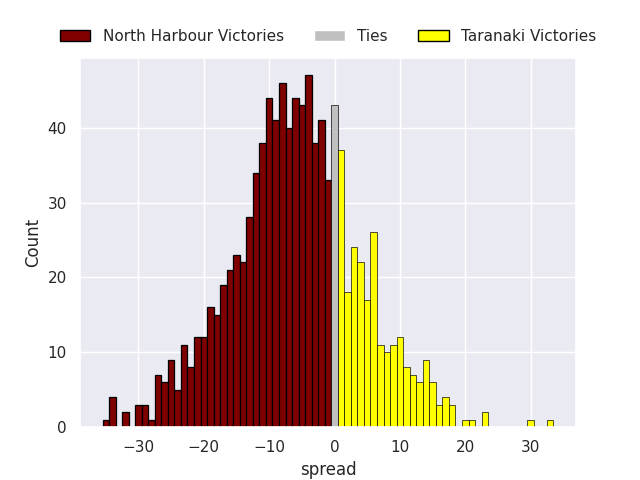

### Otago V Hawke's Bay on 2026/10/09

Average Margin: Otago by 8.5

### Northland V Tasman on 2026/10/09

Average Margin: Northland by 8.8

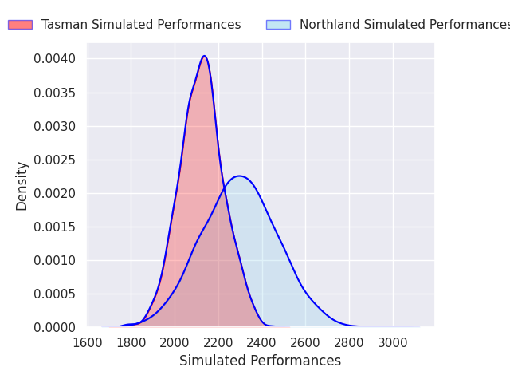
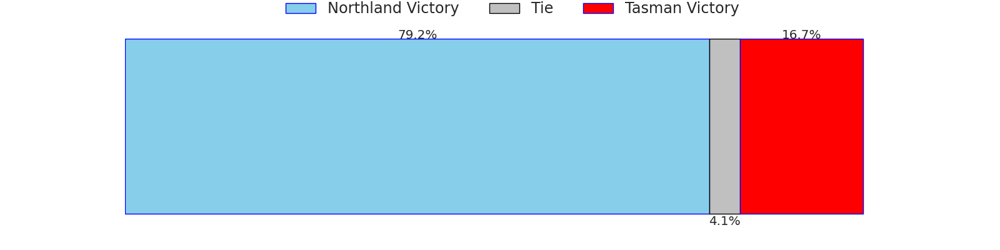
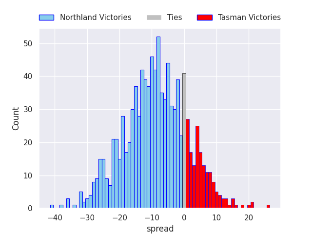

### Canterbury V Waikato on 2026/10/10

Average Margin: Canterbury by 13.0

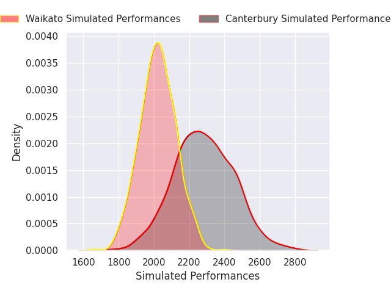
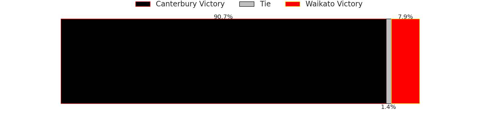
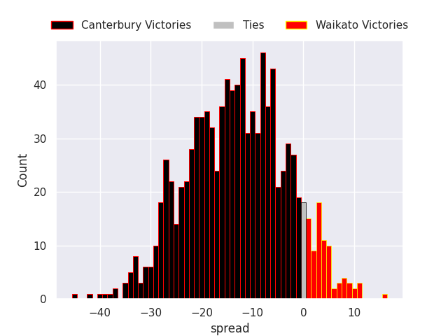

