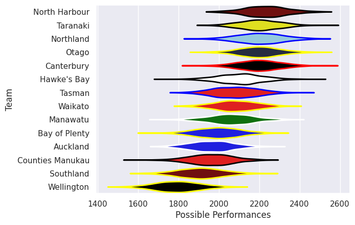
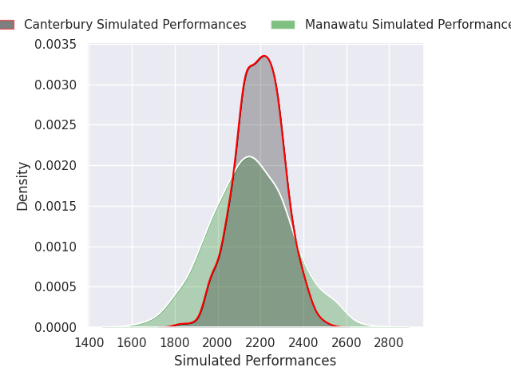
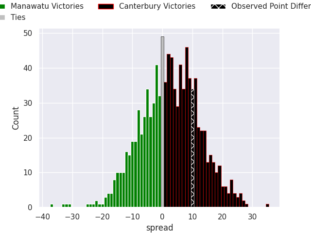
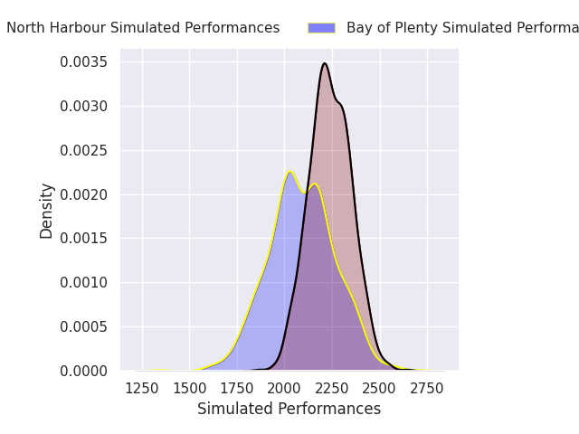
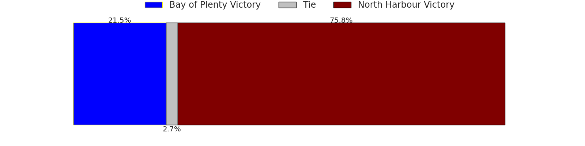
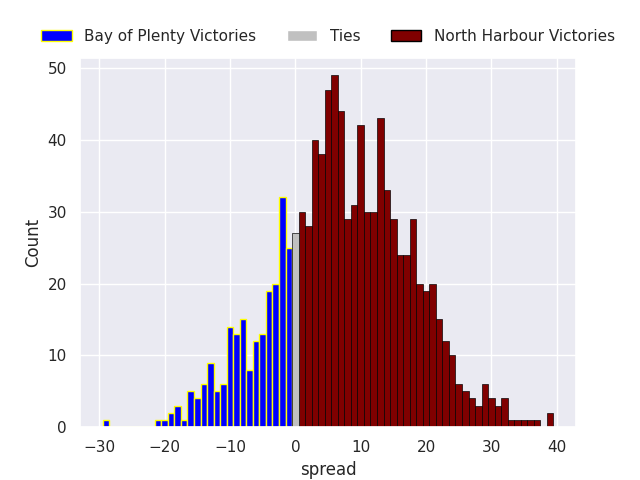
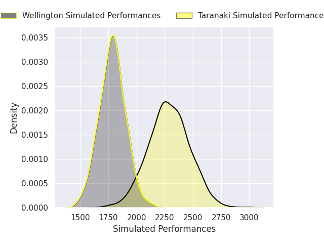
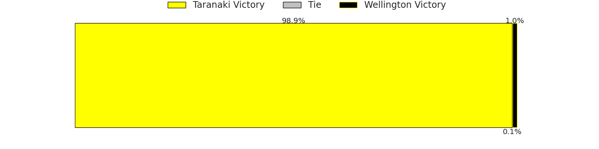
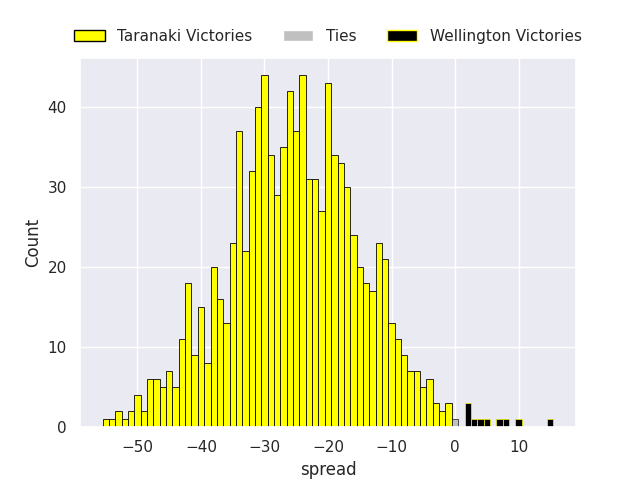

# Team Rankings

# Standings

## Current Standings

| Club             |   Played |   Wins |   Point Differential |   Losing Bonus Points |   Try Bonus Points |   Competition Points |
|:-----------------|---------:|-------:|---------------------:|----------------------:|-------------------:|---------------------:|
| North Harbour    |        9 |      6 |                  115 |                     3 |                  9 |                   36 |
| Canterbury       |        9 |      7 |                   61 |                     0 |                  7 |                   35 |
| Northland        |        9 |      6 |                  122 |                     2 |                  7 |                   33 |
| Otago            |        9 |      6 |                  100 |                     1 |                  7 |                   32 |
| Hawke's Bay      |        9 |      6 |                   73 |                     1 |                  6 |                   31 |
| Taranaki         |        9 |      5 |                   63 |                     3 |                  6 |                   29 |
| Waikato          |        9 |      5 |                   39 |                     2 |                  7 |                   29 |
| Tasman           |        9 |      5 |                   12 |                     1 |                  6 |                   27 |
| Manawatu         |        9 |      5 |                  -50 |                     1 |                  4 |                   25 |
| Bay of Plenty    |        9 |      4 |                  -59 |                     1 |                  6 |                   23 |
| Auckland         |        9 |      3 |                  -38 |                     3 |                  5 |                   20 |
| Counties Manukau |        9 |      3 |                 -105 |                     0 |                  4 |                   16 |
| Southland        |        9 |      2 |                 -112 |                     1 |                  4 |                   13 |
| Wellington       |        9 |      0 |                 -221 |                     1 |                  5 |                    6 |

## Projected Remaining Table

| Club             |   To Play |   Projected Wins |   Projected Differential |   Projected Losing Bonus Points | Projected Try Bonus Points   |   Projected Competition Points |
|:-----------------|----------:|-----------------:|-------------------------:|--------------------------------:|:-----------------------------|-------------------------------:|
| Taranaki         |         1 |            0.989 |                   25.156 |                           0.007 |                              |                          3.965 |
| Otago            |         1 |            0.941 |                   17.13  |                           0.048 |                              |                          3.824 |
| Northland        |         1 |            0.818 |                   10.15  |                           0.112 |                              |                          3.426 |
| North Harbour    |         1 |            0.752 |                    7.535 |                           0.144 |                              |                          3.222 |
| Waikato          |         1 |            0.708 |                    5.888 |                           0.162 |                              |                          3.048 |
| Canterbury       |         1 |            0.575 |                    2.199 |                           0.21  |                              |                          2.584 |
| Hawke's Bay      |         1 |            0.54  |                    1.513 |                           0.243 |                              |                          2.471 |
| Counties Manukau |         1 |            0.426 |                   -1.513 |                           0.262 |                              |                          2.034 |
| Manawatu         |         1 |            0.388 |                   -2.199 |                           0.275 |                              |                          1.901 |
| Tasman           |         1 |            0.265 |                   -5.888 |                           0.269 |                              |                          1.383 |
| Bay of Plenty    |         1 |            0.213 |                   -7.535 |                           0.263 |                              |                          1.185 |
| Southland        |         1 |            0.161 |                  -10.15  |                           0.243 |                              |                          0.929 |
| Auckland         |         1 |            0.053 |                  -17.13  |                           0.124 |                              |                          0.348 |
| Wellington       |         1 |            0.01  |                  -25.156 |                           0.033 |                              |                          0.075 |

## Projected Total Table

| Club             |   Played |   Wins |   Point Differential |   Losing Bonus Points |   Try Bonus Points |   Competition Points |
|:-----------------|---------:|-------:|---------------------:|----------------------:|-------------------:|---------------------:|
| North Harbour    |       10 |  6.752 |              122.535 |                 3.144 |                  9 |               39.222 |
| Canterbury       |       10 |  7.575 |               63.199 |                 0.21  |                  7 |               37.584 |
| Northland        |       10 |  6.818 |              132.15  |                 2.112 |                  7 |               36.426 |
| Otago            |       10 |  6.941 |              117.13  |                 1.048 |                  7 |               35.824 |
| Hawke's Bay      |       10 |  6.54  |               74.513 |                 1.243 |                  6 |               33.471 |
| Taranaki         |       10 |  5.989 |               88.156 |                 3.007 |                  6 |               32.965 |
| Waikato          |       10 |  5.708 |               44.888 |                 2.162 |                  7 |               32.048 |
| Tasman           |       10 |  5.265 |                6.112 |                 1.269 |                  6 |               28.383 |
| Manawatu         |       10 |  5.388 |              -52.199 |                 1.275 |                  4 |               26.901 |
| Bay of Plenty    |       10 |  4.213 |              -66.535 |                 1.263 |                  6 |               24.185 |
| Auckland         |       10 |  3.053 |              -55.13  |                 3.124 |                  5 |               20.348 |
| Counties Manukau |       10 |  3.426 |             -106.513 |                 0.262 |                  4 |               18.034 |
| Southland        |       10 |  2.161 |             -122.15  |                 1.243 |                  4 |               13.929 |
| Wellington       |       10 |  0.01  |             -246.156 |                 1.033 |                  5 |                6.075 |

# Completed Match Review

| Model | Percent Correct Predictions | Spread Error |
| ------ | ------ | ------ |
| Club Level | 61.4% | 15.3 |
| Player Level: Lineup | nan% | nan |
| Player Level: Minutes | nan% | nan |

# Future Predictions

## Week 10

### Otago V Auckland on 2026/10/01

Average Margin: Otago by 17.1

### Southland V Northland on 2026/10/02

Average Margin: Northland by 10.2

### Counties Manukau V Hawke's Bay on 2026/10/03

Average Margin: Hawke's Bay by 1.5

### Manawatu V Canterbury on 2026/10/03

Average Margin: Canterbury by 2.2

### Waikato V Tasman on 2026/10/03

Average Margin: Waikato by 5.9

### Bay of Plenty V North Harbour on 2026/10/04

Average Margin: North Harbour by 7.5

### Taranaki V Wellington on 2026/10/04

Average Margin: Taranaki by 25.2

