# Team Rankings

# Standings

## Current Standings

| Club             |   Played |   Wins |   Point Differential |   Losing Bonus Points |   Try Bonus Points |   Competition Points |
|:-----------------|---------:|-------:|---------------------:|----------------------:|-------------------:|---------------------:|
| Massy            |        5 |      5 |                   50 |                     0 |                  2 |                   22 |
| Carcassonne      |        5 |      4 |                   80 |                     0 |                  4 |                   20 |
| Albi             |        5 |      4 |                   31 |                     0 |                  3 |                   19 |
| Mont-de-Marsan   |        5 |      3 |                   87 |                     2 |                  3 |                   17 |
| Chambery         |        5 |      3 |                   64 |                     1 |                  2 |                   17 |
| Rouen            |        5 |      3 |                   21 |                     0 |                  2 |                   14 |
| Bourgoin-Jallieu |        5 |      2 |                   -2 |                     1 |                  2 |                   13 |
| Orleans          |        5 |      2 |                   -7 |                     2 |                  2 |                   12 |
| Suresnes         |        5 |      3 |                  -41 |                     0 |                    |                   12 |
| Périgueux        |        5 |      2 |                  -26 |                     2 |                  1 |                   11 |
| Rennes           |        5 |      1 |                  -24 |                     3 |                  2 |                    9 |
| Vienne           |        5 |      1 |                  -81 |                     1 |                    |                    5 |
| US Bressane      |        5 |      1 |                  -91 |                     0 |                    |                    4 |
| Marcq-en-Baroeul |        5 |      0 |                  -61 |                     2 |                    |                    2 |

## Projected Remaining Table

| Club             |   To Play |   Projected Wins |   Projected Differential |   Projected Losing Bonus Points | Projected Try Bonus Points   |   Projected Competition Points |
|:-----------------|----------:|-----------------:|-------------------------:|--------------------------------:|:-----------------------------|-------------------------------:|
| Chambery         |        21 |           15.422 |                  154.352 |                           3.331 |                              |                         66.277 |
| Massy            |        21 |           15.244 |                  145.737 |                           3.213 |                              |                         65.403 |
| Mont-de-Marsan   |        21 |           14.146 |                  102.57  |                           3.793 |                              |                         61.811 |
| Albi             |        21 |           13.681 |                   97.351 |                           4.044 |                              |                         60.242 |
| Périgueux        |        21 |           11.639 |                   46.358 |                           4.398 |                              |                         52.42  |
| Rouen            |        21 |           11.215 |                   24.733 |                           4.576 |                              |                         50.814 |
| Carcassonne      |        21 |           11.138 |                   32.347 |                           4.486 |                              |                         50.362 |
| Orleans          |        21 |           10.528 |                   20.082 |                           3.917 |                              |                         47.253 |
| Bourgoin-Jallieu |        21 |            9.445 |                  -24.676 |                           4.864 |                              |                         44.136 |
| Suresnes         |        21 |            8.241 |                  -47.593 |                           5.066 |                              |                         39.508 |
| US Bressane      |        21 |            7     |                  -78.728 |                           5.498 |                              |                         35.058 |
| Rennes           |        21 |            5.479 |                 -128.536 |                           5.223 |                              |                         28.527 |
| Vienne           |        21 |            5.155 |                 -167.352 |                           4.524 |                              |                         26.368 |
| Marcq-en-Baroeul |        21 |            3.894 |                 -176.645 |                           5.045 |                              |                         21.799 |

## Projected Total Table

| Club             |   Played |   Wins |   Point Differential |   Losing Bonus Points |   Try Bonus Points |   Competition Points |
|:-----------------|---------:|-------:|---------------------:|----------------------:|-------------------:|---------------------:|
| Massy            |       26 | 20.244 |              195.737 |                 3.213 |                  2 |               87.403 |
| Chambery         |       26 | 18.422 |              218.352 |                 4.331 |                  2 |               83.277 |
| Albi             |       26 | 17.681 |              128.351 |                 4.044 |                  3 |               79.242 |
| Mont-de-Marsan   |       26 | 17.146 |              189.57  |                 5.793 |                  3 |               78.811 |
| Carcassonne      |       26 | 15.138 |              112.347 |                 4.486 |                  4 |               70.362 |
| Rouen            |       26 | 14.215 |               45.733 |                 4.576 |                  2 |               64.814 |
| Périgueux        |       26 | 13.639 |               20.358 |                 6.398 |                  1 |               63.42  |
| Orleans          |       26 | 12.528 |               13.082 |                 5.917 |                  2 |               59.253 |
| Bourgoin-Jallieu |       26 | 11.445 |              -26.676 |                 5.864 |                  2 |               57.136 |
| Suresnes         |       26 | 11.241 |              -88.593 |                 5.066 |                    |               51.508 |
| US Bressane      |       26 |  8     |             -169.728 |                 5.498 |                    |               39.058 |
| Rennes           |       26 |  6.479 |             -152.536 |                 8.223 |                  2 |               37.527 |
| Vienne           |       26 |  6.155 |             -248.352 |                 5.524 |                    |               31.368 |
| Marcq-en-Baroeul |       26 |  3.894 |             -237.645 |                 7.045 |                    |               23.799 |

# Completed Match Review

| Model | Percent Correct Predictions | Spread Error |
| ------ | ------ | ------ |
| Club Level | 81.9% | 7.0 |
| Player Level: Lineup | nan% | nan |
| Player Level: Minutes | nan% | nan |

# Future Predictions

## Week 6

### US Bressane V Rennes on 2026/10/02

Average Margin: US Bressane by 5.6

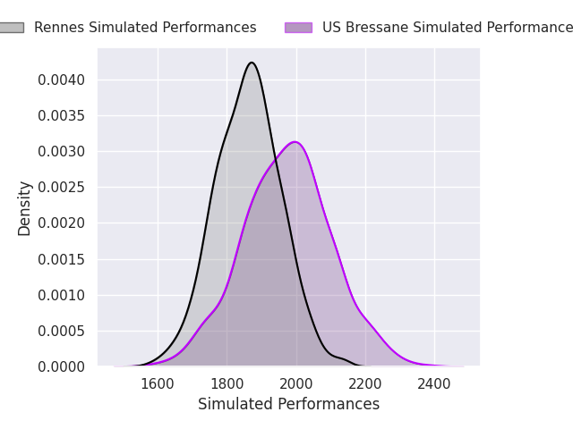
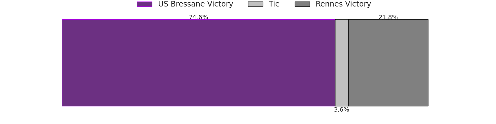
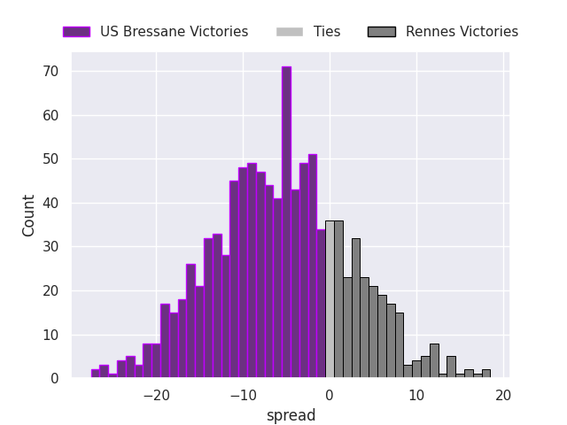

### Marcq-en-Baroeul V Vienne on 2026/10/02

Average Margin: Marcq-en-Baroeul by 0.2

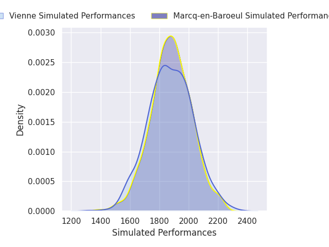

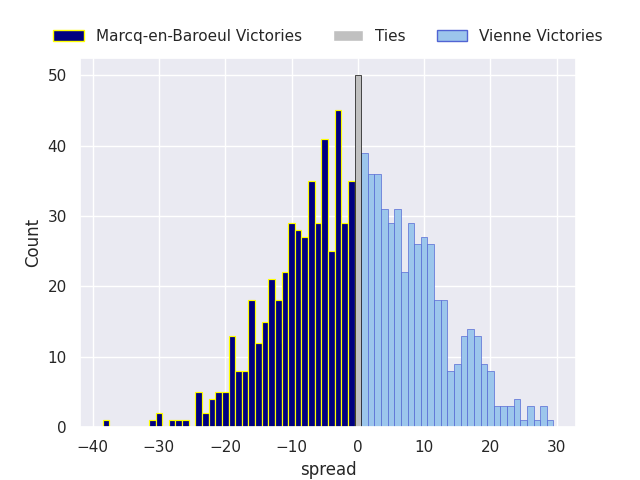

### Massy V Mont-de-Marsan on 2026/10/02

Average Margin: Massy by 7.3

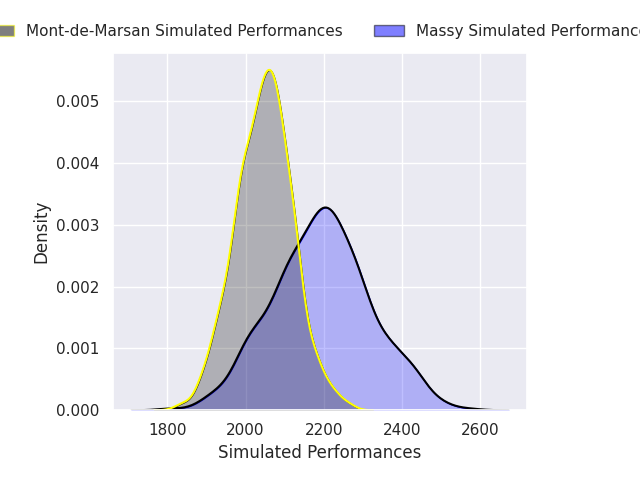
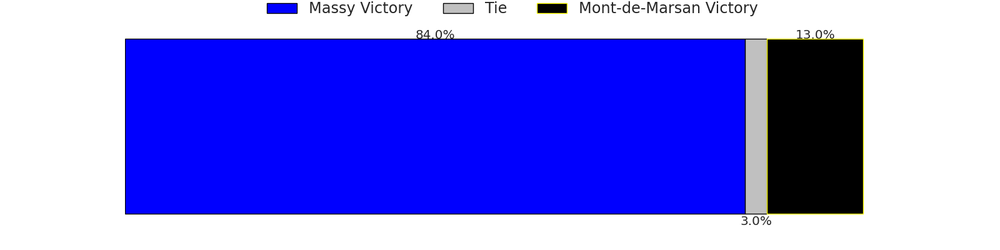
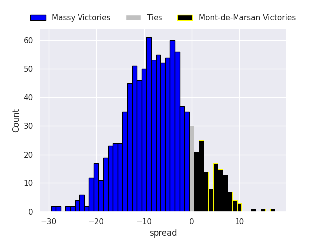

### Chambery V Carcassonne on 2026/10/02

Average Margin: Chambery by 10.8

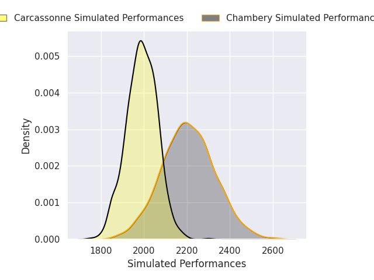
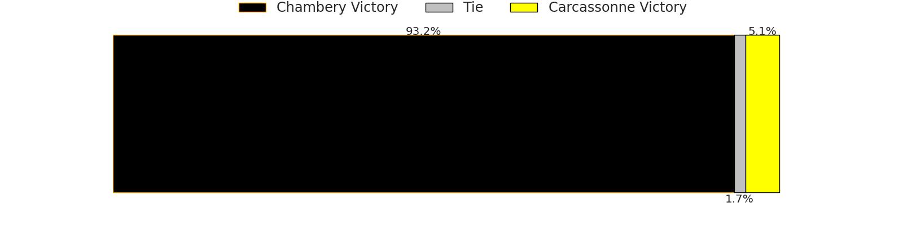
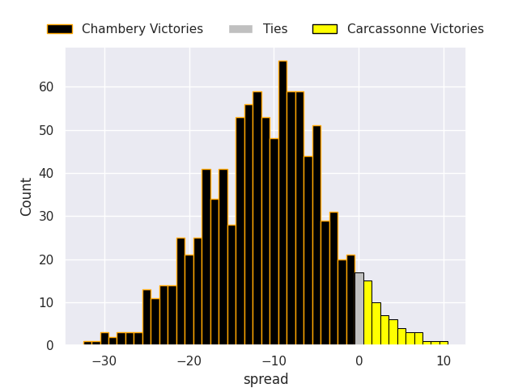

### Rouen V Albi on 2026/10/02

Average Margin: Rouen by 1.4

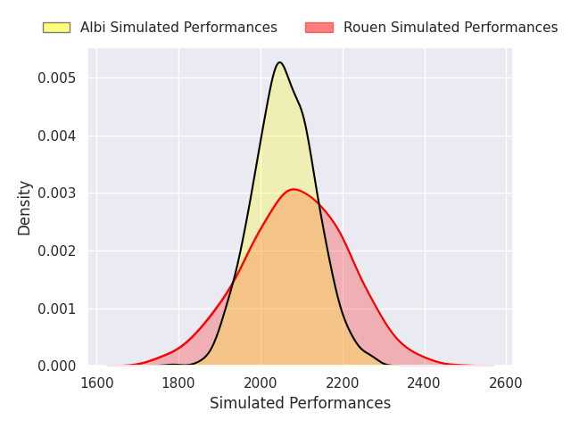

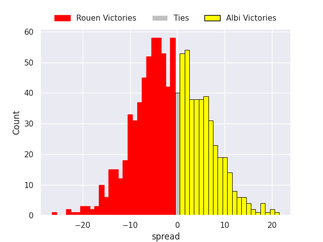

### Bourgoin-Jallieu V Suresnes on 2026/10/03

Average Margin: Bourgoin-Jallieu by 6.8

### Périgueux V Orleans on 2026/10/03

Average Margin: Périgueux by 5.5

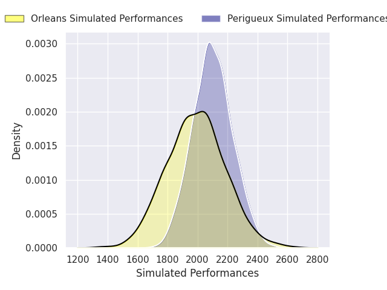

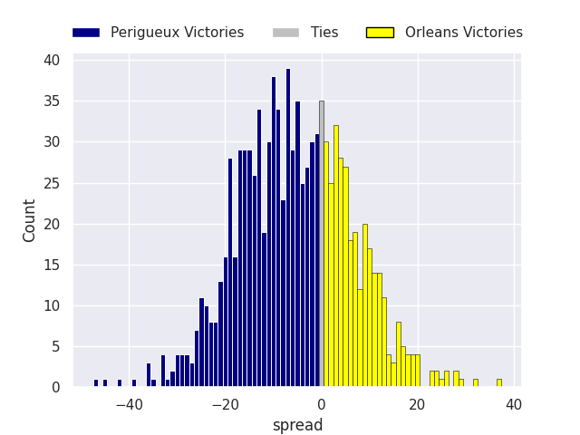

## Week 7

### Mont-de-Marsan V Chambery on 2026/10/09

Average Margin: Mont-de-Marsan by 4.5

### Orleans V Bourgoin-Jallieu on 2026/10/09

Average Margin: Orleans by 10.5

### Albi V Marcq-en-Baroeul on 2026/10/09

Average Margin: Albi by 19.2

### Carcassonne V Périgueux on 2026/10/09

Average Margin: Carcassonne by 5.7

### US Bressane V Rouen on 2026/10/09

Average Margin: Rouen by 0.6

### Rennes V Suresnes on 2026/10/10

Average Margin: Rennes by 0.8

### Vienne V Massy on 2026/10/10

Average Margin: Massy by 18.3

## Week 8

### Rouen V Rennes on 2026/10/16

Average Margin: Rouen by 11.4

### Marcq-en-Baroeul V US Bressane on 2026/10/16

Average Margin: Marcq-en-Baroeul by 0.5

### Bourgoin-Jallieu V Carcassonne on 2026/10/16

Average Margin: Bourgoin-Jallieu by 2.6

### Chambery V Vienne on 2026/10/16

Average Margin: Chambery by 15.7

### Suresnes V Orleans on 2026/10/16

Average Margin: Suresnes by 1.8

### Périgueux V Mont-de-Marsan on 2026/10/17

Average Margin: Périgueux by 3.6

### Massy V Albi on 2026/10/17

Average Margin: Massy by 6.6

## Week 9

### Mont-de-Marsan V Bourgoin-Jallieu on 2026/10/30

Average Margin: Mont-de-Marsan by 12.9

### Carcassonne V Suresnes on 2026/10/30

Average Margin: Carcassonne by 9.1

### Rouen V Marcq-en-Baroeul on 2026/10/30

Average Margin: Rouen by 14.8

### US Bressane V Massy on 2026/10/30

Average Margin: Massy by 5.3

### Albi V Chambery on 2026/10/30

Average Margin: Albi by 4.0

### Vienne V Périgueux on 2026/10/31

Average Margin: Périgueux by 12.2

### Rennes V Orleans on 2026/10/31

Average Margin: Orleans by 2.3

## Week 10

### Massy V Rouen on 2026/11/06

Average Margin: Massy by 10.2

### Orleans V Carcassonne on 2026/11/06

Average Margin: Orleans by 6.3

### Chambery V US Bressane on 2026/11/06

Average Margin: Chambery by 16.2

### Suresnes V Mont-de-Marsan on 2026/11/06

Average Margin: Mont-de-Marsan by 1.8

### Marcq-en-Baroeul V Rennes on 2026/11/07

Average Margin: Marcq-en-Baroeul by 0.5

### Périgueux V Albi on 2026/11/07

Average Margin: Périgueux by 2.3

### Bourgoin-Jallieu V Vienne on 2026/11/07

Average Margin: Bourgoin-Jallieu by 6.2

## Week 11

### Mont-de-Marsan V Orleans on 2026/11/13

Average Margin: Mont-de-Marsan by 10.2

### US Bressane V Périgueux on 2026/11/13

Average Margin: US Bressane by 0.2

### Albi V Bourgoin-Jallieu on 2026/11/13

Average Margin: Albi by 13.3

### Rouen V Chambery on 2026/11/13

Average Margin: Chambery by 0.3

### Rennes V Carcassonne on 2026/11/14

Average Margin: Carcassonne by 2.7

### Vienne V Suresnes on 2026/11/14

Average Margin: Suresnes by 8.6

### Marcq-en-Baroeul V Massy on 2026/11/14

Average Margin: Massy by 10.1

## Week 12

### Suresnes V Albi on 2026/11/20

Average Margin: Albi by 2.4

### Carcassonne V Mont-de-Marsan on 2026/11/20

Average Margin: Carcassonne by 2.5

### Chambery V Marcq-en-Baroeul on 2026/11/20

Average Margin: Chambery by 19.7

### Massy V Rennes on 2026/11/20

Average Margin: Massy by 16.3

### Bourgoin-Jallieu V US Bressane on 2026/11/21

Average Margin: Bourgoin-Jallieu by 9.4

### Orleans V Vienne on 2026/11/21

Average Margin: Orleans by 8.5

### Périgueux V Rouen on 2026/11/21

Average Margin: Périgueux by 6.4

## Week 13

### Albi V Orleans on 2026/12/04

Average Margin: Albi by 11.0

### US Bressane V Suresnes on 2026/12/04

Average Margin: US Bressane by 3.3

### Rouen V Bourgoin-Jallieu on 2026/12/04

Average Margin: Rouen by 8.8

### Massy V Chambery on 2026/12/04

Average Margin: Massy by 4.2

### Rennes V Mont-de-Marsan on 2026/12/05

Average Margin: Mont-de-Marsan by 5.3

### Vienne V Carcassonne on 2026/12/05

Average Margin: Carcassonne by 11.2

### Marcq-en-Baroeul V Périgueux on 2026/12/05

Average Margin: Périgueux by 4.7

## Week 14

### Chambery V Rennes on 2026/12/11

Average Margin: Chambery by 16.5

### Rouen V Suresnes on 2026/12/11

Average Margin: Rouen by 8.2

### Albi V Carcassonne on 2026/12/11

Average Margin: Albi by 9.2

### US Bressane V Orleans on 2026/12/11

Average Margin: US Bressane by 1.3

### Massy V Périgueux on 2026/12/11

Average Margin: Massy by 10.5

### Vienne V Mont-de-Marsan on 2026/12/12

Average Margin: Mont-de-Marsan by 13.9

### Marcq-en-Baroeul V Bourgoin-Jallieu on 2026/12/12

Average Margin: Bourgoin-Jallieu by 1.7

## Week 15

### Suresnes V Marcq-en-Baroeul on 2027/01/08

Average Margin: Suresnes by 11.2

### Mont-de-Marsan V Albi on 2027/01/08

Average Margin: Mont-de-Marsan by 6.1

### Orleans V Rouen on 2027/01/08

Average Margin: Orleans by 5.7

### Carcassonne V US Bressane on 2027/01/08

Average Margin: Carcassonne by 11.8

### Périgueux V Chambery on 2027/01/09

Average Margin: Périgueux by 0.8

### Rennes V Vienne on 2027/01/09

Average Margin: Vienne by 1.1

### Bourgoin-Jallieu V Massy on 2027/01/09

Average Margin: Massy by 1.0

## Week 16

### Albi V Vienne on 2027/01/15

Average Margin: Albi by 10.3

### Rouen V Carcassonne on 2027/01/15

Average Margin: Rouen by 4.5

### Chambery V Bourgoin-Jallieu on 2027/01/15

Average Margin: Chambery by 13.5

### Massy V Suresnes on 2027/01/15

Average Margin: Massy by 13.3

### US Bressane V Mont-de-Marsan on 2027/01/15

Average Margin: Mont-de-Marsan by 3.3

### Périgueux V Rennes on 2027/01/16

Average Margin: Périgueux by 12.1

### Marcq-en-Baroeul V Orleans on 2027/01/16

Average Margin: Orleans by 3.8

## Week 17

### Mont-de-Marsan V Rouen on 2027/01/22

Average Margin: Mont-de-Marsan by 9.6

### Orleans V Massy on 2027/01/22

Average Margin: Orleans by 1.3

### Suresnes V Chambery on 2027/01/22

Average Margin: Chambery by 3.5

### Carcassonne V Marcq-en-Baroeul on 2027/01/22

Average Margin: Carcassonne by 15.1

### Vienne V US Bressane on 2027/01/23

Average Margin: US Bressane by 4.3

### Bourgoin-Jallieu V Périgueux on 2027/01/23

Average Margin: Bourgoin-Jallieu by 3.5

### Rennes V Albi on 2027/01/23

Average Margin: Albi by 6.0

## Week 18

### US Bressane V Albi on 2027/01/29

Average Margin: Albi by 3.8

### Rouen V Vienne on 2027/01/29

Average Margin: Rouen by 6.2

### Chambery V Orleans on 2027/01/29

Average Margin: Chambery by 12.0

### Massy V Carcassonne on 2027/01/29

Average Margin: Massy by 9.8

### Marcq-en-Baroeul V Mont-de-Marsan on 2027/01/30

Average Margin: Mont-de-Marsan by 7.8

### Périgueux V Suresnes on 2027/01/30

Average Margin: Périgueux by 9.4

### Bourgoin-Jallieu V Rennes on 2027/01/30

Average Margin: Bourgoin-Jallieu by 9.1

## Week 19

### Suresnes V Bourgoin-Jallieu on 2027/02/12

Average Margin: Suresnes by 5.4

### Albi V Rouen on 2027/02/12

Average Margin: Albi by 9.0

### Mont-de-Marsan V Massy on 2027/02/12

Average Margin: Mont-de-Marsan by 4.9

### Carcassonne V Chambery on 2027/02/12

Average Margin: Carcassonne by 0.4

### Orleans V Périgueux on 2027/02/12

Average Margin: Orleans by 5.7

### Vienne V Marcq-en-Baroeul on 2027/02/13

Average Margin: Marcq-en-Baroeul by 1.0

### Rennes V US Bressane on 2027/02/13

Average Margin: Rennes by 3.9

## Week 20

### Suresnes V Rennes on 2027/02/19

Average Margin: Suresnes by 7.0

### Chambery V Mont-de-Marsan on 2027/02/19

Average Margin: Chambery by 7.2

### Rouen V US Bressane on 2027/02/19

Average Margin: Rouen by 10.9

### Massy V Vienne on 2027/02/20

Average Margin: Massy by 10.1

### Bourgoin-Jallieu V Orleans on 2027/02/20

Average Margin: Bourgoin-Jallieu by 4.6

### Marcq-en-Baroeul V Albi on 2027/02/20

Average Margin: Albi by 8.1

### Périgueux V Carcassonne on 2027/02/20

Average Margin: Périgueux by 6.0

## Week 21

### US Bressane V Marcq-en-Baroeul on 2027/02/26

Average Margin: US Bressane by 8.7

### Mont-de-Marsan V Périgueux on 2027/02/26

Average Margin: Mont-de-Marsan by 9.8

### Albi V Massy on 2027/02/26

Average Margin: Albi by 4.7

### Orleans V Suresnes on 2027/02/26

Average Margin: Orleans by 9.0

### Carcassonne V Bourgoin-Jallieu on 2027/02/26

Average Margin: Carcassonne by 9.2

### Rennes V Rouen on 2027/02/27

Average Margin: Rouen by 2.0

### Vienne V Chambery on 2027/02/27

Average Margin: Chambery by 14.8

## Week 22

### Suresnes V Carcassonne on 2027/03/05

Average Margin: Suresnes by 1.4

### Chambery V Albi on 2027/03/05

Average Margin: Chambery by 7.2

### Orleans V Rennes on 2027/03/05

Average Margin: Orleans by 10.0

### Marcq-en-Baroeul V Rouen on 2027/03/05

Average Margin: Rouen by 4.8

### Périgueux V Vienne on 2027/03/06

Average Margin: Périgueux by 6.7

### Bourgoin-Jallieu V Mont-de-Marsan on 2027/03/06

Average Margin: Bourgoin-Jallieu by 0.5

### Massy V US Bressane on 2027/03/06

Average Margin: Massy by 15.2

## Week 23

### Albi V Périgueux on 2027/03/19

Average Margin: Albi by 8.9

### US Bressane V Chambery on 2027/03/19

Average Margin: Chambery by 5.3

### Rouen V Massy on 2027/03/19

Average Margin: Rouen by 0.3

### Mont-de-Marsan V Suresnes on 2027/03/19

Average Margin: Mont-de-Marsan by 12.4

### Carcassonne V Orleans on 2027/03/19

Average Margin: Carcassonne by 7.5

### Vienne V Bourgoin-Jallieu on 2027/03/20

Average Margin: Bourgoin-Jallieu by 6.0

### Rennes V Marcq-en-Baroeul on 2027/03/20

Average Margin: Rennes by 6.9

## Week 24

### Carcassonne V Rennes on 2027/03/26

Average Margin: Carcassonne by 11.5

### Chambery V Rouen on 2027/03/26

Average Margin: Chambery by 10.1

### Orleans V Mont-de-Marsan on 2027/03/26

Average Margin: Orleans by 2.3

### Massy V Marcq-en-Baroeul on 2027/03/26

Average Margin: Massy by 18.6

### Suresnes V Vienne on 2027/03/27

Average Margin: Suresnes by 1.9

### Périgueux V US Bressane on 2027/03/27

Average Margin: Périgueux by 11.7

### Bourgoin-Jallieu V Albi on 2027/03/27

Average Margin: Albi by 0.2

## Week 25

### Marcq-en-Baroeul V Chambery on 2027/04/09

Average Margin: Chambery by 9.4

### US Bressane V Bourgoin-Jallieu on 2027/04/09

Average Margin: US Bressane by 3.2

### Mont-de-Marsan V Carcassonne on 2027/04/09

Average Margin: Mont-de-Marsan by 9.2

### Rouen V Périgueux on 2027/04/09

Average Margin: Rouen by 5.4

### Albi V Suresnes on 2027/04/09

Average Margin: Albi by 12.3

### Rennes V Massy on 2027/04/10

Average Margin: Massy by 6.2

### Vienne V Orleans on 2027/04/10

Average Margin: Orleans by 6.9

## Week 26

### Chambery V Massy on 2027/04/17

Average Margin: Chambery by 5.9

### Périgueux V Marcq-en-Baroeul on 2027/04/17

Average Margin: Périgueux by 14.6

### Bourgoin-Jallieu V Rouen on 2027/04/17

Average Margin: Bourgoin-Jallieu by 3.2

### Carcassonne V Vienne on 2027/04/17

Average Margin: Carcassonne by 5.5

### Suresnes V US Bressane on 2027/04/17

Average Margin: Suresnes by 7.5

### Orleans V Albi on 2027/04/17

Average Margin: Orleans by 1.5

### Mont-de-Marsan V Rennes on 2027/04/17

Average Margin: Mont-de-Marsan by 14.5

