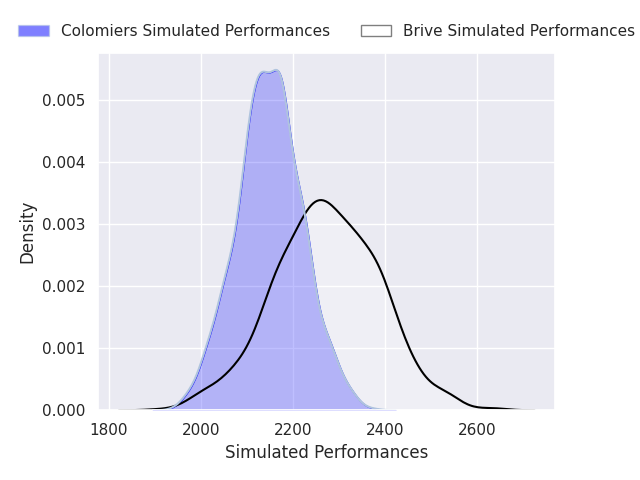
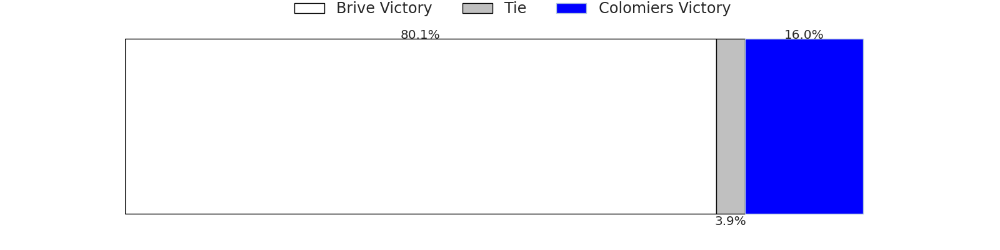
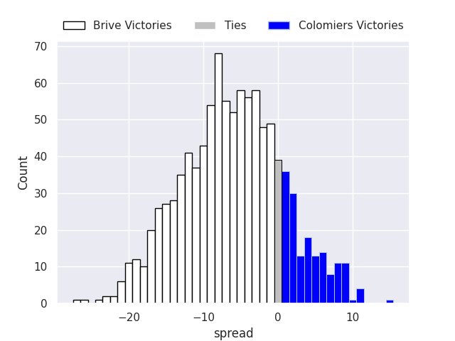

# Team Rankings

# Standings

## Current Standings

| Club                       |   Played |   Wins |   Point Differential |   Losing Bonus Points | Try Bonus Points   |   Competition Points |
|:---------------------------|---------:|-------:|---------------------:|----------------------:|:-------------------|---------------------:|
| Oyonnax                    |        4 |      4 |                   69 |                     0 |                    |                   16 |
| Provence Rugby             |        4 |      4 |                   48 |                     0 |                    |                   16 |
| Brive                      |        4 |      4 |                   47 |                     0 |                    |                   16 |
| Biarritz Olympique         |        4 |      3 |                   29 |                     0 |                    |                   12 |
| US Montauban               |        4 |      3 |                   -2 |                     0 |                    |                   12 |
| Grenoble                   |        4 |      2 |                   19 |                     2 |                    |                   10 |
| Soyaux-Angouleme           |        4 |      2 |                   28 |                     1 |                    |                    9 |
| Narbonne                   |        4 |      2 |                  -36 |                     1 |                    |                    9 |
| Dax                        |        4 |      2 |                  -30 |                     0 |                    |                    8 |
| Valence Romans Drome Rugby |        4 |      1 |                    4 |                     3 |                    |                    7 |
| Colomiers                  |        4 |      1 |                   10 |                     1 |                    |                    5 |
| Nice                       |        4 |      1 |                  -19 |                     1 |                    |                    5 |
| Aurillac                   |        4 |      1 |                  -30 |                     1 |                    |                    5 |
| Agen                       |        4 |      1 |                  -53 |                     1 |                    |                    5 |
| USON Nevers                |        4 |      0 |                   -9 |                     4 |                    |                    4 |
| Beziers                    |        4 |      1 |                  -75 |                     0 |                    |                    4 |

## Projected Remaining Table

| Club                       |   To Play |   Projected Wins |   Projected Differential |   Projected Losing Bonus Points | Projected Try Bonus Points   |   Projected Competition Points |
|:---------------------------|----------:|-----------------:|-------------------------:|--------------------------------:|:-----------------------------|-------------------------------:|
| Brive                      |        16 |           10.994 |                   99.131 |                           2.913 |                              |                         47.989 |
| Provence Rugby             |        15 |           10.899 |                   99.982 |                           2.205 |                              |                         46.659 |
| Oyonnax                    |        15 |           10.678 |                  111.94  |                           2.56  |                              |                         46.066 |
| Colomiers                  |        16 |            9.893 |                   56.384 |                           3.303 |                              |                         43.945 |
| Valence Romans Drome Rugby |        15 |            8.183 |                   26.854 |                           3.456 |                              |                         37.256 |
| Biarritz Olympique         |        15 |            7.835 |                   15.033 |                           3.313 |                              |                         35.679 |
| Narbonne                   |        15 |            7.414 |                    2.936 |                           3.46  |                              |                         34.19  |
| Agen                       |        15 |            7.204 |                   -0.312 |                           3.511 |                              |                         33.377 |
| Dax                        |        15 |            7.1   |                   -5.972 |                           3.367 |                              |                         32.781 |
| Grenoble                   |        15 |            6.234 |                  -26.069 |                           3.725 |                              |                         29.701 |
| Nice                       |        15 |            6.171 |                  -32.105 |                           3.636 |                              |                         29.448 |
| Soyaux-Angouleme           |        15 |            6.077 |                  -28.991 |                           3.898 |                              |                         29.34  |
| USON Nevers                |        15 |            5.12  |                  -65.674 |                           3.572 |                              |                         25.028 |
| Aurillac                   |        15 |            4.938 |                  -63.773 |                           3.782 |                              |                         24.55  |
| Beziers                    |        15 |            4.737 |                  -71.857 |                           3.781 |                              |                         23.711 |
| US Montauban               |        15 |            3.479 |                 -117.507 |                           3.464 |                              |                         18.226 |

## Projected Total Table

| Club                       |   Played |   Wins |   Point Differential |   Losing Bonus Points | Try Bonus Points   |   Competition Points |
|:---------------------------|---------:|-------:|---------------------:|----------------------:|:-------------------|---------------------:|
| Brive                      |       20 | 14.994 |              146.131 |                 2.913 |                    |               63.989 |
| Provence Rugby             |       19 | 14.899 |              147.982 |                 2.205 |                    |               62.659 |
| Oyonnax                    |       19 | 14.678 |              180.94  |                 2.56  |                    |               62.066 |
| Colomiers                  |       20 | 10.893 |               66.384 |                 4.303 |                    |               48.945 |
| Biarritz Olympique         |       19 | 10.835 |               44.033 |                 3.313 |                    |               47.679 |
| Valence Romans Drome Rugby |       19 |  9.183 |               30.854 |                 6.456 |                    |               44.256 |
| Narbonne                   |       19 |  9.414 |              -33.064 |                 4.46  |                    |               43.19  |
| Dax                        |       19 |  9.1   |              -35.972 |                 3.367 |                    |               40.781 |
| Grenoble                   |       19 |  8.234 |               -7.069 |                 5.725 |                    |               39.701 |
| Agen                       |       19 |  8.204 |              -53.312 |                 4.511 |                    |               38.377 |
| Soyaux-Angouleme           |       19 |  8.077 |               -0.991 |                 4.898 |                    |               38.34  |
| Nice                       |       19 |  7.171 |              -51.105 |                 4.636 |                    |               34.448 |
| US Montauban               |       19 |  6.479 |             -119.507 |                 3.464 |                    |               30.226 |
| Aurillac                   |       19 |  5.938 |              -93.773 |                 4.782 |                    |               29.55  |
| USON Nevers                |       19 |  5.12  |              -74.674 |                 7.572 |                    |               29.028 |
| Beziers                    |       19 |  5.737 |             -146.857 |                 3.781 |                    |               27.711 |

# Completed Match Review

| Model | Percent Correct Predictions | Spread Error |
| ------ | ------ | ------ |
| Club Level | 77.1% | 7.6 |
| Player Level: Lineup | nan% | nan |
| Player Level: Minutes | nan% | nan |

# Future Predictions

## Week 5

### Brive V Colomiers on 2026/09/24

Average Margin: Brive by 6.2

## Week 6

### Soyaux-Angouleme V Oyonnax on 2027/01/08

Average Margin: Oyonnax by 2.3

### Provence Rugby V Valence Romans Drome Rugby on 2027/01/08

Average Margin: Provence Rugby by 10.2

### Narbonne V US Montauban on 2027/01/08

Average Margin: Narbonne by 12.8

### Biarritz Olympique V Aurillac on 2027/01/08

Average Margin: Biarritz Olympique by 10.9

### Colomiers V Brive on 2027/01/08

Average Margin: Colomiers by 4.8

### Agen V USON Nevers on 2027/01/08

Average Margin: Agen by 10.4

### Nice V Dax on 2027/01/08

Average Margin: Nice by 4.1

### Grenoble V Beziers on 2027/01/08

Average Margin: Grenoble by 8.4

## Week 7

### Beziers V Colomiers on 2027/01/15

Average Margin: Colomiers by 1.1

### Oyonnax V Narbonne on 2027/01/15

Average Margin: Oyonnax by 14.6

### Dax V Soyaux-Angouleme on 2027/01/15

Average Margin: Dax by 7.9

### US Montauban V Biarritz Olympique on 2027/01/15

Average Margin: Biarritz Olympique by 1.7

### Aurillac V Provence Rugby on 2027/01/15

Average Margin: Provence Rugby by 3.2

### Brive V Agen on 2027/01/15

Average Margin: Brive by 12.6

### Valence Romans Drome Rugby V Grenoble on 2027/01/15

Average Margin: Valence Romans Drome Rugby by 10.3

### USON Nevers V Nice on 2027/01/15

Average Margin: USON Nevers by 2.4

## Week 8

### Soyaux-Angouleme V Valence Romans Drome Rugby on 2027/01/22

Average Margin: Soyaux-Angouleme by 2.5

### Agen V US Montauban on 2027/01/22

Average Margin: Agen by 13.3

### Biarritz Olympique V USON Nevers on 2027/01/22

Average Margin: Biarritz Olympique by 11.7

### Provence Rugby V Grenoble on 2027/01/22

Average Margin: Provence Rugby by 14.2

### Narbonne V Dax on 2027/01/22

Average Margin: Narbonne by 5.4

### Nice V Brive on 2027/01/22

Average Margin: Brive by 1.4

### Colomiers V Aurillac on 2027/01/22

Average Margin: Colomiers by 14.2

### Oyonnax V Beziers on 2027/01/22

Average Margin: Oyonnax by 19.1

## Week 9

### USON Nevers V Colomiers on 2027/01/29

Average Margin: Colomiers by 1.8

### US Montauban V Soyaux-Angouleme on 2027/01/29

Average Margin: US Montauban by 0.8

### Grenoble V Nice on 2027/01/29

Average Margin: Grenoble by 4.5

### Brive V Narbonne on 2027/01/29

Average Margin: Brive by 11.7

### Aurillac V Oyonnax on 2027/01/29

Average Margin: Oyonnax by 3.2

### Dax V Agen on 2027/01/29

Average Margin: Dax by 6.4

### Valence Romans Drome Rugby V Biarritz Olympique on 2027/01/29

Average Margin: Valence Romans Drome Rugby by 8.2

### Beziers V Provence Rugby on 2027/01/29

Average Margin: Provence Rugby by 4.2

## Week 10

### Grenoble V Brive on 2027/02/12

Average Margin: Brive by 0.8

### Provence Rugby V Dax on 2027/02/12

Average Margin: Provence Rugby by 12.5

### Aurillac V Beziers on 2027/02/12

Average Margin: Aurillac by 7.1

### Narbonne V Biarritz Olympique on 2027/02/12

Average Margin: Narbonne by 5.3

### Soyaux-Angouleme V USON Nevers on 2027/02/12

Average Margin: Soyaux-Angouleme by 9.6

### Nice V Agen on 2027/02/12

Average Margin: Nice by 4.1

### Oyonnax V US Montauban on 2027/02/12

Average Margin: Oyonnax by 21.7

### Colomiers V Valence Romans Drome Rugby on 2027/02/12

Average Margin: Colomiers by 7.7

## Week 11

### US Montauban V Aurillac on 2027/02/19

Average Margin: US Montauban by 3.2

### Valence Romans Drome Rugby V Nice on 2027/02/19

Average Margin: Valence Romans Drome Rugby by 9.5

### Beziers V Soyaux-Angouleme on 2027/02/19

Average Margin: Beziers by 4.2

### Brive V Provence Rugby on 2027/02/19

Average Margin: Brive by 5.9

### Biarritz Olympique V Oyonnax on 2027/02/19

Average Margin: Oyonnax by 0.2

### USON Nevers V Grenoble on 2027/02/19

Average Margin: USON Nevers by 3.6

### Agen V Narbonne on 2027/02/19

Average Margin: Agen by 5.8

### Dax V Colomiers on 2027/02/19

Average Margin: Dax by 2.9

## Week 12

### Grenoble V US Montauban on 2027/02/26

Average Margin: Grenoble by 11.2

### Brive V Beziers on 2027/02/26

Average Margin: Brive by 15.9

### Oyonnax V Dax on 2027/02/26

Average Margin: Oyonnax by 14.7

### Narbonne V Valence Romans Drome Rugby on 2027/02/26

Average Margin: Narbonne by 4.1

### Nice V Biarritz Olympique on 2027/02/26

Average Margin: Nice by 3.3

### Provence Rugby V USON Nevers on 2027/02/26

Average Margin: Provence Rugby by 17.0

### Colomiers V Soyaux-Angouleme on 2027/02/26

Average Margin: Colomiers by 11.6

### Aurillac V Agen on 2027/02/26

Average Margin: Aurillac by 4.1

## Week 13

### Agen V Colomiers on 2027/03/05

Average Margin: Agen by 2.9

### Dax V Aurillac on 2027/03/05

Average Margin: Dax by 10.1

### US Montauban V Provence Rugby on 2027/03/05

Average Margin: Provence Rugby by 6.6

### Soyaux-Angouleme V Narbonne on 2027/03/05

Average Margin: Soyaux-Angouleme by 4.6

### Beziers V Nice on 2027/03/05

Average Margin: Beziers by 3.2

### Valence Romans Drome Rugby V Brive on 2027/03/05

Average Margin: Valence Romans Drome Rugby by 3.2

### USON Nevers V Oyonnax on 2027/03/05

Average Margin: Oyonnax by 4.3

### Biarritz Olympique V Grenoble on 2027/03/05

Average Margin: Biarritz Olympique by 8.3

## Week 14

### Nice V US Montauban on 2027/03/26

Average Margin: Nice by 10.9

### Dax V Beziers on 2027/03/26

Average Margin: Dax by 10.0

### Colomiers V Oyonnax on 2027/03/26

Average Margin: Colomiers by 3.2

### Grenoble V Narbonne on 2027/03/26

Average Margin: Grenoble by 4.0

### Brive V USON Nevers on 2027/03/26

Average Margin: Brive by 16.7

### Biarritz Olympique V Agen on 2027/03/26

Average Margin: Biarritz Olympique by 6.7

### Provence Rugby V Soyaux-Angouleme on 2027/03/26

Average Margin: Provence Rugby by 13.5

### Aurillac V Valence Romans Drome Rugby on 2027/03/26

Average Margin: Aurillac by 1.2

## Week 15

### Narbonne V Provence Rugby on 2027/04/02

Average Margin: Provence Rugby by 0.3

### Oyonnax V Nice on 2027/04/02

Average Margin: Oyonnax by 15.4

### Beziers V US Montauban on 2027/04/02

Average Margin: Beziers by 9.0

### Valence Romans Drome Rugby V Dax on 2027/04/02

Average Margin: Valence Romans Drome Rugby by 9.0

### USON Nevers V Aurillac on 2027/04/02

Average Margin: USON Nevers by 6.3

### Colomiers V Biarritz Olympique on 2027/04/02

Average Margin: Colomiers by 9.7

### Agen V Grenoble on 2027/04/02

Average Margin: Agen by 7.6

### Soyaux-Angouleme V Brive on 2027/04/02

Average Margin: Brive by 0.1

## Week 16

### US Montauban V USON Nevers on 2027/04/09

Average Margin: US Montauban by 3.5

### Biarritz Olympique V Beziers on 2027/04/09

Average Margin: Biarritz Olympique by 10.2

### Brive V Oyonnax on 2027/04/09

Average Margin: Brive by 4.9

### Agen V Valence Romans Drome Rugby on 2027/04/09

Average Margin: Agen by 3.7

### Grenoble V Dax on 2027/04/09

Average Margin: Grenoble by 3.9

### Narbonne V Aurillac on 2027/04/09

Average Margin: Narbonne by 9.7

### Nice V Soyaux-Angouleme on 2027/04/09

Average Margin: Nice by 5.5

### Provence Rugby V Colomiers on 2027/04/09

Average Margin: Provence Rugby by 8.6

## Week 17

### Soyaux-Angouleme V Biarritz Olympique on 2027/04/16

Average Margin: Soyaux-Angouleme by 4.6

### Aurillac V Grenoble on 2027/04/16

Average Margin: Aurillac by 5.0

### Dax V Brive on 2027/04/16

Average Margin: Dax by 1.4

### Beziers V Agen on 2027/04/16

Average Margin: Beziers by 2.7

### Colomiers V Nice on 2027/04/16

Average Margin: Colomiers by 10.5

### USON Nevers V Narbonne on 2027/04/16

Average Margin: USON Nevers by 1.7

### Oyonnax V Provence Rugby on 2027/04/16

Average Margin: Oyonnax by 8.8

### Valence Romans Drome Rugby V US Montauban on 2027/04/16

Average Margin: Valence Romans Drome Rugby by 15.0

## Week 18

### Provence Rugby V Nice on 2027/04/23

Average Margin: Provence Rugby by 12.5

### Biarritz Olympique V Dax on 2027/04/23

Average Margin: Biarritz Olympique by 6.5

### Narbonne V Beziers on 2027/04/23

Average Margin: Narbonne by 9.5

### Grenoble V Oyonnax on 2027/04/23

Average Margin: Oyonnax by 2.8

### US Montauban V Colomiers on 2027/04/23

Average Margin: Colomiers by 3.6

### Brive V Aurillac on 2027/04/23

Average Margin: Brive by 15.9

### USON Nevers V Valence Romans Drome Rugby on 2027/04/23

Average Margin: USON Nevers by 0.4

### Agen V Soyaux-Angouleme on 2027/04/23

Average Margin: Agen by 7.6

## Week 19

### Colomiers V Grenoble on 2027/05/07

Average Margin: Colomiers by 11.2

### Provence Rugby V Biarritz Olympique on 2027/05/07

Average Margin: Provence Rugby by 11.5

### Nice V Narbonne on 2027/05/07

Average Margin: Nice by 3.7

### Soyaux-Angouleme V Aurillac on 2027/05/07

Average Margin: Soyaux-Angouleme by 8.9

### Beziers V Valence Romans Drome Rugby on 2027/05/07

Average Margin: Beziers by 0.4

### Oyonnax V Agen on 2027/05/07

Average Margin: Oyonnax by 14.8

### Brive V US Montauban on 2027/05/07

Average Margin: Brive by 18.4

### Dax V USON Nevers on 2027/05/07

Average Margin: Dax by 10.8

## Week 20

### Grenoble V Soyaux-Angouleme on 2027/05/14

Average Margin: Grenoble by 5.6

### USON Nevers V Beziers on 2027/05/14

Average Margin: USON Nevers by 5.8

### Aurillac V Nice on 2027/05/14

Average Margin: Aurillac by 4.3

### Agen V Provence Rugby on 2027/05/14

Average Margin: Provence Rugby by 0.2

### Biarritz Olympique V Brive on 2027/05/14

Average Margin: Biarritz Olympique by 1.9

### Narbonne V Colomiers on 2027/05/14

Average Margin: Narbonne by 2.6

### Valence Romans Drome Rugby V Oyonnax on 2027/05/14

Average Margin: Valence Romans Drome Rugby by 1.9

### US Montauban V Dax on 2027/05/14

Average Margin: Dax by 0.7

