# Team Rankings

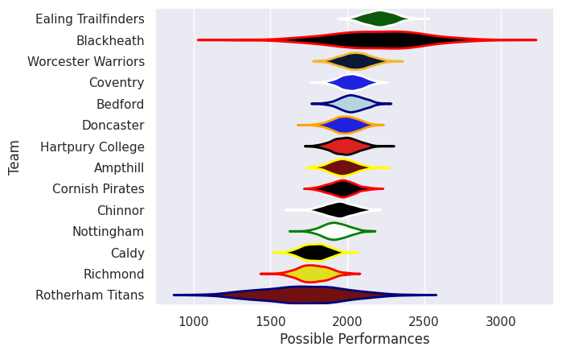
# Standings

## Current Standings

| Club                |   Played |   Wins |   Point Differential |   Losing Bonus Points | Try Bonus Points   |   Competition Points |
|:--------------------|---------:|-------:|---------------------:|----------------------:|:-------------------|---------------------:|
| Worcester Warriors  |        1 |      1 |                   35 |                     0 |                    |                    4 |
| Cornish Pirates     |        1 |      1 |                   26 |                     0 |                    |                    4 |
| Ealing Trailfinders |        1 |      1 |                   17 |                     0 |                    |                    4 |
| Nottingham          |        1 |      1 |                    7 |                     0 |                    |                    4 |
| Rotherham Titans    |        1 |      1 |                    3 |                     0 |                    |                    4 |
| Ampthill            |        1 |      1 |                    2 |                     0 |                    |                    4 |
| Hartpury College    |        1 |      1 |                    2 |                     0 |                    |                    4 |
| Caldy               |        1 |      0 |                   -2 |                     1 |                    |                    1 |
| Richmond            |        1 |      0 |                   -2 |                     1 |                    |                    1 |
| Coventry            |        1 |      0 |                   -3 |                     1 |                    |                    1 |
| Blackheath          |        1 |      0 |                   -7 |                     1 |                    |                    1 |
| Chinnor             |        1 |      0 |                  -17 |                     0 |                    |                    0 |
| Doncaster           |        1 |      0 |                  -26 |                     0 |                    |                    0 |
| Bedford             |        1 |      0 |                  -35 |                     0 |                    |                    0 |

## Projected Remaining Table

| Club                |   To Play |   Projected Wins |   Projected Differential |   Projected Losing Bonus Points | Projected Try Bonus Points   |   Projected Competition Points |
|:--------------------|----------:|-----------------:|-------------------------:|--------------------------------:|:-----------------------------|-------------------------------:|
| Ealing Trailfinders |         1 |            0.999 |                   26.845 |                           0.001 |                              |                          3.997 |
| Coventry            |         1 |            0.801 |                    7.083 |                           0.142 |                              |                          3.408 |
| Bedford             |         1 |            0.782 |                    6.871 |                           0.142 |                              |                          3.34  |
| Worcester Warriors  |         1 |            0.743 |                    9.699 |                           0.12  |                              |                          3.14  |
| Ampthill            |         1 |            0.716 |                    4.987 |                           0.186 |                              |                          3.13  |
| Blackheath          |         1 |            0.717 |                   14.912 |                           0.073 |                              |                          2.969 |
| Doncaster           |         1 |            0.662 |                    3.77  |                           0.229 |                              |                          2.951 |
| Hartpury College    |         1 |            0.301 |                   -3.77  |                           0.347 |                              |                          1.625 |
| Nottingham          |         1 |            0.244 |                   -4.987 |                           0.343 |                              |                          1.399 |
| Caldy               |         1 |            0.269 |                  -14.912 |                           0.108 |                              |                          1.212 |
| Rotherham Titans    |         1 |            0.233 |                   -9.699 |                           0.183 |                              |                          1.163 |
| Chinnor             |         1 |            0.183 |                   -6.871 |                           0.328 |                              |                          1.13  |
| Cornish Pirates     |         1 |            0.168 |                   -7.083 |                           0.329 |                              |                          1.063 |
| Richmond            |         1 |            0.001 |                  -26.845 |                           0.019 |                              |                          0.023 |

## Projected Total Table

| Club                |   Played |   Wins |   Point Differential |   Losing Bonus Points | Try Bonus Points   |   Competition Points |
|:--------------------|---------:|-------:|---------------------:|----------------------:|:-------------------|---------------------:|
| Ealing Trailfinders |        2 |  1.999 |               43.845 |                 0.001 |                    |                7.997 |
| Worcester Warriors  |        2 |  1.743 |               44.699 |                 0.12  |                    |                7.14  |
| Ampthill            |        2 |  1.716 |                6.987 |                 0.186 |                    |                7.13  |
| Hartpury College    |        2 |  1.301 |               -1.77  |                 0.347 |                    |                5.625 |
| Nottingham          |        2 |  1.244 |                2.013 |                 0.343 |                    |                5.399 |
| Rotherham Titans    |        2 |  1.233 |               -6.699 |                 0.183 |                    |                5.163 |
| Cornish Pirates     |        2 |  1.168 |               18.917 |                 0.329 |                    |                5.063 |
| Coventry            |        2 |  0.801 |                4.083 |                 1.142 |                    |                4.408 |
| Blackheath          |        2 |  0.717 |                7.912 |                 1.073 |                    |                3.969 |
| Bedford             |        2 |  0.782 |              -28.129 |                 0.142 |                    |                3.34  |
| Doncaster           |        2 |  0.662 |              -22.23  |                 0.229 |                    |                2.951 |
| Caldy               |        2 |  0.269 |              -16.912 |                 1.108 |                    |                2.212 |
| Chinnor             |        2 |  0.183 |              -23.871 |                 0.328 |                    |                1.13  |
| Richmond            |        2 |  0.001 |              -28.845 |                 1.019 |                    |                1.023 |

# Completed Match Review

| Model | Percent Correct Predictions | Spread Error |
| ------ | ------ | ------ |
| Club Level | 64.3% | 12.1 |
| Player Level: Lineup | nan% | nan |
| Player Level: Minutes | nan% | nan |

# Future Predictions

## Week 2

### Blackheath V Caldy on 2026/09/25

Average Margin: Blackheath by 14.9

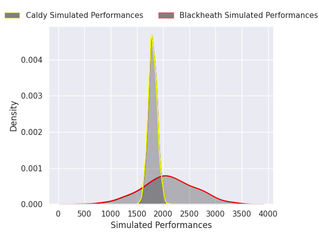

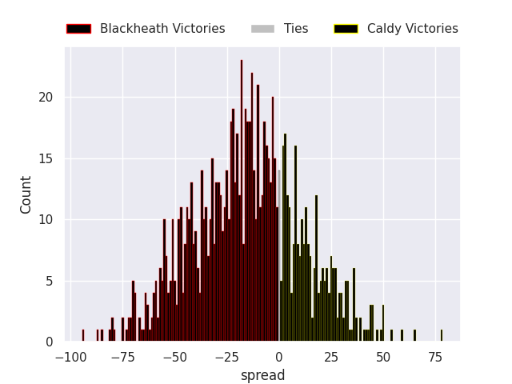

### Ampthill V Nottingham on 2026/09/26

Average Margin: Ampthill by 5.0

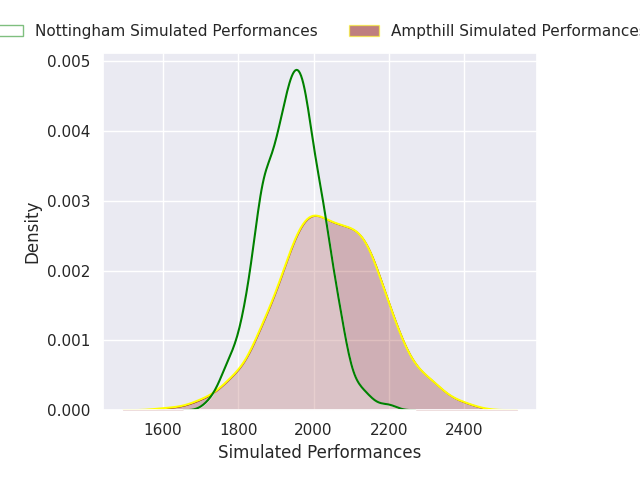

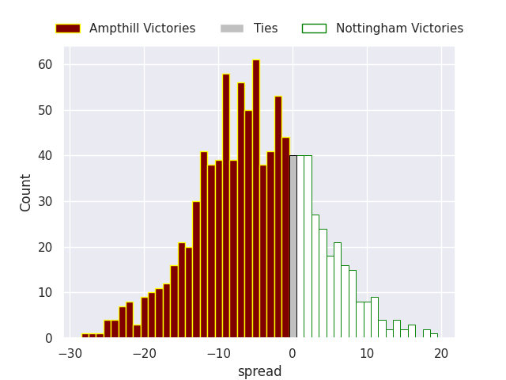

### Bedford V Chinnor on 2026/09/26

Average Margin: Bedford by 6.9

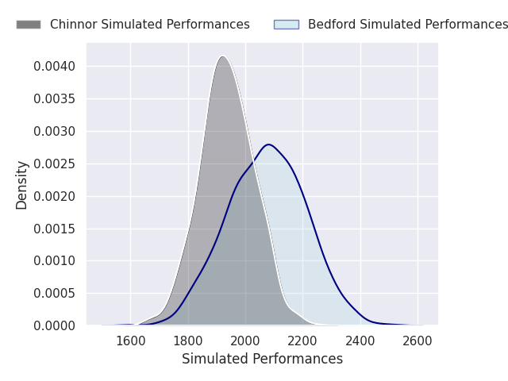

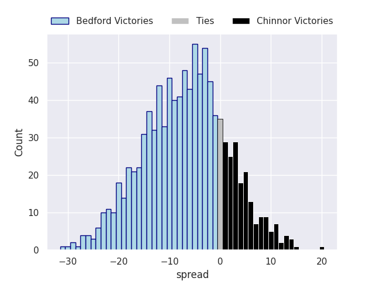

### Coventry V Cornish Pirates on 2026/09/26

Average Margin: Coventry by 7.1

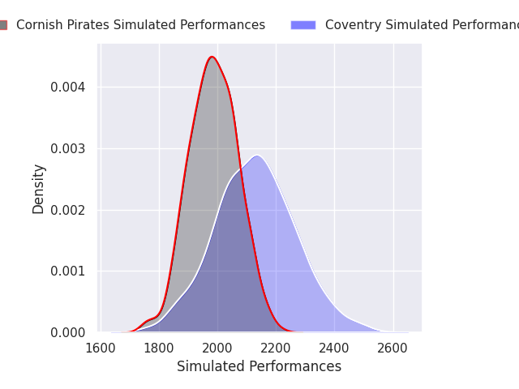

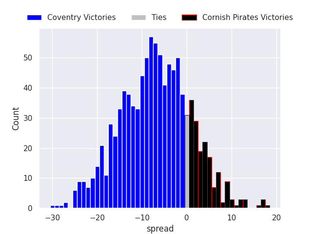

### Worcester Warriors V Rotherham Titans on 2026/09/26

Average Margin: Worcester Warriors by 9.7

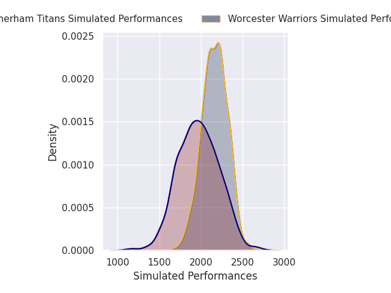

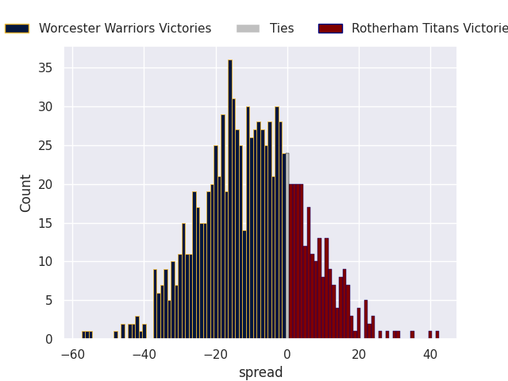

### Ealing Trailfinders V Richmond on 2026/09/27

Average Margin: Ealing Trailfinders by 26.8

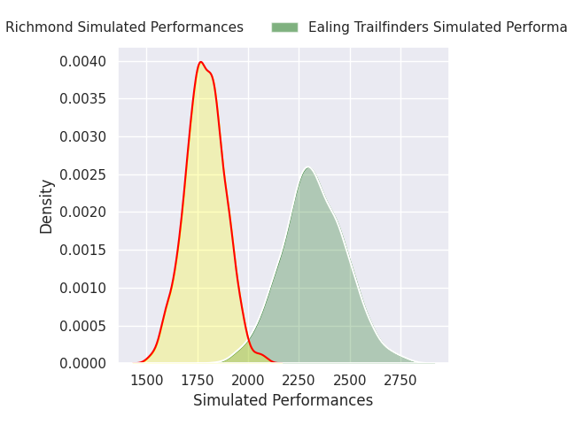

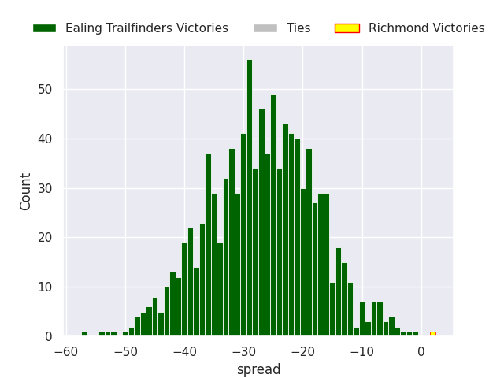

### Doncaster V Hartpury College RFC on 2026/09/27

Average Margin: Doncaster by 3.8

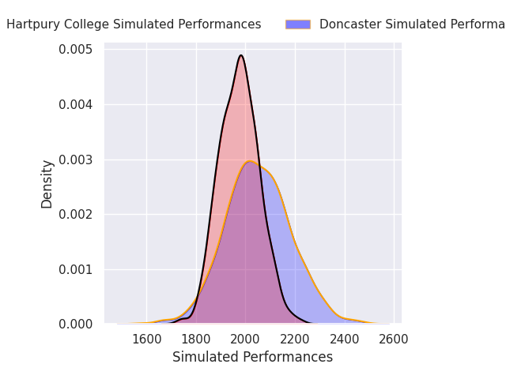

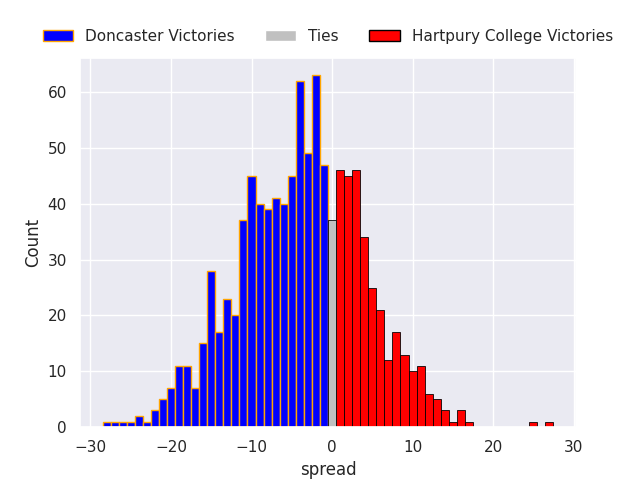

