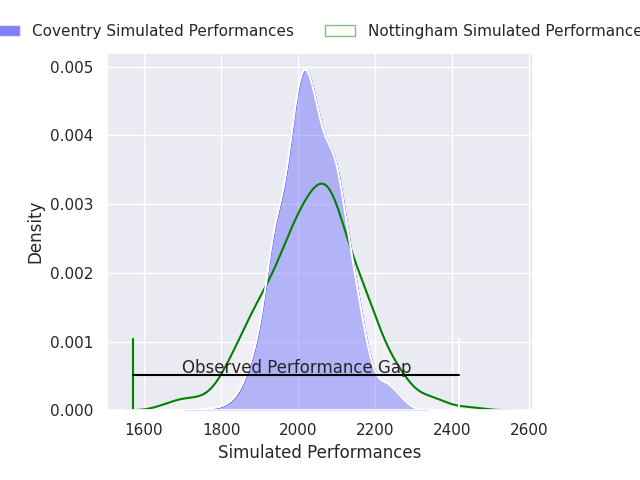
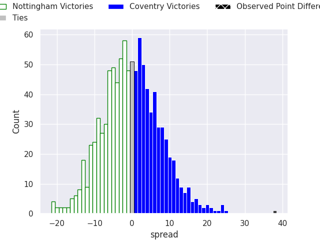
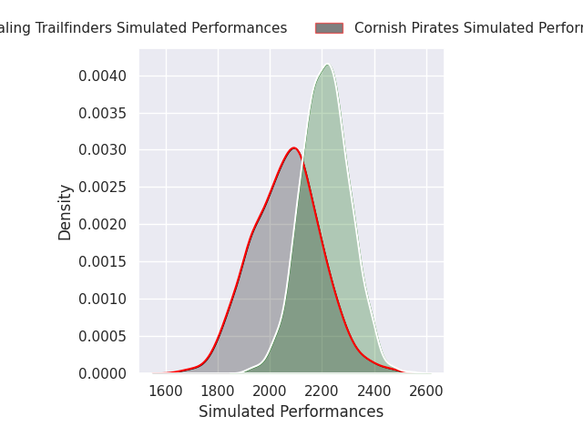
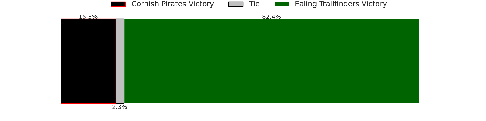
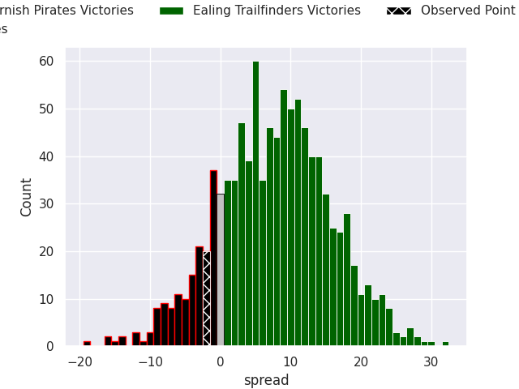

# Team Rankings

# Standings

## Current Standings

| Club                |   Played |   Wins |   Point Differential |   Losing Bonus Points | Try Bonus Points   |   Competition Points |
|:--------------------|---------:|-------:|---------------------:|----------------------:|:-------------------|---------------------:|
| Worcester Warriors  |        2 |      2 |                  101 |                     0 |                    |                    8 |
| Ealing Trailfinders |        2 |      2 |                   34 |                     0 |                    |                    8 |
| Ampthill            |        2 |      2 |                    7 |                     0 |                    |                    8 |
| Coventry            |        2 |      1 |                   30 |                     1 |                    |                    5 |
| Caldy               |        2 |      1 |                    2 |                     1 |                    |                    5 |
| Nottingham          |        2 |      1 |                    2 |                     1 |                    |                    5 |
| Chinnor             |        2 |      1 |                    2 |                     0 |                    |                    4 |
| Cornish Pirates     |        2 |      1 |                   -7 |                     0 |                    |                    4 |
| Doncaster           |        2 |      1 |                  -12 |                     0 |                    |                    4 |
| Hartpury College    |        2 |      1 |                  -12 |                     0 |                    |                    4 |
| Rotherham Titans    |        2 |      1 |                  -63 |                     0 |                    |                    4 |
| Blackheath          |        2 |      0 |                  -11 |                     2 |                    |                    2 |
| Richmond            |        2 |      0 |                  -19 |                     1 |                    |                    1 |
| Bedford             |        2 |      0 |                  -54 |                     0 |                    |                    0 |

## Projected Remaining Table

| Club                |   To Play |   Projected Wins |   Projected Differential |   Projected Losing Bonus Points | Projected Try Bonus Points   |   Projected Competition Points |
|:--------------------|----------:|-----------------:|-------------------------:|--------------------------------:|:-----------------------------|-------------------------------:|
| Worcester Warriors  |         1 |            0.928 |                   12.848 |                           0.052 |                              |                          3.784 |
| Ealing Trailfinders |         1 |            0.82  |                    7.468 |                           0.122 |                              |                          3.456 |
| Chinnor             |         1 |            0.732 |                    5.529 |                           0.162 |                              |                          3.188 |
| Hartpury College    |         1 |            0.732 |                    4.967 |                           0.177 |                              |                          3.177 |
| Doncaster           |         1 |            0.674 |                   11.078 |                           0.089 |                              |                          2.813 |
| Coventry            |         1 |            0.518 |                    0.735 |                           0.289 |                              |                          2.457 |
| Bedford             |         1 |            0.505 |                    1.304 |                           0.157 |                              |                          2.239 |
| Nottingham          |         1 |            0.434 |                   -0.735 |                           0.34  |                              |                          2.172 |
| Rotherham Titans    |         1 |            0.464 |                   -1.304 |                           0.154 |                              |                          2.072 |
| Blackheath          |         1 |            0.312 |                  -11.078 |                           0.13  |                              |                          1.406 |
| Ampthill            |         1 |            0.232 |                   -4.967 |                           0.357 |                              |                          1.357 |
| Caldy               |         1 |            0.219 |                   -5.529 |                           0.332 |                              |                          1.306 |
| Cornish Pirates     |         1 |            0.153 |                   -7.468 |                           0.31  |                              |                          0.976 |
| Richmond            |         1 |            0.062 |                  -12.848 |                           0.197 |                              |                          0.465 |

## Projected Total Table

| Club                |   Played |   Wins |   Point Differential |   Losing Bonus Points | Try Bonus Points   |   Competition Points |
|:--------------------|---------:|-------:|---------------------:|----------------------:|:-------------------|---------------------:|
| Worcester Warriors  |        3 |  2.928 |              113.848 |                 0.052 |                    |               11.784 |
| Ealing Trailfinders |        3 |  2.82  |               41.468 |                 0.122 |                    |               11.456 |
| Ampthill            |        3 |  2.232 |                2.033 |                 0.357 |                    |                9.357 |
| Coventry            |        3 |  1.518 |               30.735 |                 1.289 |                    |                7.457 |
| Chinnor             |        3 |  1.732 |                7.529 |                 0.162 |                    |                7.188 |
| Hartpury College    |        3 |  1.732 |               -7.033 |                 0.177 |                    |                7.177 |
| Nottingham          |        3 |  1.434 |                1.265 |                 1.34  |                    |                7.172 |
| Doncaster           |        3 |  1.674 |               -0.922 |                 0.089 |                    |                6.813 |
| Caldy               |        3 |  1.219 |               -3.529 |                 1.332 |                    |                6.306 |
| Rotherham Titans    |        3 |  1.464 |              -64.304 |                 0.154 |                    |                6.072 |
| Cornish Pirates     |        3 |  1.153 |              -14.468 |                 0.31  |                    |                4.976 |
| Blackheath          |        3 |  0.312 |              -22.078 |                 2.13  |                    |                3.406 |
| Bedford             |        3 |  0.505 |              -52.696 |                 0.157 |                    |                2.239 |
| Richmond            |        3 |  0.062 |              -31.848 |                 1.197 |                    |                1.465 |

# Completed Match Review

| Model | Percent Correct Predictions | Spread Error |
| ------ | ------ | ------ |
| Club Level | 76.2% | 13.9 |
| Player Level: Lineup | nan% | nan |
| Player Level: Minutes | nan% | nan |

# Future Predictions

## Week 3

### Nottingham V Coventry on 2026/10/02

Average Margin: Coventry by 0.7

### Hartpury College RFC V Ampthill on 2026/10/02

Average Margin: Hartpury College by 5.0

### Richmond V Worcester Warriors on 2026/10/03

Average Margin: Worcester Warriors by 12.8

### Caldy V Chinnor on 2026/10/03

Average Margin: Chinnor by 5.5

### Rotherham Titans V Bedford on 2026/10/03

Average Margin: Bedford by 1.3

### Cornish Pirates V Ealing Trailfinders on 2026/10/03

Average Margin: Ealing Trailfinders by 7.5

### Blackheath V Doncaster on 2026/10/04

Average Margin: Doncaster by 11.1

