# Team Rankings

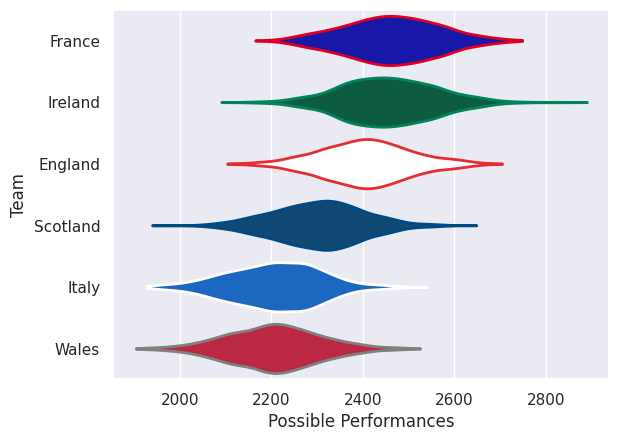
# Standings

## Projected Remaining Table

| Club     |   To Play |   Projected Wins |   Projected Differential |   Projected Losing Bonus Points | Projected Try Bonus Points   |   Projected Competition Points |
|:---------|----------:|-----------------:|-------------------------:|--------------------------------:|:-----------------------------|-------------------------------:|
| France   |         5 |            3.489 |                   35.982 |                           0.744 |                              |                         14.986 |
| England  |         5 |            3.375 |                   31.653 |                           0.783 |                              |                         14.591 |
| Ireland  |         5 |            2.991 |                   16.793 |                           1.036 |                              |                         13.32  |
| Scotland |         5 |            2.756 |                   12.329 |                           0.81  |                              |                         12.05  |
| Wales    |         5 |            1.234 |                  -37.637 |                           1.139 |                              |                          6.337 |
| Italy    |         5 |            0.762 |                  -59.12  |                           0.896 |                              |                          4.124 |

## Projected Total Table

| Club     |   Played |   Wins |   Point Differential |   Losing Bonus Points | Try Bonus Points   |   Competition Points |
|:---------|---------:|-------:|---------------------:|----------------------:|:-------------------|---------------------:|
| France   |        5 |  3.489 |               35.982 |                 0.744 |                    |               14.986 |
| England  |        5 |  3.375 |               31.653 |                 0.783 |                    |               14.591 |
| Ireland  |        5 |  2.991 |               16.793 |                 1.036 |                    |               13.32  |
| Scotland |        5 |  2.756 |               12.329 |                 0.81  |                    |               12.05  |
| Wales    |        5 |  1.234 |              -37.637 |                 1.139 |                    |                6.337 |
| Italy    |        5 |  0.762 |              -59.12  |                 0.896 |                    |                4.124 |

# Future Predictions

## Week 1

### Ireland V England on 2027/02/05

Average Margin: Ireland by 3.0

### Scotland V Italy on 2027/02/06

Average Margin: Scotland by 16.6

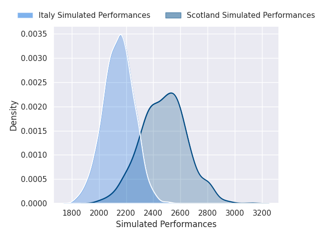

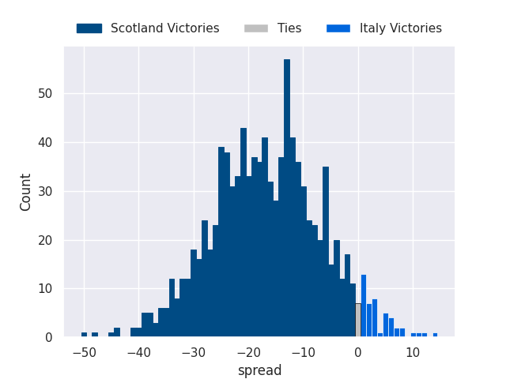

### France V Wales on 2027/02/06

Average Margin: France by 17.3

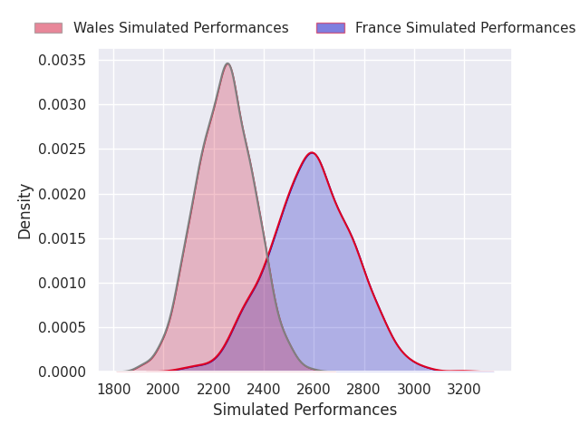
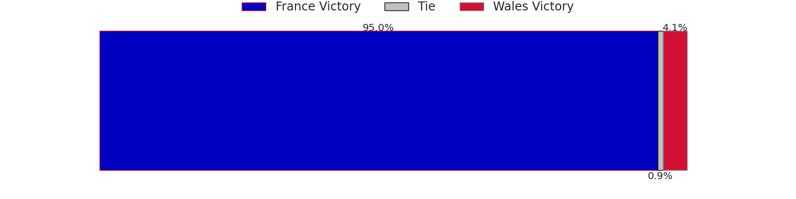
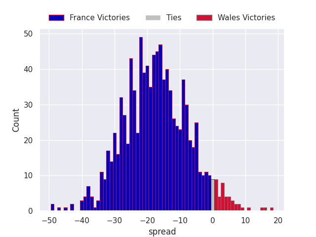

## Week 2

### Italy V Ireland on 2027/02/13

Average Margin: Ireland by 10.0

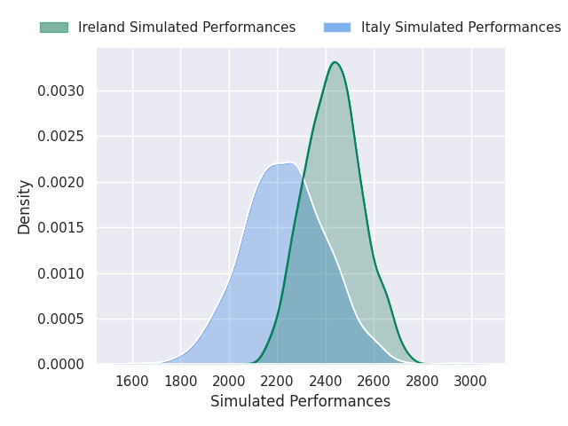
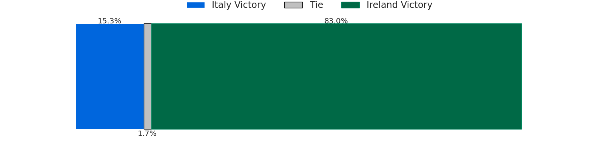
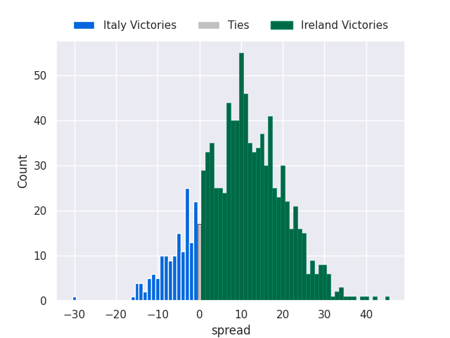

### Scotland V Wales on 2027/02/13

Average Margin: Scotland by 11.4

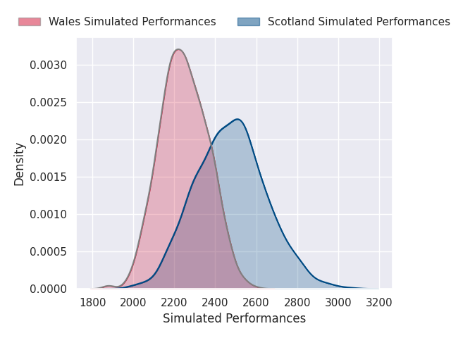
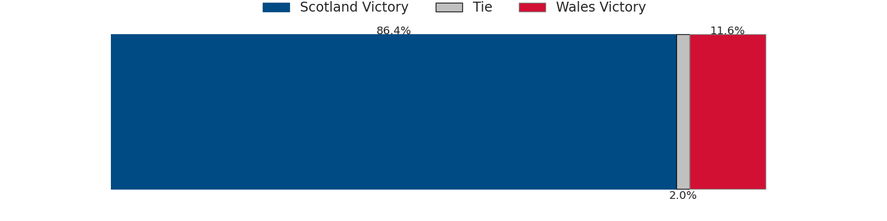
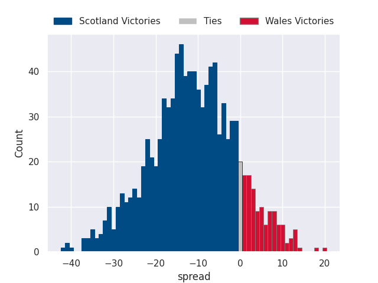

### England V France on 2027/02/14

Average Margin: England by 1.9

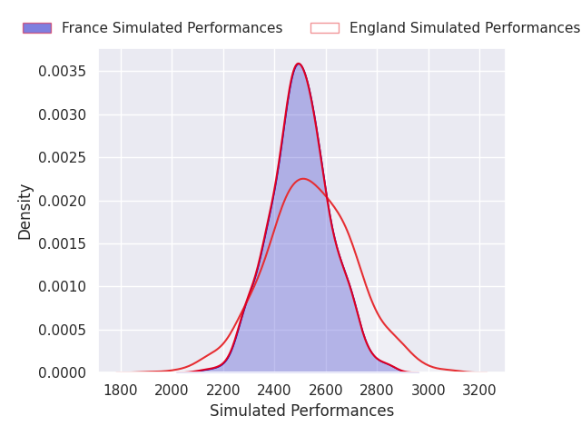

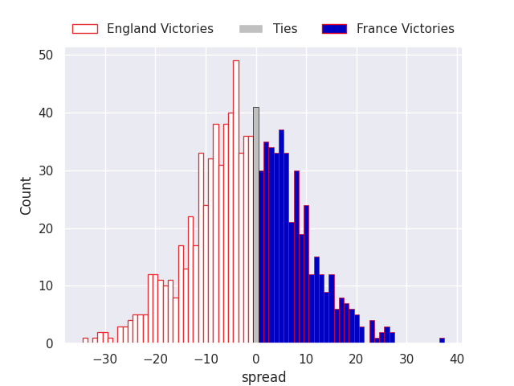

## Week 3

### England V Italy on 2027/02/20

Average Margin: England by 19.6

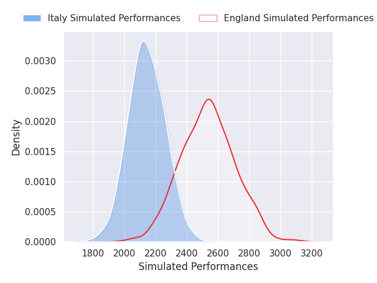
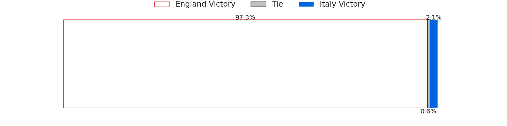
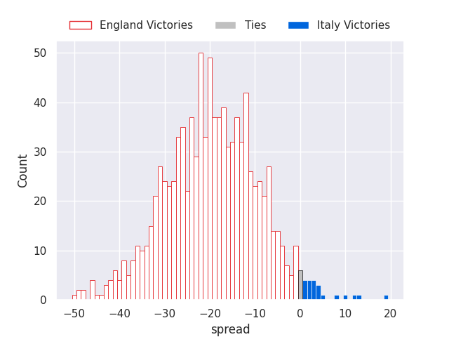

### Wales V Ireland on 2027/02/20

Average Margin: Ireland by 5.1

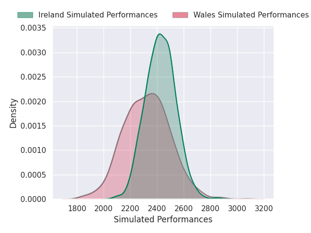

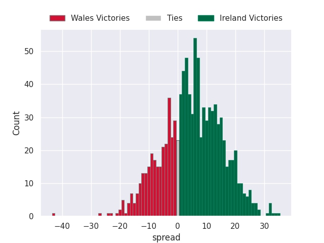

### France V Scotland on 2027/02/21

Average Margin: France by 10.3

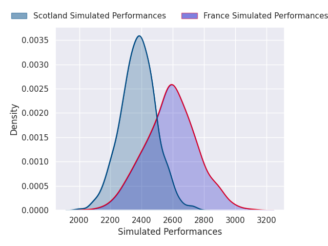
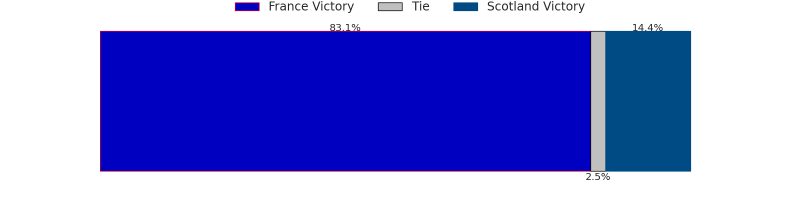
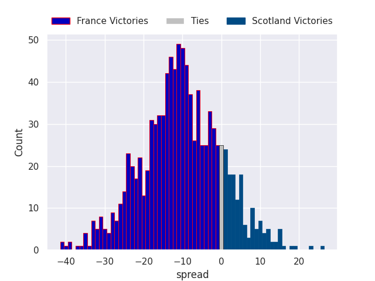

## Week 4

### Scotland V Ireland on 2027/03/05

Average Margin: Scotland by 2.6

### Italy V France on 2027/03/06

Average Margin: France by 11.5

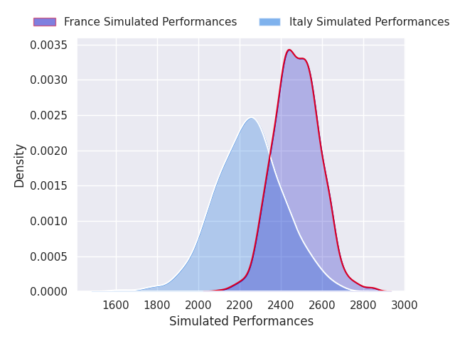
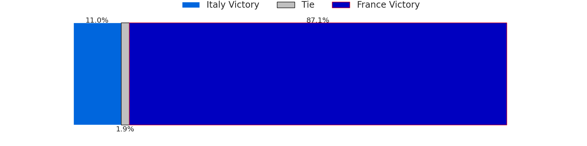
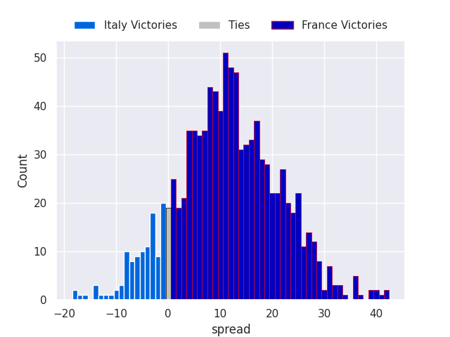

### Wales V England on 2027/03/06

Average Margin: England by 5.3

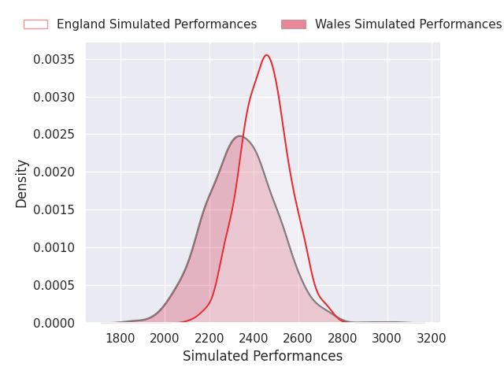
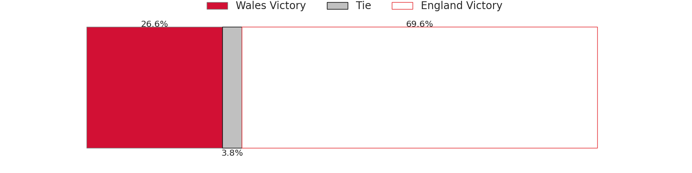
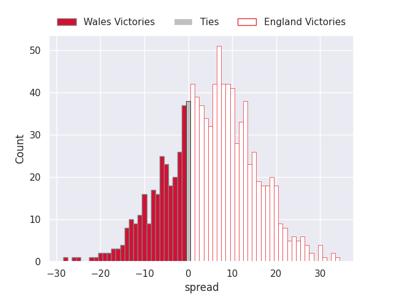

## Week 5

### Ireland V France on 2027/03/13

Average Margin: Ireland by 1.2

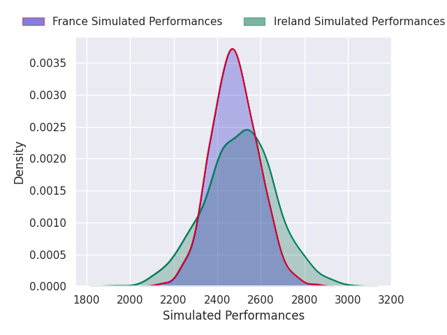

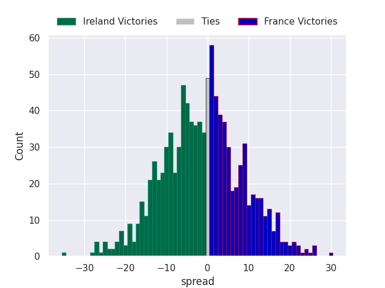

### Italy V Wales on 2027/03/13

Average Margin: Wales by 1.4

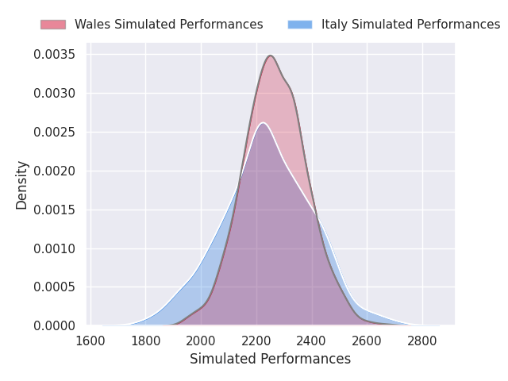

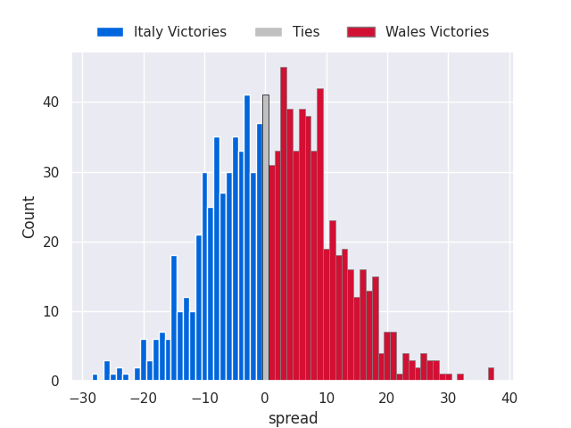

### England V Scotland on 2027/03/13

Average Margin: England by 7.9

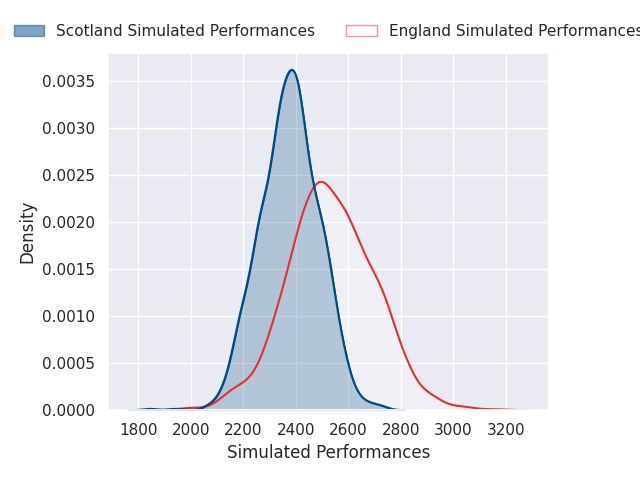
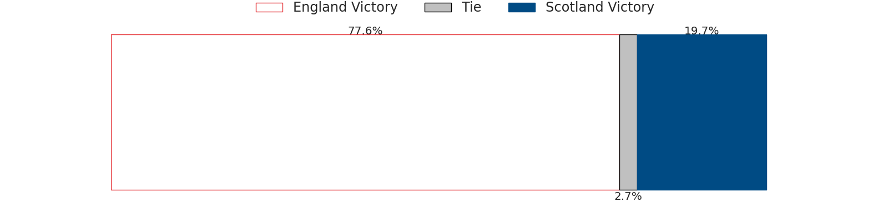
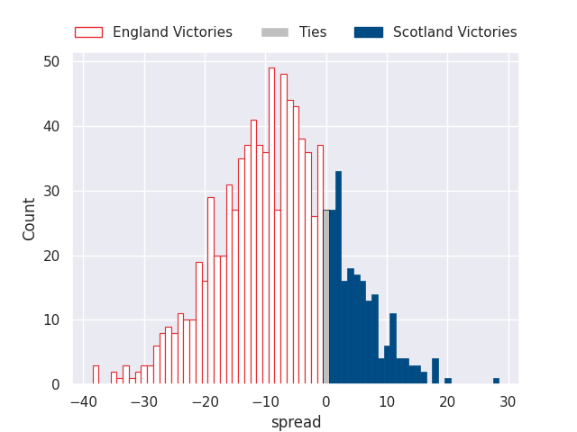

