# Team Rankings

# Standings

## Current Standings

| Club                 |   Played |   Wins |   Point Differential |   Losing Bonus Points |   Try Bonus Points |   Competition Points |
|:---------------------|---------:|-------:|---------------------:|----------------------:|-------------------:|---------------------:|
| Stade Toulousain     |        4 |      3 |                   61 |                     1 |                  3 |                   16 |
| Pau                  |        4 |      3 |                   46 |                     0 |                  4 |                   16 |
| Lyon                 |        4 |      3 |                   26 |                     0 |                  3 |                   15 |
| Bayonne              |        4 |      3 |                  -16 |                     0 |                  3 |                   15 |
| Perpignan            |        4 |      2 |                  -12 |                     1 |                  3 |                   12 |
| Castres Olympique    |        4 |      2 |                  -17 |                     0 |                  3 |                   11 |
| Bordeaux Begles      |        4 |      2 |                   40 |                     0 |                  2 |                   10 |
| Montpellier Herault  |        4 |      2 |                   21 |                     0 |                  2 |                   10 |
| Toulon               |        4 |      1 |                   14 |                     3 |                  3 |                   10 |
| Clermont Auvergne    |        4 |      2 |                   -3 |                     1 |                  1 |                   10 |
| Stade Francais Paris |        4 |      2 |                  -16 |                     0 |                  2 |                   10 |
| La Rochelle          |        4 |      2 |                  -28 |                     0 |                    |                    8 |
| Racing 92            |        4 |      1 |                  -69 |                     1 |                  1 |                    6 |
| Vannes               |        4 |      0 |                  -47 |                     1 |                  1 |                    2 |

## Projected Remaining Table

| Club                 |   To Play |   Projected Wins |   Projected Differential |   Projected Losing Bonus Points | Projected Try Bonus Points   |   Projected Competition Points |
|:---------------------|----------:|-----------------:|-------------------------:|--------------------------------:|:-----------------------------|-------------------------------:|
| Stade Toulousain     |        22 |           17.157 |                  194.465 |                           3.128 |                              |                         73.052 |
| Bordeaux Begles      |        22 |           14.728 |                  115.422 |                           4.448 |                              |                         64.984 |
| Montpellier Herault  |        22 |           14.36  |                  104.638 |                           4.602 |                              |                         63.554 |
| Stade Francais Paris |        22 |           12.086 |                   36.497 |                           5.259 |                              |                         55.323 |
| Pau                  |        22 |           11.648 |                   28.458 |                           5.414 |                              |                         53.712 |
| La Rochelle          |        22 |           11.057 |                    7.878 |                           5.099 |                              |                         50.823 |
| Clermont Auvergne    |        22 |            9.708 |                  -26.305 |                           5.238 |                              |                         45.53  |
| Racing 92            |        22 |            9.228 |                  -34.195 |                           6.231 |                              |                         44.851 |
| Lyon                 |        22 |            9.184 |                  -41.177 |                           5.523 |                              |                         43.919 |
| Toulon               |        22 |            8.918 |                  -47.337 |                           5.384 |                              |                         42.55  |
| Vannes               |        22 |            8.775 |                  -57.629 |                           5.246 |                              |                         41.898 |
| Perpignan            |        22 |            7.919 |                  -72.689 |                           5.75  |                              |                         38.978 |
| Castres Olympique    |        22 |            7.272 |                  -91.045 |                           5.773 |                              |                         36.505 |
| Bayonne              |        22 |            6.484 |                 -116.981 |                           5.73  |                              |                         33.146 |

## Projected Total Table

| Club                 |   Played |   Wins |   Point Differential |   Losing Bonus Points |   Try Bonus Points |   Competition Points |
|:---------------------|---------:|-------:|---------------------:|----------------------:|-------------------:|---------------------:|
| Stade Toulousain     |       26 | 20.157 |              255.465 |                 4.128 |                  3 |               89.052 |
| Bordeaux Begles      |       26 | 16.728 |              155.422 |                 4.448 |                  2 |               74.984 |
| Montpellier Herault  |       26 | 16.36  |              125.638 |                 4.602 |                  2 |               73.554 |
| Pau                  |       26 | 14.648 |               74.458 |                 5.414 |                  4 |               69.712 |
| Stade Francais Paris |       26 | 14.086 |               20.497 |                 5.259 |                  2 |               65.323 |
| Lyon                 |       26 | 12.184 |              -15.177 |                 5.523 |                  3 |               58.919 |
| La Rochelle          |       26 | 13.057 |              -20.122 |                 5.099 |                    |               58.823 |
| Clermont Auvergne    |       26 | 11.708 |              -29.305 |                 6.238 |                  1 |               55.53  |
| Toulon               |       26 |  9.918 |              -33.337 |                 8.384 |                  3 |               52.55  |
| Perpignan            |       26 |  9.919 |              -84.689 |                 6.75  |                  3 |               50.978 |
| Racing 92            |       26 | 10.228 |             -103.195 |                 7.231 |                  1 |               50.851 |
| Bayonne              |       26 |  9.484 |             -132.981 |                 5.73  |                  3 |               48.146 |
| Castres Olympique    |       26 |  9.272 |             -108.045 |                 5.773 |                  3 |               47.505 |
| Vannes               |       26 |  8.775 |             -104.629 |                 6.246 |                  1 |               43.898 |

# Completed Match Review

| Model | Percent Correct Predictions | Spread Error |
| ------ | ------ | ------ |
| Club Level | 69.8% | 6.7 |
| Player Level: Lineup | nan% | nan |
| Player Level: Minutes | nan% | nan |

# Future Predictions

## Week 5

### Bayonne V Stade Francais Paris on 2026/10/03

Average Margin: Stade Francais Paris by 0.2

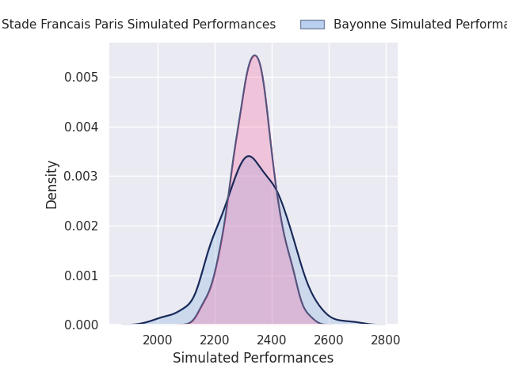
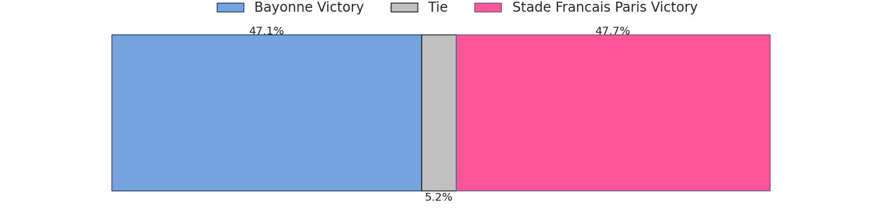
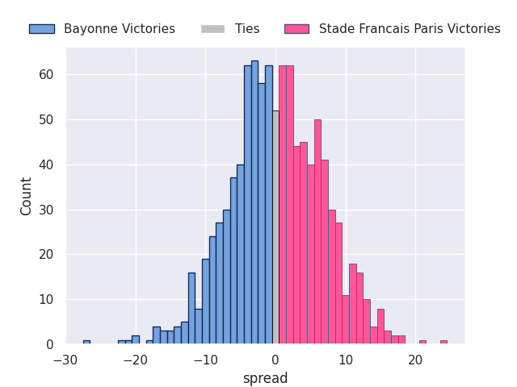

### Vannes V Pau on 2026/10/03

Average Margin: Vannes by 2.0

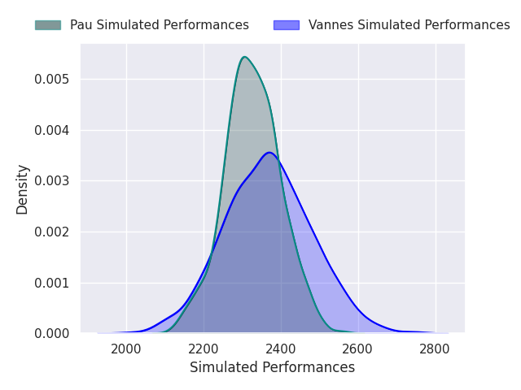

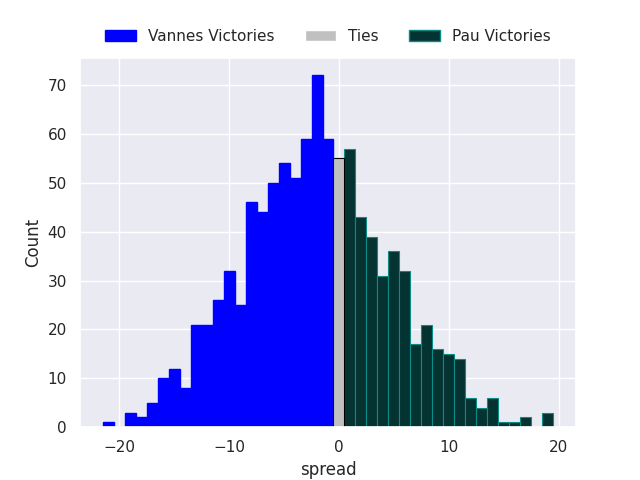

### La Rochelle V Clermont Auvergne on 2026/10/03

Average Margin: La Rochelle by 7.6

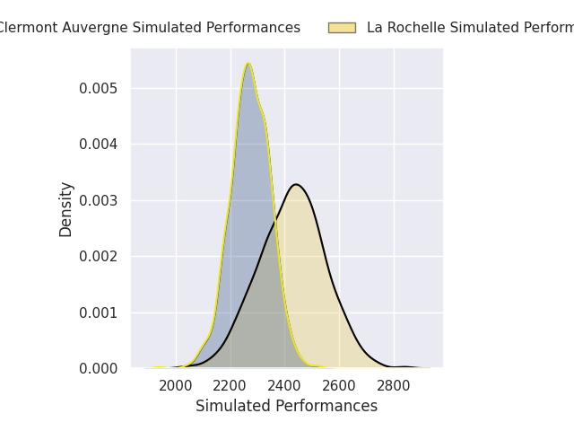
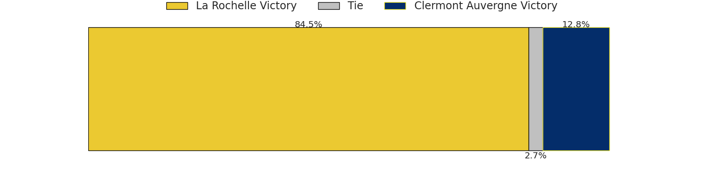
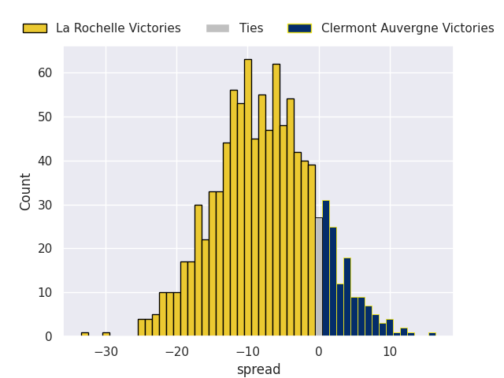

### Bordeaux Begles V Lyon on 2026/10/03

Average Margin: Bordeaux Begles by 12.9

### Racing 92 V Perpignan on 2026/10/03

Average Margin: Racing 92 by 7.7

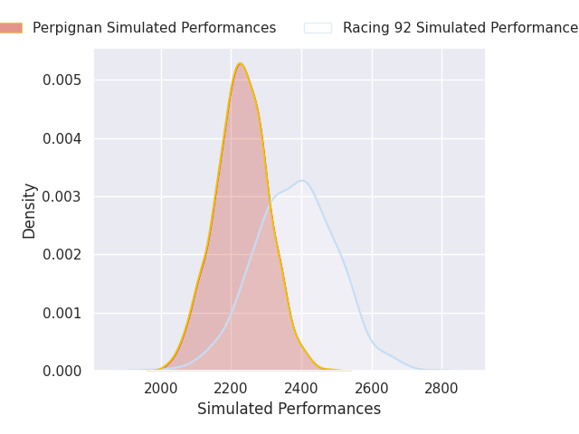
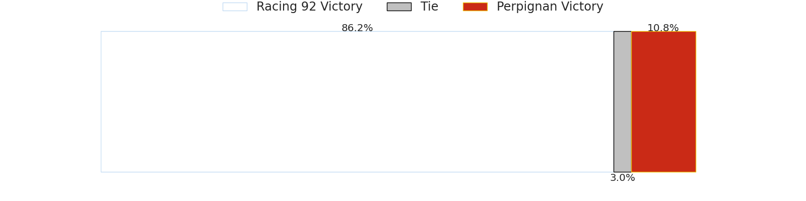
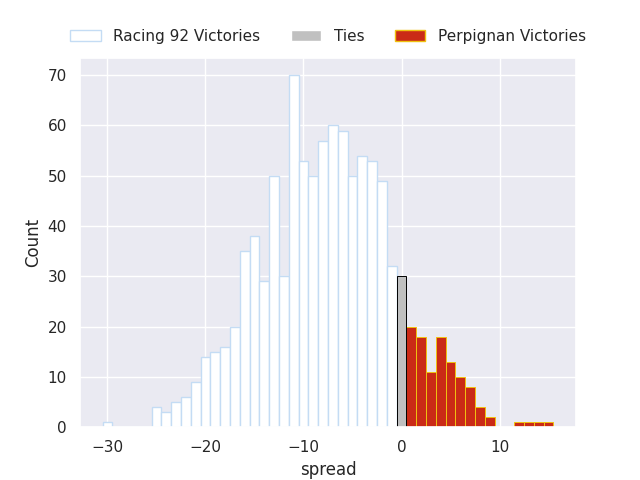

### Castres Olympique V Stade Toulousain on 2026/10/03

Average Margin: Stade Toulousain by 5.8

### Montpellier Herault V Toulon on 2026/10/04

Average Margin: Montpellier Herault by 13.1

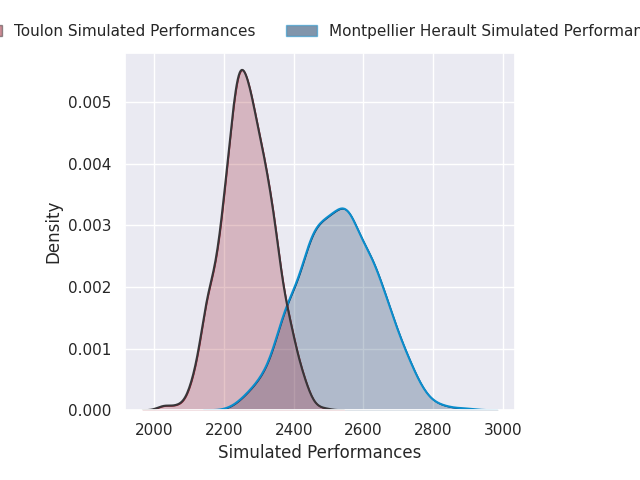

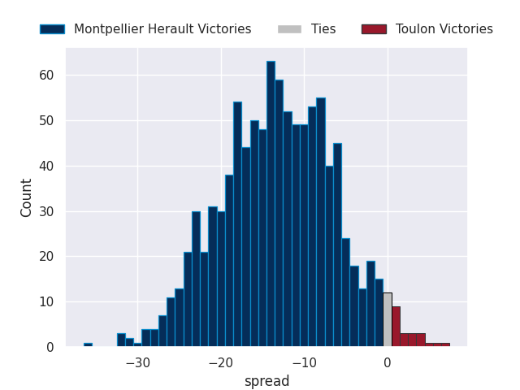

## Week 6

### Stade Toulousain V Bayonne on 2026/10/09

Average Margin: Stade Toulousain by 19.5

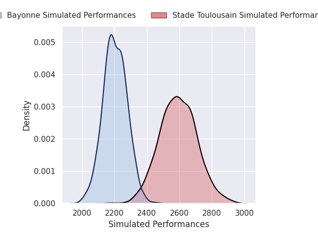
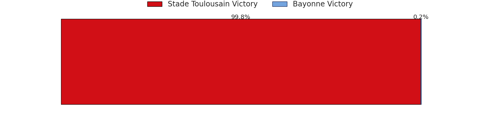
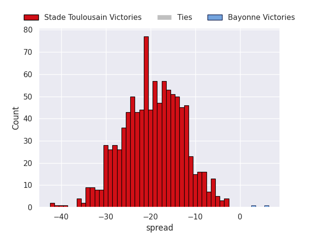

### Stade Francais Paris V Montpellier Herault on 2026/10/10

Average Margin: Stade Francais Paris by 4.0

### Perpignan V Vannes on 2026/10/10

Average Margin: Perpignan by 5.8

### Lyon V La Rochelle on 2026/10/10

Average Margin: Lyon by 4.9

### Pau V Castres Olympique on 2026/10/10

Average Margin: Pau by 11.5

### Toulon V Racing 92 on 2026/10/10

Average Margin: Toulon by 5.9

### Clermont Auvergne V Bordeaux Begles on 2026/10/10

Average Margin: Clermont Auvergne by 1.5

## Week 7

### Bayonne V Lyon on 2026/10/23

Average Margin: Bayonne by 3.4

### Vannes V Clermont Auvergne on 2026/10/23

Average Margin: Vannes by 4.9

### La Rochelle V Bordeaux Begles on 2026/10/23

Average Margin: La Rochelle by 2.4

### Castres Olympique V Stade Francais Paris on 2026/10/23

Average Margin: Castres Olympique by 0.9

### Toulon V Pau on 2026/10/23

Average Margin: Toulon by 3.8

### Racing 92 V Montpellier Herault on 2026/10/23

Average Margin: Racing 92 by 0.9

### Stade Toulousain V Perpignan on 2026/10/23

Average Margin: Stade Toulousain by 18.4

## Week 8

### Pau V Stade Toulousain on 2026/10/30

Average Margin: Stade Toulousain by 0.3

### Lyon V Vannes on 2026/10/30

Average Margin: Lyon by 7.2

### Stade Francais Paris V La Rochelle on 2026/10/30

Average Margin: Stade Francais Paris by 7.7

### Perpignan V Toulon on 2026/10/30

Average Margin: Perpignan by 5.3

### Montpellier Herault V Castres Olympique on 2026/10/30

Average Margin: Montpellier Herault by 14.7

### Clermont Auvergne V Racing 92 on 2026/10/30

Average Margin: Clermont Auvergne by 6.4

### Bordeaux Begles V Bayonne on 2026/10/30

Average Margin: Bordeaux Begles by 16.2

## Week 9

### Stade Toulousain V Clermont Auvergne on 2026/11/06

Average Margin: Stade Toulousain by 15.7

### La Rochelle V Bayonne on 2026/11/06

Average Margin: La Rochelle by 11.8

### Vannes V Bordeaux Begles on 2026/11/06

Average Margin: Bordeaux Begles by 0.8

### Castres Olympique V Racing 92 on 2026/11/06

Average Margin: Castres Olympique by 3.2

### Toulon V Stade Francais Paris on 2026/11/06

Average Margin: Toulon by 3.7

### Pau V Perpignan on 2026/11/06

Average Margin: Pau by 11.2

### Montpellier Herault V Lyon on 2026/11/06

Average Margin: Montpellier Herault by 12.7

## Week 10

### Clermont Auvergne V Toulon on 2026/11/27

Average Margin: Clermont Auvergne by 7.7

### Stade Francais Paris V Vannes on 2026/11/27

Average Margin: Stade Francais Paris by 10.3

### Lyon V Stade Toulousain on 2026/11/27

Average Margin: Stade Toulousain by 3.7

### Bayonne V Castres Olympique on 2026/11/27

Average Margin: Bayonne by 4.6

### La Rochelle V Perpignan on 2026/11/27

Average Margin: La Rochelle by 10.6

### Bordeaux Begles V Montpellier Herault on 2026/11/27

Average Margin: Bordeaux Begles by 7.2

### Racing 92 V Pau on 2026/11/27

Average Margin: Racing 92 by 3.0

## Week 11

### Montpellier Herault V La Rochelle on 2026/12/04

Average Margin: Montpellier Herault by 11.4

### Castres Olympique V Lyon on 2026/12/04

Average Margin: Castres Olympique by 4.1

### Pau V Stade Francais Paris on 2026/12/04

Average Margin: Pau by 6.0

### Stade Toulousain V Racing 92 on 2026/12/04

Average Margin: Stade Toulousain by 15.2

### Toulon V Bordeaux Begles on 2026/12/04

Average Margin: Toulon by 0.4

### Perpignan V Clermont Auvergne on 2026/12/04

Average Margin: Perpignan by 4.6

### Vannes V Bayonne on 2026/12/04

Average Margin: Vannes by 8.3

## Week 12

### Stade Francais Paris V Stade Toulousain on 2026/12/18

Average Margin: Stade Francais Paris by 0.1

### Lyon V Toulon on 2026/12/18

Average Margin: Lyon by 6.5

### Bayonne V Perpignan on 2026/12/18

Average Margin: Bayonne by 5.1

### Racing 92 V Vannes on 2026/12/18

Average Margin: Racing 92 by 6.5

### Bordeaux Begles V Pau on 2026/12/18

Average Margin: Bordeaux Begles by 10.1

### La Rochelle V Castres Olympique on 2026/12/18

Average Margin: La Rochelle by 9.6

### Clermont Auvergne V Montpellier Herault on 2026/12/18

Average Margin: Clermont Auvergne by 2.0

## Week 13

### Castres Olympique V Bordeaux Begles on 2026/12/25

Average Margin: Bordeaux Begles by 1.9

### Perpignan V Lyon on 2026/12/25

Average Margin: Perpignan by 5.2

### Vannes V La Rochelle on 2026/12/25

Average Margin: Vannes by 3.9

### Stade Toulousain V Toulon on 2026/12/25

Average Margin: Stade Toulousain by 16.4

### Montpellier Herault V Bayonne on 2026/12/25

Average Margin: Montpellier Herault by 16.5

### Pau V Clermont Auvergne on 2026/12/25

Average Margin: Pau by 8.9

### Racing 92 V Stade Francais Paris on 2026/12/25

Average Margin: Racing 92 by 2.6

## Week 14

### Bayonne V Stade Toulousain on 2027/01/01

Average Margin: Stade Toulousain by 5.7

### Stade Francais Paris V Castres Olympique on 2027/01/01

Average Margin: Stade Francais Paris by 11.1

### Clermont Auvergne V Vannes on 2027/01/01

Average Margin: Clermont Auvergne by 8.5

### Lyon V Racing 92 on 2027/01/01

Average Margin: Lyon by 5.6

### Toulon V Montpellier Herault on 2027/01/01

Average Margin: Toulon by 1.4

### Bordeaux Begles V Perpignan on 2027/01/01

Average Margin: Bordeaux Begles by 14.8

### La Rochelle V Pau on 2027/01/01

Average Margin: La Rochelle by 5.5

## Week 15

### Castres Olympique V Clermont Auvergne on 2027/01/23

Average Margin: Castres Olympique by 3.7

### Pau V Lyon on 2027/01/23

Average Margin: Pau by 9.1

### Vannes V Perpignan on 2027/01/23

Average Margin: Vannes by 7.3

### Stade Toulousain V La Rochelle on 2027/01/23

Average Margin: Stade Toulousain by 14.4

### Racing 92 V Bordeaux Begles on 2027/01/23

Average Margin: Bordeaux Begles by 0.1

### Toulon V Bayonne on 2027/01/23

Average Margin: Toulon by 10.4

### Montpellier Herault V Stade Francais Paris on 2027/01/23

Average Margin: Montpellier Herault by 9.0

## Week 16

### Lyon V Bayonne on 2027/01/30

Average Margin: Lyon by 9.1

### Racing 92 V Castres Olympique on 2027/01/30

Average Margin: Racing 92 by 7.2

### La Rochelle V Toulon on 2027/01/30

Average Margin: La Rochelle by 8.5

### Bordeaux Begles V Vannes on 2027/01/30

Average Margin: Bordeaux Begles by 13.6

### Perpignan V Stade Francais Paris on 2027/01/30

Average Margin: Perpignan by 1.4

### Pau V Montpellier Herault on 2027/01/30

Average Margin: Pau by 3.6

### Clermont Auvergne V Stade Toulousain on 2027/01/30

Average Margin: Stade Toulousain by 1.7

## Week 17

### Bayonne V La Rochelle on 2027/02/20

Average Margin: Bayonne by 2.2

### Vannes V Castres Olympique on 2027/02/20

Average Margin: Vannes by 6.6

### Perpignan V Pau on 2027/02/20

Average Margin: Perpignan by 1.8

### Stade Francais Paris V Bordeaux Begles on 2027/02/20

Average Margin: Stade Francais Paris by 3.5

### Montpellier Herault V Racing 92 on 2027/02/20

Average Margin: Montpellier Herault by 11.5

### Stade Toulousain V Lyon on 2027/02/20

Average Margin: Stade Toulousain by 16.0

### Toulon V Clermont Auvergne on 2027/02/20

Average Margin: Toulon by 6.3

## Week 18

### Bordeaux Begles V Toulon on 2027/02/27

Average Margin: Bordeaux Begles by 12.9

### Clermont Auvergne V Bayonne on 2027/02/27

Average Margin: Clermont Auvergne by 10.9

### Castres Olympique V Perpignan on 2027/02/27

Average Margin: Castres Olympique by 6.2

### Racing 92 V Stade Toulousain on 2027/02/27

Average Margin: Stade Toulousain by 3.3

### La Rochelle V Stade Francais Paris on 2027/02/27

Average Margin: La Rochelle by 4.8

### Pau V Vannes on 2027/02/27

Average Margin: Pau by 10.3

### Lyon V Montpellier Herault on 2027/02/27

Average Margin: Lyon by 0.6

## Week 19

### Castres Olympique V La Rochelle on 2027/03/20

Average Margin: Castres Olympique by 3.2

### Stade Toulousain V Vannes on 2027/03/20

Average Margin: Stade Toulousain by 17.3

### Toulon V Lyon on 2027/03/20

Average Margin: Toulon by 6.5

### Bayonne V Bordeaux Begles on 2027/03/20

Average Margin: Bordeaux Begles by 2.4

### Stade Francais Paris V Pau on 2027/03/20

Average Margin: Stade Francais Paris by 6.4

### Montpellier Herault V Clermont Auvergne on 2027/03/20

Average Margin: Montpellier Herault by 12.0

### Perpignan V Racing 92 on 2027/03/20

Average Margin: Perpignan by 4.0

## Week 20

### Racing 92 V Toulon on 2027/03/27

Average Margin: Racing 92 by 6.2

### Clermont Auvergne V Pau on 2027/03/27

Average Margin: Clermont Auvergne by 4.8

### Vannes V Stade Francais Paris on 2027/03/27

Average Margin: Vannes by 2.0

### Perpignan V La Rochelle on 2027/03/27

Average Margin: Perpignan by 3.6

### Bordeaux Begles V Stade Toulousain on 2027/03/27

Average Margin: Bordeaux Begles by 3.8

### Lyon V Castres Olympique on 2027/03/27

Average Margin: Lyon by 7.8

### Bayonne V Montpellier Herault on 2027/03/27

Average Margin: Montpellier Herault by 1.5

## Week 21

### Stade Francais Paris V Clermont Auvergne on 2027/04/17

Average Margin: Stade Francais Paris by 8.8

### Lyon V Perpignan on 2027/04/17

Average Margin: Lyon by 8.3

### La Rochelle V Vannes on 2027/04/17

Average Margin: La Rochelle by 9.0

### Toulon V Stade Toulousain on 2027/04/17

Average Margin: Stade Toulousain by 2.1

### Pau V Racing 92 on 2027/04/17

Average Margin: Pau by 8.0

### Montpellier Herault V Bordeaux Begles on 2027/04/17

Average Margin: Montpellier Herault by 6.7

### Castres Olympique V Bayonne on 2027/04/17

Average Margin: Castres Olympique by 7.3

## Week 22

### Perpignan V Montpellier Herault on 2027/04/24

Average Margin: Montpellier Herault by 0.6

### Stade Toulousain V Castres Olympique on 2027/04/24

Average Margin: Stade Toulousain by 17.5

### Clermont Auvergne V Lyon on 2027/04/24

Average Margin: Clermont Auvergne by 7.4

### Bayonne V Pau on 2027/04/24

Average Margin: Bayonne by 0.7

### Bordeaux Begles V La Rochelle on 2027/04/24

Average Margin: Bordeaux Begles by 11.0

### Stade Francais Paris V Racing 92 on 2027/04/24

Average Margin: Stade Francais Paris by 8.5

### Vannes V Toulon on 2027/04/24

Average Margin: Vannes by 5.1

## Week 23

### Toulon V Castres Olympique on 2027/05/08

Average Margin: Toulon by 8.4

### Pau V Bordeaux Begles on 2027/05/08

Average Margin: Pau by 3.2

### Bayonne V Vannes on 2027/05/08

Average Margin: Bayonne by 4.6

### Clermont Auvergne V Perpignan on 2027/05/08

Average Margin: Clermont Auvergne by 9.6

### Racing 92 V La Rochelle on 2027/05/08

Average Margin: Racing 92 by 4.8

### Lyon V Stade Francais Paris on 2027/05/08

Average Margin: Lyon by 3.1

### Montpellier Herault V Stade Toulousain on 2027/05/08

Average Margin: Montpellier Herault by 3.5

## Week 24

### Perpignan V Bayonne on 2027/05/15

Average Margin: Perpignan by 8.0

### Castres Olympique V Montpellier Herault on 2027/05/15

Average Margin: Montpellier Herault by 0.8

### Bordeaux Begles V Clermont Auvergne on 2027/05/15

Average Margin: Bordeaux Begles by 11.7

### Vannes V Racing 92 on 2027/05/15

Average Margin: Vannes by 4.2

### Stade Toulousain V Pau on 2027/05/15

Average Margin: Stade Toulousain by 12.9

### Stade Francais Paris V Toulon on 2027/05/15

Average Margin: Stade Francais Paris by 9.5

### La Rochelle V Lyon on 2027/05/15

Average Margin: La Rochelle by 8.5

## Week 25

### Lyon V Bordeaux Begles on 2027/05/29

Average Margin: Lyon by 0.5

### Toulon V Perpignan on 2027/05/29

Average Margin: Toulon by 8.8

### Castres Olympique V Pau on 2027/05/29

Average Margin: Castres Olympique by 1.7

### Montpellier Herault V Vannes on 2027/05/29

Average Margin: Montpellier Herault by 13.3

### Bayonne V Racing 92 on 2027/05/29

Average Margin: Bayonne by 2.6

### Stade Toulousain V Stade Francais Paris on 2027/05/29

Average Margin: Stade Toulousain by 12.4

### Clermont Auvergne V La Rochelle on 2027/05/29

Average Margin: Clermont Auvergne by 6.4

## Week 26

### Racing 92 V Clermont Auvergne on 2027/06/05

Average Margin: Racing 92 by 5.4

### Perpignan V Stade Toulousain on 2027/06/05

Average Margin: Stade Toulousain by 3.8

### Stade Francais Paris V Bayonne on 2027/06/05

Average Margin: Stade Francais Paris by 12.4

### Bordeaux Begles V Castres Olympique on 2027/06/05

Average Margin: Bordeaux Begles by 14.0

### Pau V Toulon on 2027/06/05

Average Margin: Pau by 9.6

### La Rochelle V Montpellier Herault on 2027/06/05

Average Margin: La Rochelle by 3.2

### Vannes V Lyon on 2027/06/05

Average Margin: Vannes by 5.2

