# Team Rankings

# Standings

## Current Standings

| Club             |   Played |   Wins |   Point Differential |   Losing Bonus Points |   Try Bonus Points |   Competition Points |
|:-----------------|---------:|-------:|---------------------:|----------------------:|-------------------:|---------------------:|
| Sharks           |        2 |      2 |                   23 |                     0 |                  2 |                   10 |
| Cardiff Rugby    |        2 |      2 |                   19 |                     0 |                  1 |                    9 |
| Lions            |        2 |      2 |                   17 |                     0 |                  1 |                    9 |
| Edinburgh        |        2 |      2 |                    9 |                     0 |                  1 |                    9 |
| Glasgow Warriors |        2 |      1 |                    6 |                     0 |                  2 |                    8 |
| Dragons          |        2 |      1 |                   12 |                     0 |                  1 |                    7 |
| Bulls            |        2 |      1 |                   30 |                     1 |                  1 |                    6 |
| Stormers         |        2 |      1 |                   10 |                     1 |                  1 |                    6 |
| Munster          |        2 |      1 |                   -2 |                     1 |                  1 |                    6 |
| Ulster           |        2 |      0 |                   -5 |                     1 |                  2 |                    5 |
| Connacht         |        2 |      1 |                  -11 |                     0 |                  1 |                    5 |
| Benetton Treviso |        2 |      0 |                   -3 |                     1 |                    |                    3 |
| Leinster         |        2 |      0 |                   -7 |                     2 |                  1 |                    3 |
| Scarlets         |        2 |      0 |                  -18 |                     1 |                  1 |                    2 |
| Ospreys          |        2 |      0 |                  -33 |                     0 |                  1 |                    1 |
| Zebre            |        2 |      0 |                  -47 |                     0 |                  1 |                    1 |

## Projected Remaining Table

| Club             |   To Play |   Projected Wins |   Projected Differential |   Projected Losing Bonus Points | Projected Try Bonus Points   |   Projected Competition Points |
|:-----------------|----------:|-----------------:|-------------------------:|--------------------------------:|:-----------------------------|-------------------------------:|
| Leinster         |        17 |           13.471 |                  129.06  |                           2.254 |                              |                         57.16  |
| Glasgow Warriors |        17 |           11.879 |                   97.23  |                           2.887 |                              |                         51.513 |
| Bulls            |        17 |           11.728 |                   87.695 |                           3.056 |                              |                         51.108 |
| Stormers         |        17 |           11.057 |                   77.64  |                           3.31  |                              |                         48.746 |
| Sharks           |        17 |            9.252 |                   25.408 |                           4.292 |                              |                         42.74  |
| Connacht         |        17 |            9.04  |                   27.835 |                           3.891 |                              |                         41.177 |
| Ulster           |        17 |            8.905 |                   21.746 |                           3.898 |                              |                         40.796 |
| Munster          |        17 |            8.197 |                    5.738 |                           4.491 |                              |                         38.559 |
| Lions            |        17 |            8.046 |                    3.407 |                           4.466 |                              |                         37.966 |
| Edinburgh        |        17 |            7.212 |                  -25.307 |                           4.477 |                              |                         34.707 |
| Ospreys          |        17 |            6.8   |                  -31.487 |                           4.845 |                              |                         33.491 |
| Cardiff Rugby    |        17 |            6.669 |                  -37.39  |                           4.625 |                              |                         32.717 |
| Dragons          |        17 |            6.157 |                  -53.08  |                           4.555 |                              |                         30.537 |
| Benetton Treviso |        17 |            5.035 |                  -78.563 |                           4.723 |                              |                         26.071 |
| Scarlets         |        17 |            4.727 |                  -96.116 |                           4.525 |                              |                         24.645 |
| Zebre            |        17 |            2.891 |                 -153.816 |                           4.12  |                              |                         16.482 |

## Projected Total Table

| Club             |   Played |   Wins |   Point Differential |   Losing Bonus Points |   Try Bonus Points |   Competition Points |
|:-----------------|---------:|-------:|---------------------:|----------------------:|-------------------:|---------------------:|
| Leinster         |       19 | 13.471 |              122.06  |                 4.254 |                  1 |               60.16  |
| Glasgow Warriors |       19 | 12.879 |              103.23  |                 2.887 |                  2 |               59.513 |
| Bulls            |       19 | 12.728 |              117.695 |                 4.056 |                  1 |               57.108 |
| Stormers         |       19 | 12.057 |               87.64  |                 4.31  |                  1 |               54.746 |
| Sharks           |       19 | 11.252 |               48.408 |                 4.292 |                  2 |               52.74  |
| Lions            |       19 | 10.046 |               20.407 |                 4.466 |                  1 |               46.966 |
| Connacht         |       19 | 10.04  |               16.835 |                 3.891 |                  1 |               46.177 |
| Ulster           |       19 |  8.905 |               16.746 |                 4.898 |                  2 |               45.796 |
| Munster          |       19 |  9.197 |                3.738 |                 5.491 |                  1 |               44.559 |
| Edinburgh        |       19 |  9.212 |              -16.307 |                 4.477 |                  1 |               43.707 |
| Cardiff Rugby    |       19 |  8.669 |              -18.39  |                 4.625 |                  1 |               41.717 |
| Dragons          |       19 |  7.157 |              -41.08  |                 4.555 |                  1 |               37.537 |
| Ospreys          |       19 |  6.8   |              -64.487 |                 4.845 |                  1 |               34.491 |
| Benetton Treviso |       19 |  5.035 |              -81.563 |                 5.723 |                    |               29.071 |
| Scarlets         |       19 |  4.727 |             -114.116 |                 5.525 |                  1 |               26.645 |
| Zebre            |       19 |  2.891 |             -200.816 |                 4.12  |                  1 |               17.482 |

# Completed Match Review

| Model | Percent Correct Predictions | Spread Error |
| ------ | ------ | ------ |
| Club Level | 76.3% | 5.2 |
| Player Level: Lineup | nan% | nan |
| Player Level: Minutes | nan% | nan |

# Future Predictions

## Week 3

### Glasgow Warriors V Connacht on 2026/09/01

Average Margin: Glasgow Warriors by 6.0

### Dragons V Ospreys on 2026/09/01

Average Margin: Dragons by 4.0

## Week 4

### Stormers V Sharks on 2026/10/01

Average Margin: Stormers by 6.8

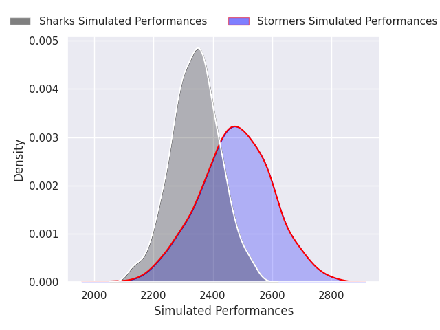
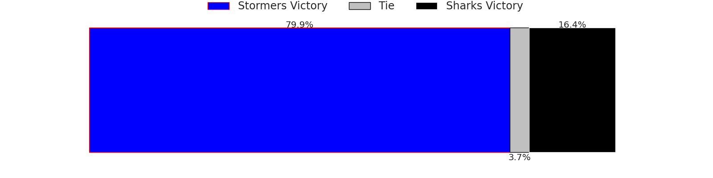
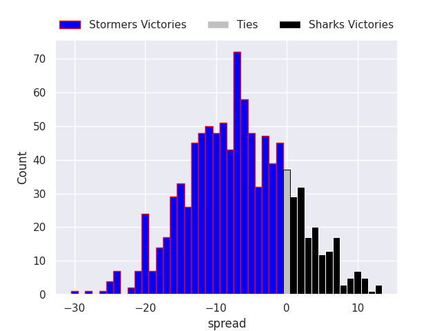

### Scarlets V Benetton Treviso on 2026/10/01

Average Margin: Scarlets by 2.7

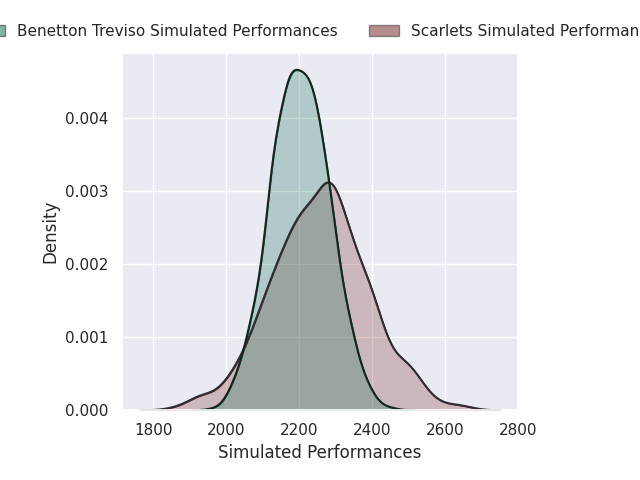

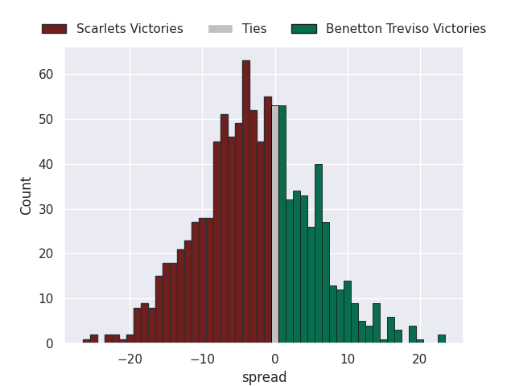

### Bulls V Lions on 2026/10/01

Average Margin: Bulls by 8.9

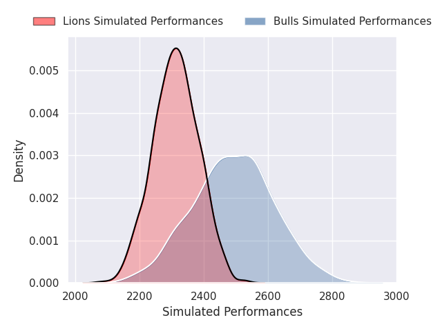

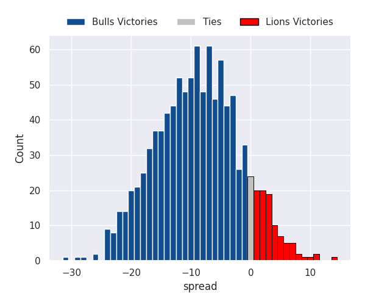

### Leinster V Cardiff Rugby on 2026/10/01

Average Margin: Leinster by 13.1

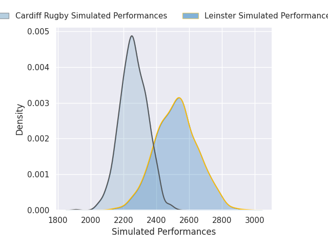

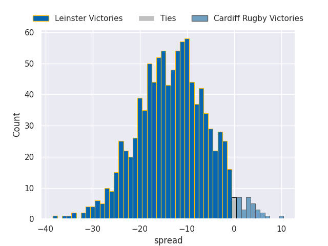

### Ulster V Munster on 2026/10/01

Average Margin: Ulster by 5.0

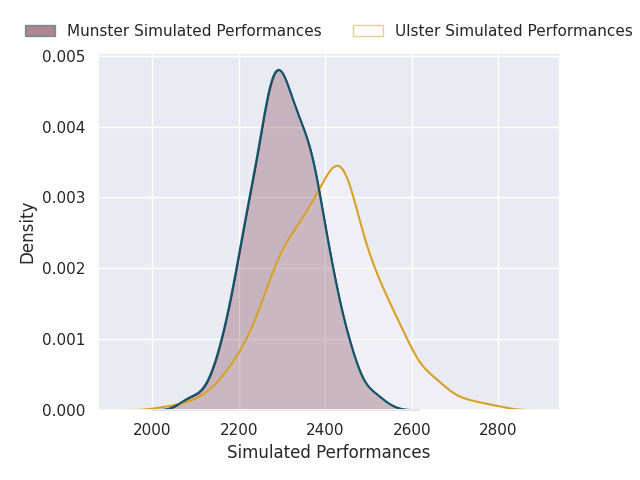
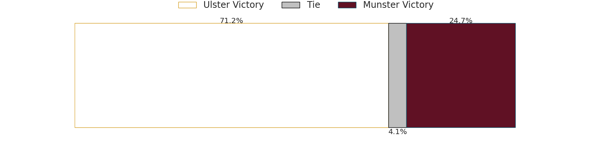
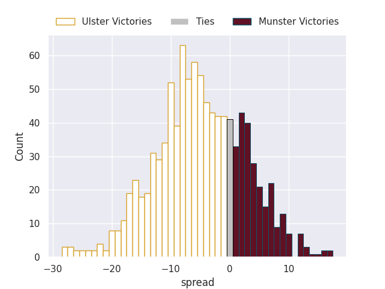

### Zebre V Edinburgh on 2026/10/01

Average Margin: Edinburgh by 1.7

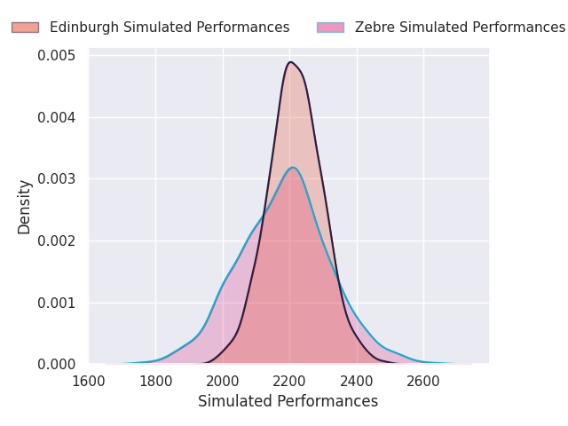

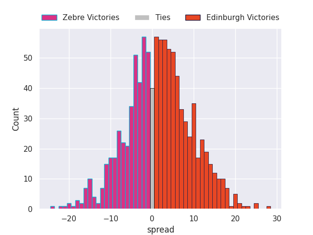

## Week 5

### Glasgow Warriors V Connacht on 2026/10/09

Average Margin: Glasgow Warriors by 7.9

### Dragons V Ospreys on 2026/10/09

Average Margin: Dragons by 4.5

### Leinster V Cardiff Rugby on 2026/10/10

Average Margin: Leinster by 12.7

### Scarlets V Benetton Treviso on 2026/10/10

Average Margin: Scarlets by 2.6

### Zebre V Edinburgh on 2026/10/10

Average Margin: Edinburgh by 2.1

### Bulls V Lions on 2026/10/10

Average Margin: Bulls by 8.5

### Stormers V Sharks on 2026/10/10

Average Margin: Stormers by 6.2

### Ulster V Munster on 2026/10/10

Average Margin: Ulster by 5.7

## Week 6

### Cardiff Rugby V Sharks on 2026/10/23

Average Margin: Cardiff Rugby by 0.1

### Connacht V Zebre on 2026/10/23

Average Margin: Connacht by 17.8

### Edinburgh V Lions on 2026/10/23

Average Margin: Edinburgh by 0.5

### Ospreys V Dragons on 2026/10/24

Average Margin: Ospreys by 5.4

### Bulls V Ulster on 2026/10/24

Average Margin: Bulls by 9.6

### Benetton Treviso V Glasgow Warriors on 2026/10/24

Average Margin: Glasgow Warriors by 4.1

### Stormers V Scarlets on 2026/10/24

Average Margin: Stormers by 15.4

### Leinster V Munster on 2026/10/24

Average Margin: Leinster by 9.8

## Week 7

### Glasgow Warriors V Lions on 2026/10/30

Average Margin: Glasgow Warriors by 7.5

### Connacht V Leinster on 2026/10/30

Average Margin: Connacht by 1.5

### Munster V Sharks on 2026/10/31

Average Margin: Munster by 2.5

### Benetton Treviso V Edinburgh on 2026/10/31

Average Margin: Benetton Treviso by 3.2

### Bulls V Scarlets on 2026/10/31

Average Margin: Bulls by 16.4

### Dragons V Zebre on 2026/10/31

Average Margin: Dragons by 11.3

### Stormers V Ulster on 2026/10/31

Average Margin: Stormers by 8.5

### Ospreys V Cardiff Rugby on 2026/10/31

Average Margin: Ospreys by 3.1

## Week 8

### Ospreys V Leinster on 2026/12/04

Average Margin: Leinster by 4.8

### Edinburgh V Dragons on 2026/12/04

Average Margin: Edinburgh by 6.2

### Sharks V Stormers on 2026/12/05

Average Margin: Sharks by 3.2

### Zebre V Munster on 2026/12/05

Average Margin: Munster by 6.4

### Cardiff Rugby V Ulster on 2026/12/05

Average Margin: Cardiff Rugby by 2.1

### Glasgow Warriors V Benetton Treviso on 2026/12/05

Average Margin: Glasgow Warriors by 14.0

### Lions V Bulls on 2026/12/05

Average Margin: Lions by 2.4

### Scarlets V Connacht on 2026/12/05

Average Margin: Connacht by 4.0

## Week 9

### Munster V Scarlets on 2026/12/18

Average Margin: Munster by 12.4

### Ulster V Ospreys on 2026/12/18

Average Margin: Ulster by 10.5

### Sharks V Bulls on 2026/12/19

Average Margin: Sharks by 2.8

### Cardiff Rugby V Dragons on 2026/12/19

Average Margin: Cardiff Rugby by 7.3

### Zebre V Benetton Treviso on 2026/12/19

Average Margin: Benetton Treviso by 0.3

### Stormers V Lions on 2026/12/19

Average Margin: Stormers by 7.3

### Leinster V Glasgow Warriors on 2026/12/19

Average Margin: Leinster by 7.4

### Connacht V Edinburgh on 2026/12/19

Average Margin: Connacht by 10.2

## Week 10

### Dragons V Cardiff Rugby on 2026/12/26

Average Margin: Dragons by 3.0

### Ospreys V Scarlets on 2026/12/26

Average Margin: Ospreys by 7.6

### Edinburgh V Glasgow Warriors on 2026/12/27

Average Margin: Glasgow Warriors by 1.8

### Benetton Treviso V Zebre on 2026/12/27

Average Margin: Benetton Treviso by 9.8

### Munster V Leinster on 2026/12/27

Average Margin: Leinster by 0.2

### Ulster V Connacht on 2026/12/27

Average Margin: Ulster by 4.8

## Week 11

### Scarlets V Dragons on 2027/01/02

Average Margin: Scarlets by 2.9

### Connacht V Munster on 2027/01/02

Average Margin: Connacht by 6.2

### Cardiff Rugby V Ospreys on 2027/01/02

Average Margin: Cardiff Rugby by 6.3

### Sharks V Lions on 2027/01/02

Average Margin: Sharks by 5.2

### Zebre V Glasgow Warriors on 2027/01/02

Average Margin: Glasgow Warriors by 8.7

### Edinburgh V Benetton Treviso on 2027/01/02

Average Margin: Edinburgh by 6.9

### Leinster V Ulster on 2027/01/02

Average Margin: Leinster by 10.1

### Stormers V Bulls on 2027/01/03

Average Margin: Stormers by 4.3

## Week 12

### Glasgow Warriors V Scarlets on 2027/01/22

Average Margin: Glasgow Warriors by 14.9

### Ulster V Sharks on 2027/01/22

Average Margin: Ulster by 3.6

### Munster V Connacht on 2027/01/23

Average Margin: Munster by 3.8

### Stormers V Cardiff Rugby on 2027/01/23

Average Margin: Stormers by 10.0

### Leinster V Dragons on 2027/01/23

Average Margin: Leinster by 15.3

### Benetton Treviso V Bulls on 2027/01/23

Average Margin: Bulls by 4.2

### Ospreys V Edinburgh on 2027/01/23

Average Margin: Ospreys by 4.2

### Lions V Zebre on 2027/01/23

Average Margin: Lions by 15.8

## Week 13

### Glasgow Warriors V Ospreys on 2027/01/29

Average Margin: Glasgow Warriors by 12.6

### Dragons V Munster on 2027/01/29

Average Margin: Dragons by 0.6

### Scarlets V Edinburgh on 2027/01/30

Average Margin: Scarlets by 1.2

### Benetton Treviso V Sharks on 2027/01/30

Average Margin: Sharks by 2.9

### Lions V Cardiff Rugby on 2027/01/30

Average Margin: Lions by 7.7

### Leinster V Bulls on 2027/01/30

Average Margin: Leinster by 6.7

### Connacht V Ulster on 2027/01/30

Average Margin: Connacht by 6.9

### Stormers V Zebre on 2027/01/30

Average Margin: Stormers by 17.9

## Week 14

### Lions V Sharks on 2027/02/20

Average Margin: Lions by 3.5

### Bulls V Stormers on 2027/02/21

Average Margin: Bulls by 5.6

## Week 15

### Dragons V Ulster on 2027/02/26

Average Margin: Dragons by 0.7

### Munster V Benetton Treviso on 2027/02/26

Average Margin: Munster by 10.2

### Edinburgh V Leinster on 2027/02/27

Average Margin: Leinster by 3.4

### Lions V Stormers on 2027/02/27

Average Margin: Lions by 2.8

### Ospreys V Connacht on 2027/02/27

Average Margin: Connacht by 0.2

### Cardiff Rugby V Glasgow Warriors on 2027/02/27

Average Margin: Glasgow Warriors by 0.6

### Bulls V Sharks on 2027/02/27

Average Margin: Bulls by 6.5

### Zebre V Scarlets on 2027/02/27

Average Margin: Zebre by 1.0

## Week 16

### Sharks V Edinburgh on 2027/03/19

Average Margin: Sharks by 10.3

### Connacht V Cardiff Rugby on 2027/03/19

Average Margin: Connacht by 8.7

### Glasgow Warriors V Stormers on 2027/03/19

Average Margin: Glasgow Warriors by 4.9

### Leinster V Benetton Treviso on 2027/03/20

Average Margin: Leinster by 15.1

### Scarlets V Lions on 2027/03/20

Average Margin: Lions by 3.2

### Munster V Ospreys on 2027/03/20

Average Margin: Munster by 9.0

### Bulls V Dragons on 2027/03/20

Average Margin: Bulls by 13.9

### Ulster V Zebre on 2027/03/20

Average Margin: Ulster by 16.2

## Week 17

### Glasgow Warriors V Zebre on 2027/03/26

Average Margin: Glasgow Warriors by 17.6

### Scarlets V Leinster on 2027/03/26

Average Margin: Leinster by 7.1

### Sharks V Dragons on 2027/03/27

Average Margin: Sharks by 10.5

### Bulls V Edinburgh on 2027/03/27

Average Margin: Bulls by 12.6

### Ospreys V Stormers on 2027/03/27

Average Margin: Stormers by 2.3

### Benetton Treviso V Ulster on 2027/03/27

Average Margin: Ulster by 0.5

### Connacht V Lions on 2027/03/27

Average Margin: Connacht by 5.4

### Cardiff Rugby V Munster on 2027/03/27

Average Margin: Cardiff Rugby by 2.1

## Week 18

### Edinburgh V Cardiff Rugby on 2027/04/16

Average Margin: Edinburgh by 3.1

### Dragons V Glasgow Warriors on 2027/04/16

Average Margin: Glasgow Warriors by 2.3

### Ulster V Scarlets on 2027/04/17

Average Margin: Ulster by 12.5

### Leinster V Connacht on 2027/04/17

Average Margin: Leinster by 9.0

### Stormers V Benetton Treviso on 2027/04/17

Average Margin: Stormers by 12.8

### Lions V Munster on 2027/04/17

Average Margin: Lions by 5.3

### Zebre V Sharks on 2027/04/17

Average Margin: Sharks by 7.3

### Ospreys V Bulls on 2027/04/17

Average Margin: Bulls by 2.5

## Week 19

### Zebre V Ospreys on 2027/04/23

Average Margin: Ospreys by 1.0

### Cardiff Rugby V Bulls on 2027/04/23

Average Margin: Bulls by 0.8

### Ulster V Leinster on 2027/04/23

Average Margin: Ulster by 0.9

### Connacht V Dragons on 2027/04/24

Average Margin: Connacht by 11.4

### Scarlets V Sharks on 2027/04/24

Average Margin: Sharks by 4.4

### Lions V Benetton Treviso on 2027/04/24

Average Margin: Lions by 11.1

### Stormers V Munster on 2027/04/24

Average Margin: Stormers by 7.4

### Glasgow Warriors V Edinburgh on 2027/04/24

Average Margin: Glasgow Warriors by 11.1

## Week 20

### Dragons V Lions on 2027/05/07

Average Margin: Dragons by 0.1

### Edinburgh V Zebre on 2027/05/07

Average Margin: Edinburgh by 11.0

### Bulls V Glasgow Warriors on 2027/05/08

Average Margin: Bulls by 6.3

### Benetton Treviso V Cardiff Rugby on 2027/05/08

Average Margin: Benetton Treviso by 1.4

### Munster V Ulster on 2027/05/08

Average Margin: Munster by 5.0

### Sharks V Connacht on 2027/05/08

Average Margin: Sharks by 4.7

### Scarlets V Ospreys on 2027/05/08

Average Margin: Scarlets by 2.2

### Leinster V Stormers on 2027/05/08

Average Margin: Leinster by 6.7

## Week 21

### Ospreys V Benetton Treviso on 2027/05/14

Average Margin: Ospreys by 6.0

### Edinburgh V Munster on 2027/05/14

Average Margin: Edinburgh by 1.3

### Ulster V Lions on 2027/05/14

Average Margin: Ulster by 5.0

### Zebre V Leinster on 2027/05/15

Average Margin: Leinster by 9.8

### Sharks V Glasgow Warriors on 2027/05/15

Average Margin: Sharks by 3.3

### Bulls V Connacht on 2027/05/15

Average Margin: Bulls by 8.1

### Cardiff Rugby V Scarlets on 2027/05/15

Average Margin: Cardiff Rugby by 8.8

### Dragons V Stormers on 2027/05/15

Average Margin: Stormers by 1.9

