# Team Rankings

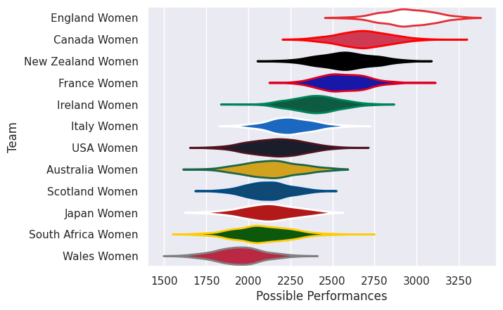
# Standings

## Current Standings

| Club               |   Played |   Wins |   Point Differential |   Losing Bonus Points | Try Bonus Points   |   Competition Points |
|:-------------------|---------:|-------:|---------------------:|----------------------:|:-------------------|---------------------:|
| New Zealand Women  |        2 |      2 |                   66 |                     0 |                    |                    8 |
| Canada Women       |        2 |      1 |                   38 |                     0 |                    |                    6 |
| England Women      |        2 |      1 |                   33 |                     0 |                    |                    6 |
| Italy Women        |        1 |      1 |                   34 |                     0 |                    |                    4 |
| Wales Women        |        1 |      1 |                   31 |                     0 |                    |                    4 |
| USA Women          |        1 |      1 |                    4 |                     0 |                    |                    4 |
| France Women       |        2 |      1 |                  -11 |                     0 |                    |                    4 |
| Ireland Women      |        1 |      0 |                   -4 |                     1 |                    |                    1 |
| Australia Women    |        2 |      0 |                  -36 |                     1 |                    |                    1 |
| South Africa Women |        1 |      0 |                  -31 |                     0 |                    |                    0 |
| Japan Women        |        1 |      0 |                  -34 |                     0 |                    |                    0 |
| Scotland Women     |        2 |      0 |                  -90 |                     0 |                    |                    0 |

## Projected Remaining Table

| Club               |   To Play |   Projected Wins |   Projected Differential |   Projected Losing Bonus Points | Projected Try Bonus Points   |   Projected Competition Points |
|:-------------------|----------:|-----------------:|-------------------------:|--------------------------------:|:-----------------------------|-------------------------------:|
| Italy Women        |         1 |            0.962 |                   21.705 |                           0.028 |                              |                          3.886 |
| Ireland Women      |         1 |            0.892 |                   16.77  |                           0.059 |                              |                          3.661 |
| Canada Women       |         1 |            0.796 |                   10.81  |                           0.113 |                              |                          3.349 |
| England Women      |         1 |            0.805 |                   13.739 |                           0.099 |                              |                          3.347 |
| USA Women          |         1 |            0.668 |                    6.213 |                           0.157 |                              |                          2.893 |
| Australia Women    |         1 |            0.563 |                    2.742 |                           0.192 |                              |                          2.51  |
| Scotland Women     |         1 |            0.404 |                   -2.742 |                           0.204 |                              |                          1.886 |
| Wales Women        |         1 |            0.3   |                   -6.213 |                           0.205 |                              |                          1.469 |
| France Women       |         1 |            0.178 |                  -10.81  |                           0.192 |                              |                          0.956 |
| New Zealand Women  |         1 |            0.181 |                  -13.739 |                           0.155 |                              |                          0.907 |
| Japan Women        |         1 |            0.091 |                  -16.77  |                           0.133 |                              |                          0.531 |
| South Africa Women |         1 |            0.033 |                  -21.705 |                           0.09  |                              |                          0.232 |

## Projected Total Table

| Club               |   Played |   Wins |   Point Differential |   Losing Bonus Points | Try Bonus Points   |   Competition Points |
|:-------------------|---------:|-------:|---------------------:|----------------------:|:-------------------|---------------------:|
| Canada Women       |        3 |  1.796 |               48.81  |                 0.113 |                    |                9.349 |
| England Women      |        3 |  1.805 |               46.739 |                 0.099 |                    |                9.347 |
| New Zealand Women  |        3 |  2.181 |               52.261 |                 0.155 |                    |                8.907 |
| Italy Women        |        2 |  1.962 |               55.705 |                 0.028 |                    |                7.886 |
| USA Women          |        2 |  1.668 |               10.213 |                 0.157 |                    |                6.893 |
| Wales Women        |        2 |  1.3   |               24.787 |                 0.205 |                    |                5.469 |
| France Women       |        3 |  1.178 |              -21.81  |                 0.192 |                    |                4.956 |
| Ireland Women      |        2 |  0.892 |               12.77  |                 1.059 |                    |                4.661 |
| Australia Women    |        3 |  0.563 |              -33.258 |                 1.192 |                    |                3.51  |
| Scotland Women     |        3 |  0.404 |              -92.742 |                 0.204 |                    |                1.886 |
| Japan Women        |        2 |  0.091 |              -50.77  |                 0.133 |                    |                0.531 |
| South Africa Women |        2 |  0.033 |              -52.705 |                 0.09  |                    |                0.232 |

# Completed Match Review

| Model | Percent Correct Predictions | Spread Error |
| ------ | ------ | ------ |
| Club Level | 66.7% | 20.2 |
| Player Level: Lineup | nan% | nan |
| Player Level: Minutes | nan% | nan |

# Future Predictions

## Week 3

### England Women V New Zealand Women on 2026/09/26

Average Margin: England Women by 13.7

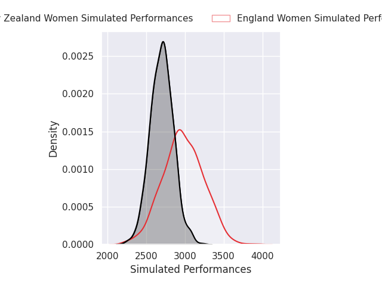
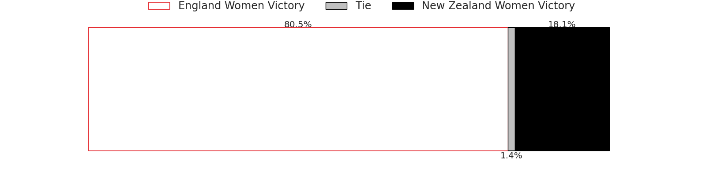
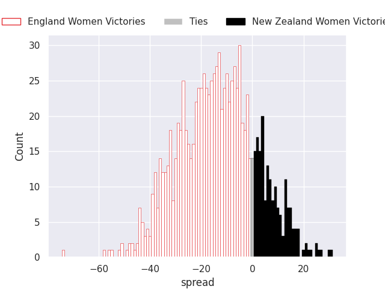

### Scotland Women V Australia Women on 2026/09/26

Average Margin: Australia Women by 2.7

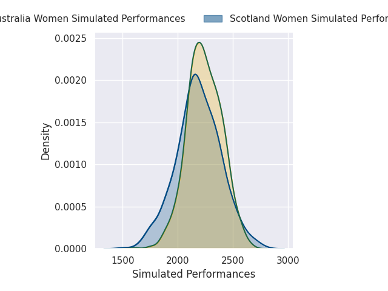

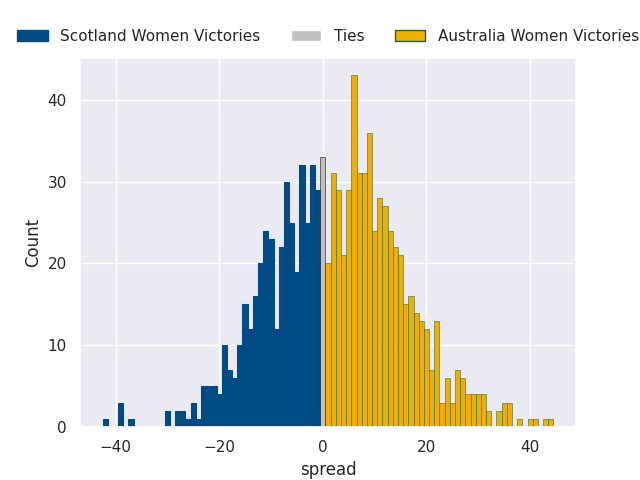

### Italy Women V South Africa Women on 2026/09/26

Average Margin: Italy Women by 21.7

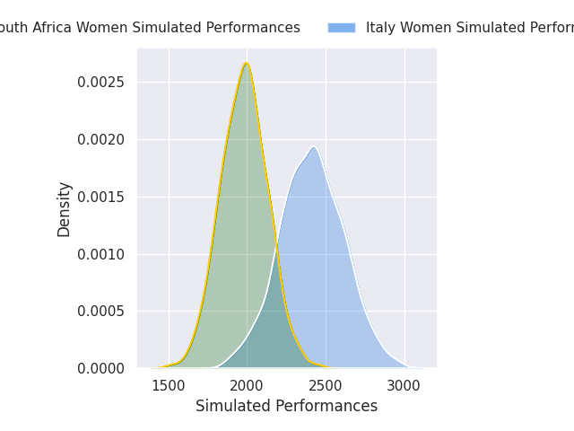
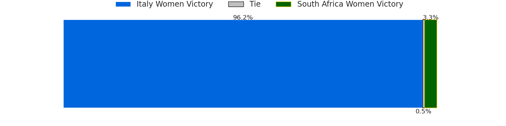
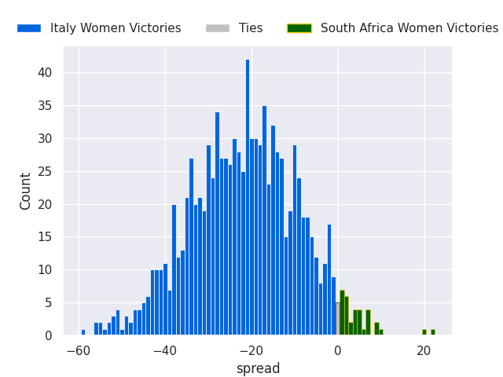

### Wales Women V USA Women on 2026/09/26

Average Margin: USA Women by 6.2

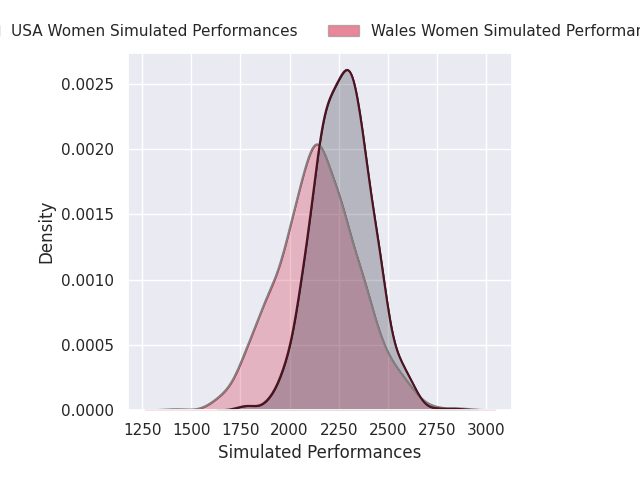
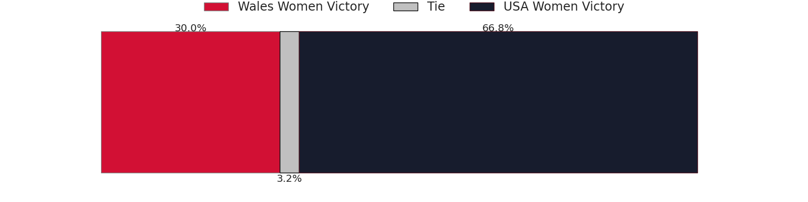
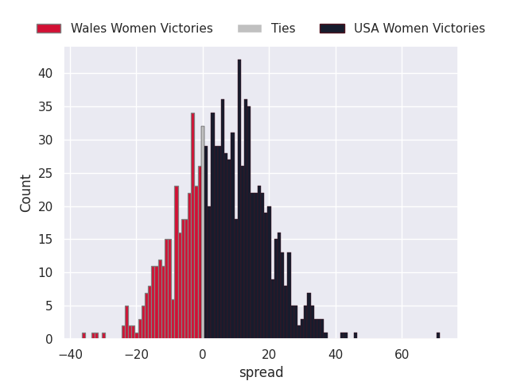

### France Women V Canada Women on 2026/09/26

Average Margin: Canada Women by 10.8

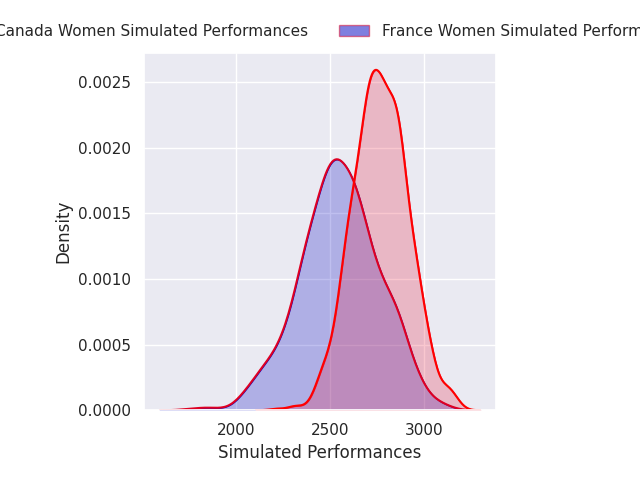
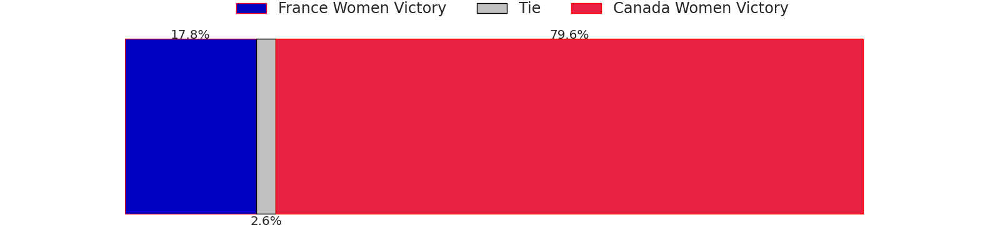
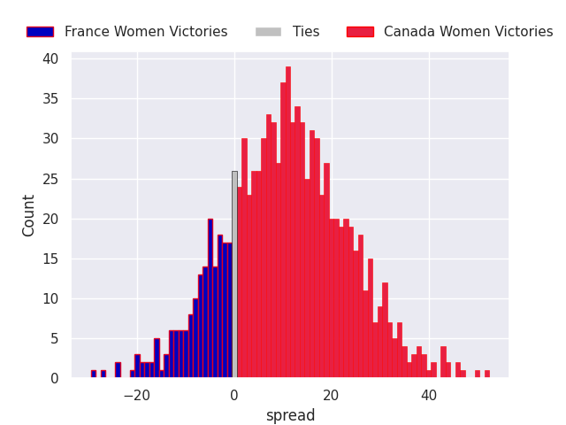

### Ireland Women V Japan Women on 2026/09/27

Average Margin: Ireland Women by 16.8

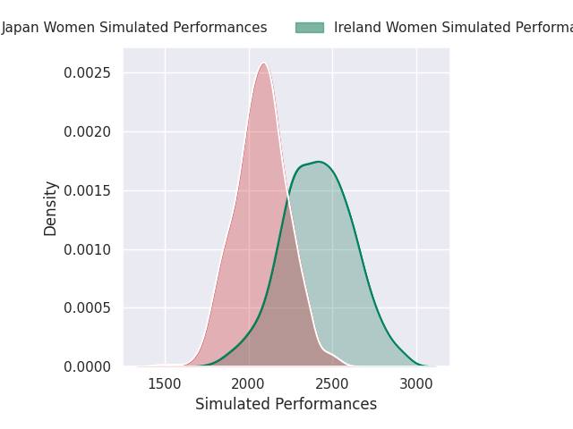
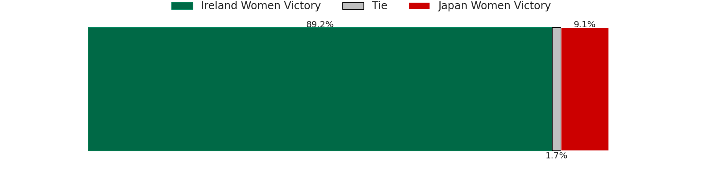
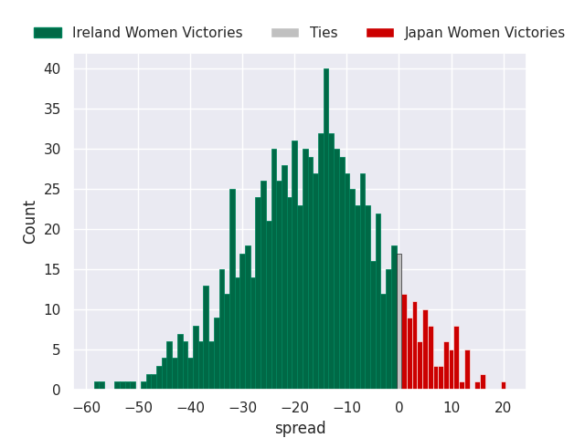

