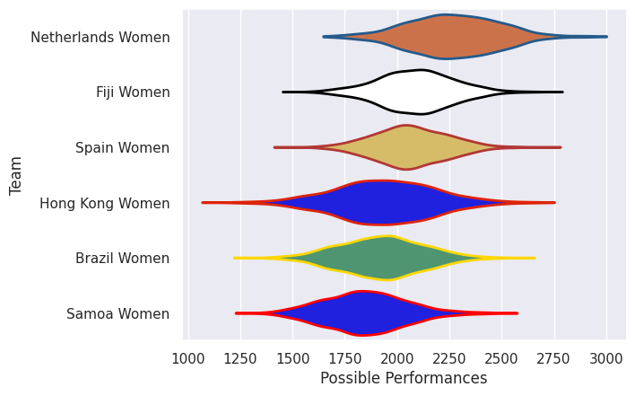
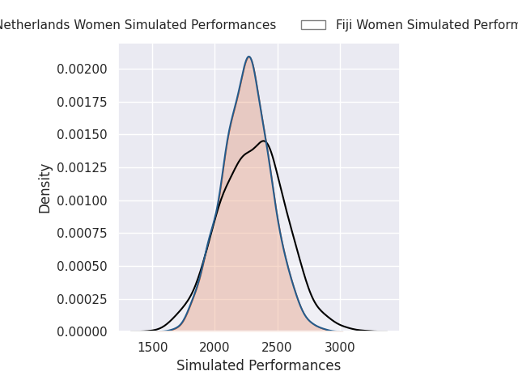
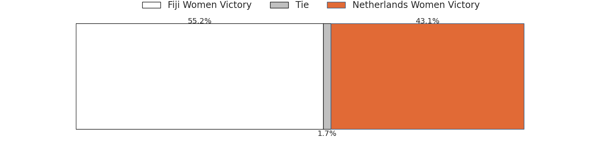
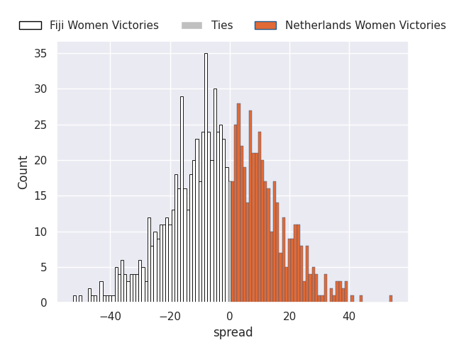
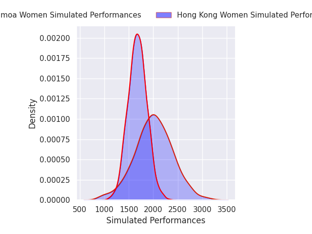
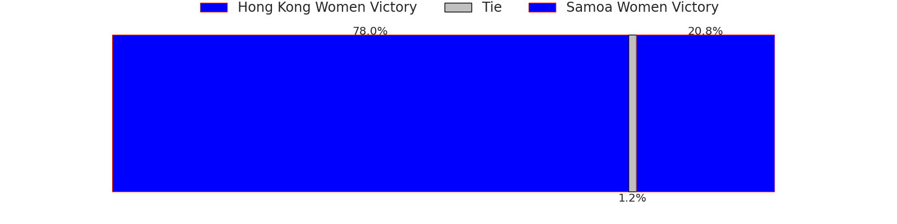
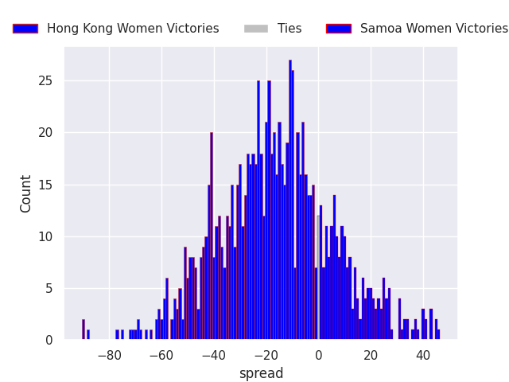
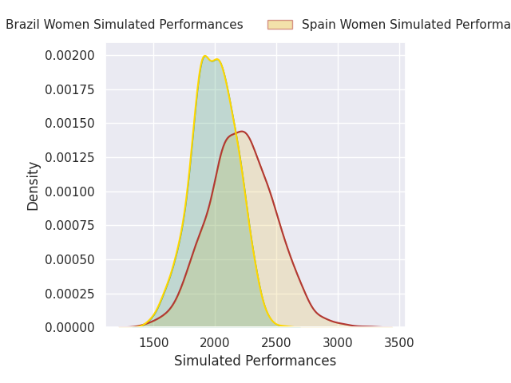
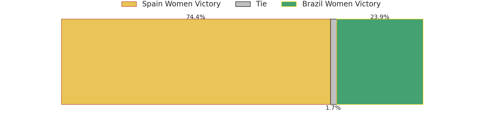
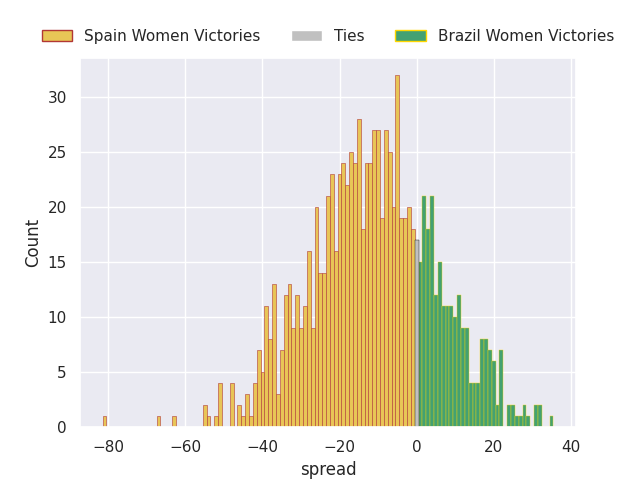

# Team Rankings

# Standings

## Current Standings

| Club              |   Played |   Wins |   Point Differential |   Losing Bonus Points | Try Bonus Points   |   Competition Points |
|:------------------|---------:|-------:|---------------------:|----------------------:|:-------------------|---------------------:|
| Netherlands Women |        2 |      2 |                   72 |                     0 |                    |                    8 |
| Fiji Women        |        2 |      2 |                   34 |                     0 |                    |                    8 |
| Spain Women       |        2 |      1 |                   34 |                     1 |                    |                    5 |
| Hong Kong Women   |        2 |      1 |                  -23 |                     0 |                    |                    4 |
| Brazil Women      |        2 |      0 |                   -7 |                     2 |                    |                    2 |
| Samoa Women       |        2 |      0 |                 -110 |                     0 |                    |                    0 |

## Projected Remaining Table

| Club              |   To Play |   Projected Wins |   Projected Differential |   Projected Losing Bonus Points | Projected Try Bonus Points   |   Projected Competition Points |
|:------------------|----------:|-----------------:|-------------------------:|--------------------------------:|:-----------------------------|-------------------------------:|
| Hong Kong Women   |         1 |            0.78  |                   16.596 |                           0.074 |                              |                          3.218 |
| Spain Women       |         1 |            0.744 |                   11.286 |                           0.113 |                              |                          3.123 |
| Fiji Women        |         1 |            0.552 |                    2.497 |                           0.152 |                              |                          2.394 |
| Netherlands Women |         1 |            0.431 |                   -2.497 |                           0.165 |                              |                          1.923 |
| Brazil Women      |         1 |            0.239 |                  -11.286 |                           0.153 |                              |                          1.143 |
| Samoa Women       |         1 |            0.208 |                  -16.596 |                           0.103 |                              |                          0.959 |

## Projected Total Table

| Club              |   Played |   Wins |   Point Differential |   Losing Bonus Points | Try Bonus Points   |   Competition Points |
|:------------------|---------:|-------:|---------------------:|----------------------:|:-------------------|---------------------:|
| Fiji Women        |        3 |  2.552 |               36.497 |                 0.152 |                    |               10.394 |
| Netherlands Women |        3 |  2.431 |               69.503 |                 0.165 |                    |                9.923 |
| Spain Women       |        3 |  1.744 |               45.286 |                 1.113 |                    |                8.123 |
| Hong Kong Women   |        3 |  1.78  |               -6.404 |                 0.074 |                    |                7.218 |
| Brazil Women      |        3 |  0.239 |              -18.286 |                 2.153 |                    |                3.143 |
| Samoa Women       |        3 |  0.208 |             -126.596 |                 0.103 |                    |                0.959 |

# Completed Match Review

| Model | Percent Correct Predictions | Spread Error |
| ------ | ------ | ------ |
| Club Level | 88.9% | 18.0 |
| Player Level: Lineup | nan% | nan |
| Player Level: Minutes | nan% | nan |

# Future Predictions

## Week 3

### Fiji Women V Netherlands Women on 2026/09/26

Average Margin: Fiji Women by 2.5

### Hong Kong Women V Samoa Women on 2026/09/26

Average Margin: Hong Kong Women by 16.6

### Spain Women V Brazil Women on 2026/09/26

Average Margin: Spain Women by 11.3

