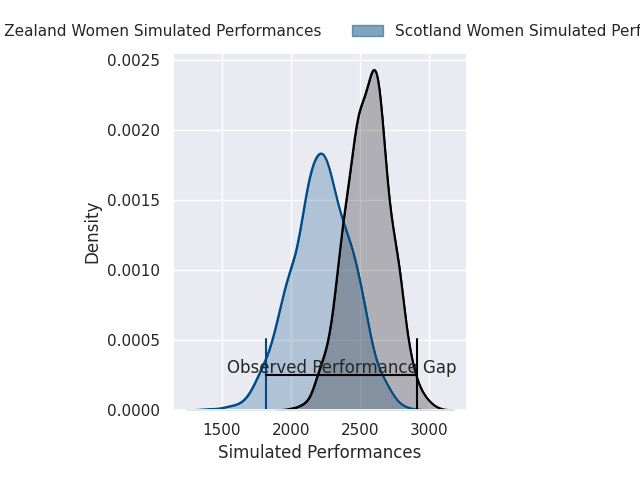
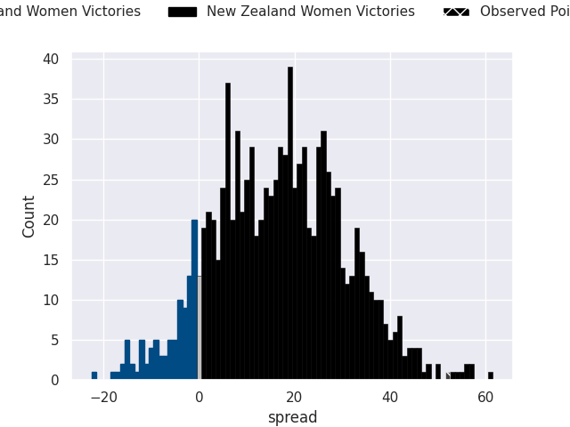

# Scotland Women V New Zealand Women on 2026/09/19, 14.0 to 66.0

# Club Level Predictions

Now that the game has been played, lets see how the club predictions did. I predicted New Zealand Women to win by 16.9, and New Zealand Women won by 52.0. That's an absolute error of 35.1 for the margin of victory, while my average absolute error has been 14.8 over the past six months. This prediction was more accurate than 7.8% of my recent predictions.

For the Over/Under model, I predicted a total of 50.5 and we have an actual total of 80.0. That's an absolute error of 29.5 compared to a six month average of 14.3. This prediction was more accurate than 10.8% of my recent predictions.
## Projected Performances - Club Model

## Projected Spreads - Club Model

## Projected Results - Club Model

