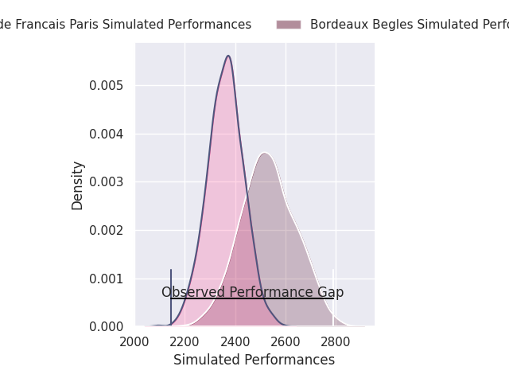
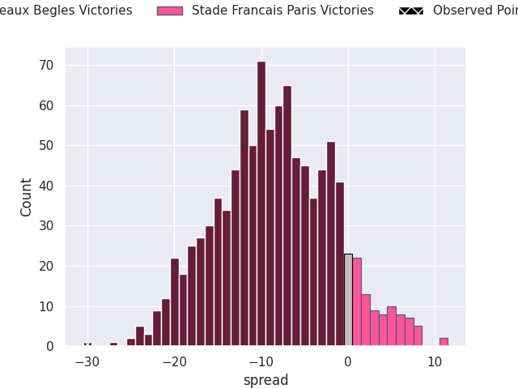
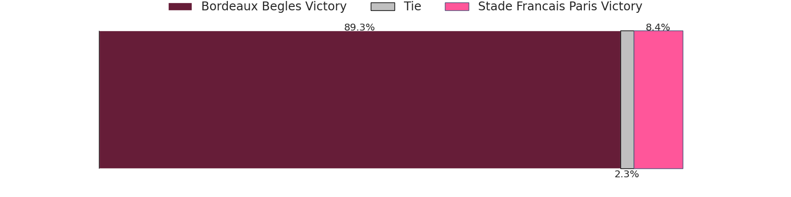

# Bordeaux Begles V Stade Francais Paris on 2026/09/20, 40.0 to 10.0

# Club Level Predictions

Now that the game has been played, lets see how the club predictions did. I predicted Bordeaux Begles to win by 8.49, and Bordeaux Begles won by 30.0. That's an absolute error of 21.5 for the margin of victory, while my average absolute error has been 14.8 over the past six months. This prediction was more accurate than 23.4% of my recent predictions.

For the Over/Under model, I predicted a total of 50.5 and we have an actual total of 50.0. That's an absolute error of 0.5 compared to a six month average of 14.4. This prediction was more accurate than 98.0% of my recent predictions.
## Projected Performances - Club Model

## Projected Spreads - Club Model

## Projected Results - Club Model

