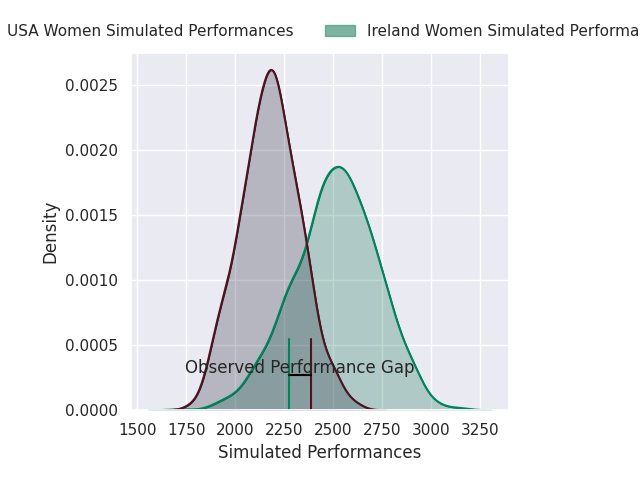
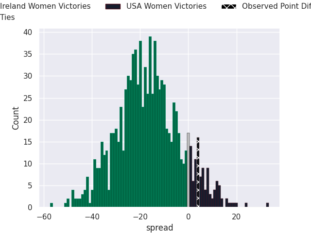
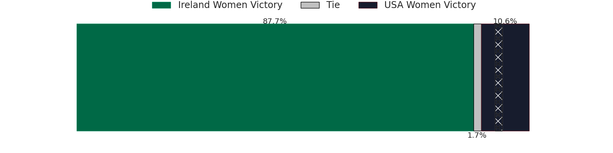

# Ireland Women V USA Women on 2026/09/20, 36.0 to 40.0

# Club Level Predictions

Now that the game has been played, lets see how the club predictions did. I predicted Ireland Women to win by 16.62, and USA Women won by 4.0. That's an absolute error of 20.6 for the margin of victory, while my average absolute error has been 14.8 over the past six months. This prediction was more accurate than 25.2% of my recent predictions.

For the Over/Under model, I predicted a total of 47.5 and we have an actual total of 76.0. That's an absolute error of 28.5 compared to a six month average of 14.4. This prediction was more accurate than 11.9% of my recent predictions.
## Projected Performances - Club Model

## Projected Spreads - Club Model

## Projected Results - Club Model

