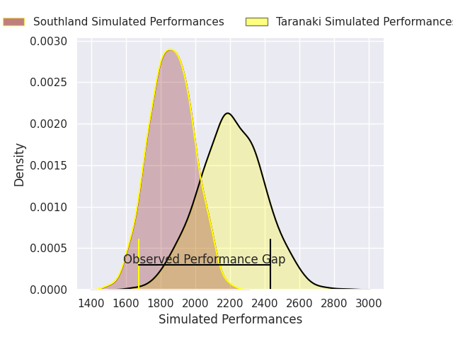
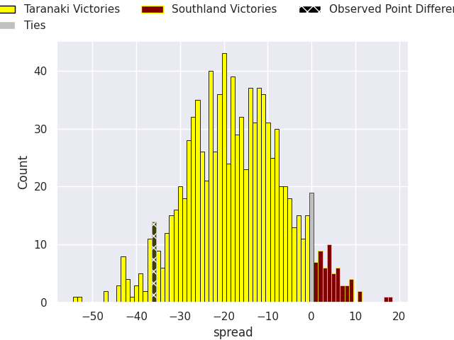
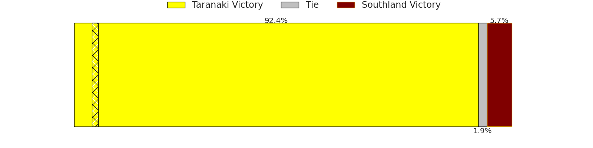
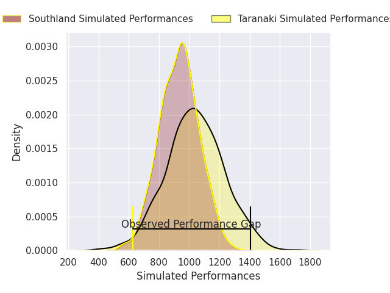
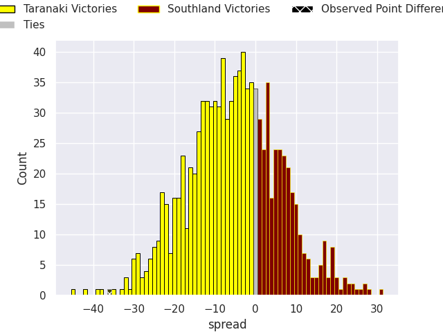
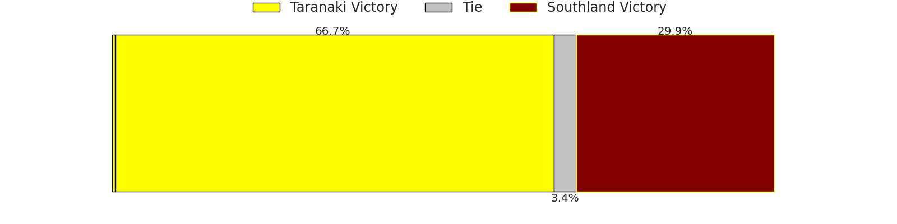

# Taranaki V Southland on 2026/09/20, 55.0 to 19.0

# Club Level Predictions

Now that the game has been played, lets see how the club predictions did. I predicted Taranaki to win by 17.27, and Taranaki won by 36.0. That's an absolute error of 18.7 for the margin of victory, while my average absolute error has been 14.8 over the past six months. This prediction was more accurate than 30.2% of my recent predictions.

For the Over/Under model, I predicted a total of 50.5 and we have an actual total of 74.0. That's an absolute error of 23.5 compared to a six month average of 14.4. This prediction was more accurate than 20.2% of my recent predictions.
## Projected Performances - Club Model

## Projected Spreads - Club Model

## Projected Results - Club Model

# Player Level Predictions

With the player model, I predicted Taranaki to win by 5.3,  and Taranaki won by 36.0. That's an absolute error of 30.7 for the margin of victory, while the average error as been 15.2 for the past six months. So this prediction was more accurate than 9.5% of my recent predictions.
## Projected Performances - Player Model

## Projected Spreads - Player Model

## Projected Results - Player Model

