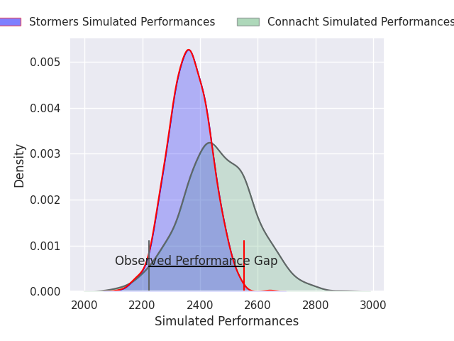
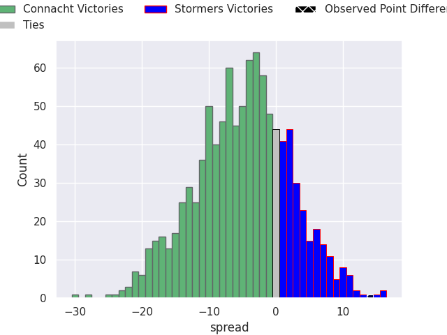
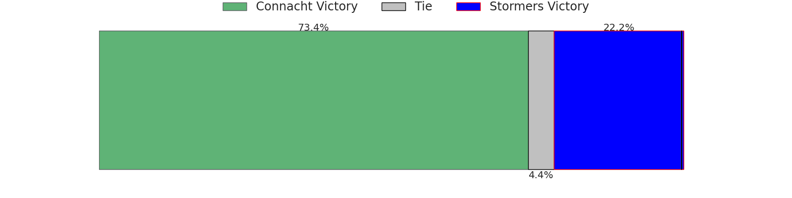

# Connacht V Stormers on 2026/09/25, 15.0 to 29.0

# Club Level Predictions

Now that the game has been played, lets see how the club predictions did. I predicted Connacht to win by 4.96, and Stormers won by 14.0. That's an absolute error of 19.0 for the margin of victory, while my average absolute error has been 14.8 over the past six months. This prediction was more accurate than 29.9% of my recent predictions.

For the Over/Under model, I predicted a total of 46.5 and we have an actual total of 44.0. That's an absolute error of 2.5 compared to a six month average of 14.8. This prediction was more accurate than 88.5% of my recent predictions.
## Projected Performances - Club Model

## Projected Spreads - Club Model

## Projected Results - Club Model

