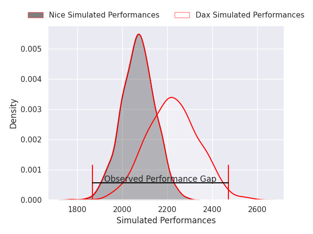
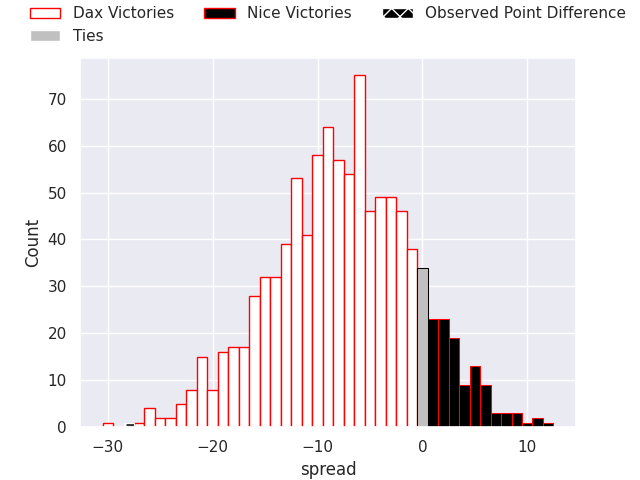
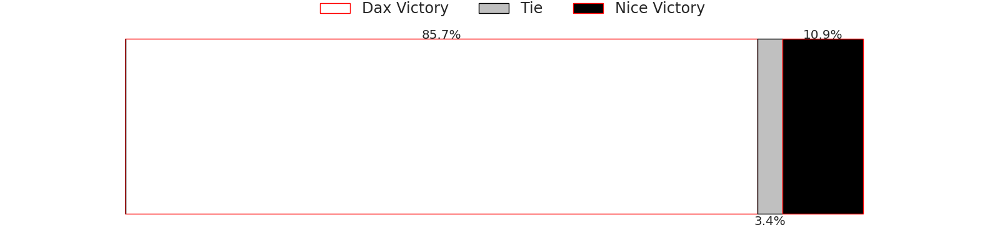
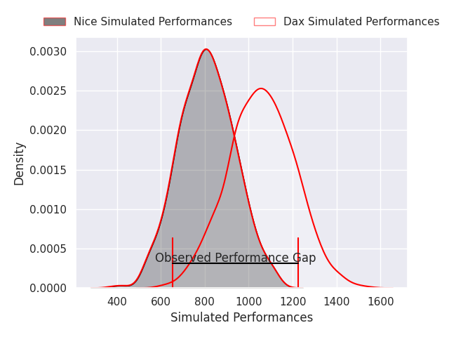
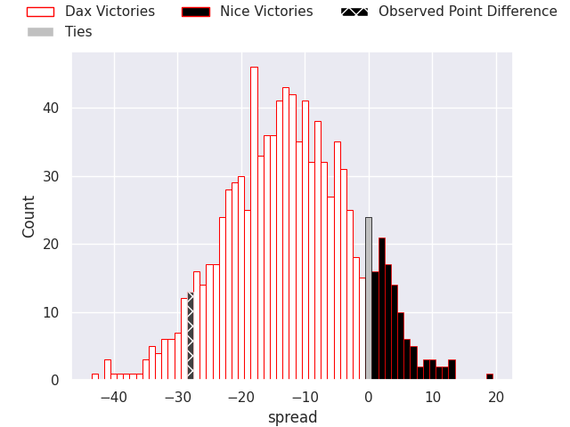
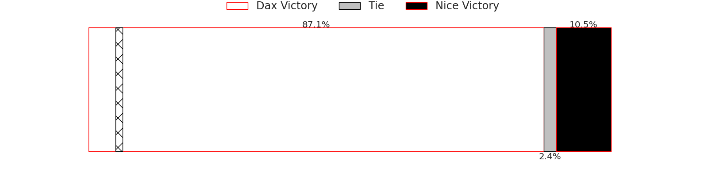

# Dax V Nice on 2026/09/25, 45.0 to 17.0

# Club Level Predictions

Now that the game has been played, lets see how the club predictions did. I predicted Dax to win by 7.64, and Dax won by 28.0. That's an absolute error of 20.4 for the margin of victory, while my average absolute error has been 14.8 over the past six months. This prediction was more accurate than 26.0% of my recent predictions.

For the Over/Under model, I predicted a total of 51.5 and we have an actual total of 62.0. That's an absolute error of 10.5 compared to a six month average of 14.8. This prediction was more accurate than 54.5% of my recent predictions.
## Projected Performances - Club Model

## Projected Spreads - Club Model

## Projected Results - Club Model

# Player Level Predictions

With the player model, I predicted Dax to win by 12.42,  and Dax won by 28.0. That's an absolute error of 15.6 for the margin of victory, while the average error as been 15.0 for the past six months. So this prediction was more accurate than 29.8% of my recent predictions.
## Projected Performances - Player Model

## Projected Spreads - Player Model

## Projected Results - Player Model

