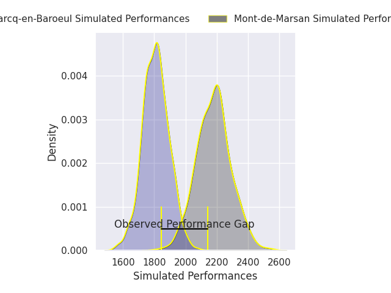
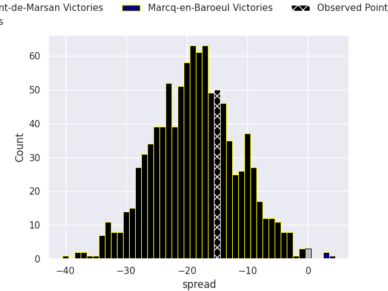
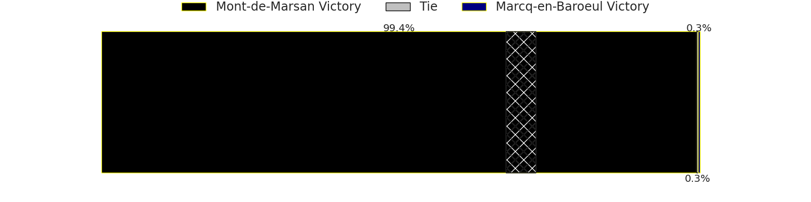

# Mont-de-Marsan V Marcq-en-Baroeul on 2026/09/25, 38.0 to 23.0

# Club Level Predictions

Now that the game has been played, lets see how the club predictions did. I predicted Mont-de-Marsan to win by 18.49, and Mont-de-Marsan won by 15.0. That's an absolute error of 3.5 for the margin of victory, while my average absolute error has been 14.8 over the past six months. This prediction was more accurate than 83.8% of my recent predictions.

For the Over/Under model, I predicted a total of 44.5 and we have an actual total of 61.0. That's an absolute error of 16.5 compared to a six month average of 14.8. This prediction was more accurate than 35.7% of my recent predictions.
## Projected Performances - Club Model

## Projected Spreads - Club Model

## Projected Results - Club Model

