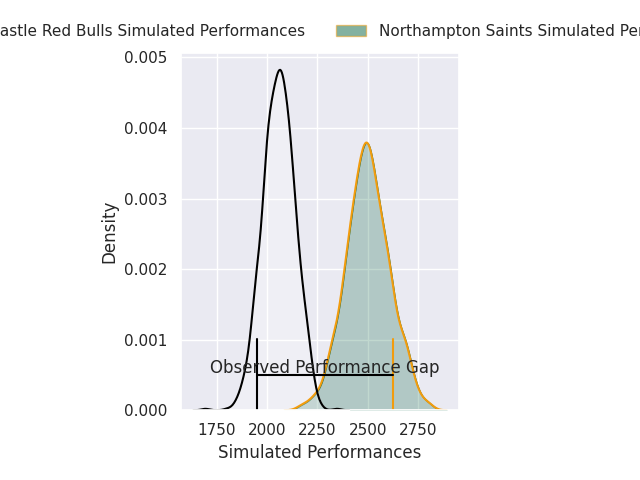
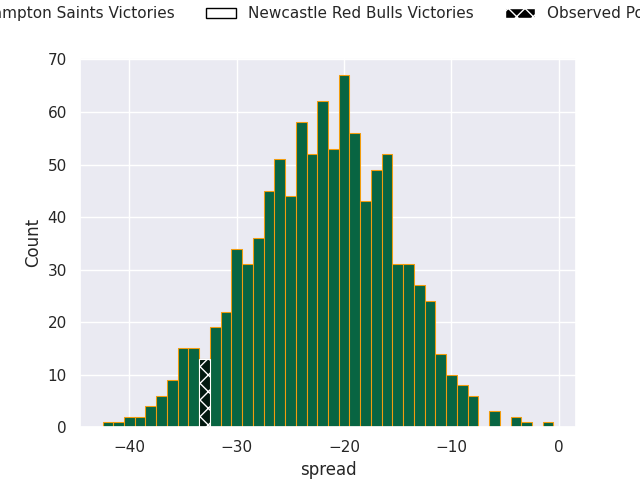
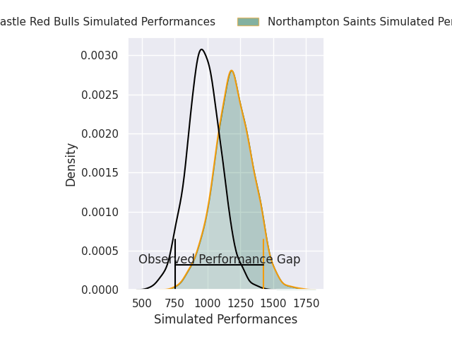
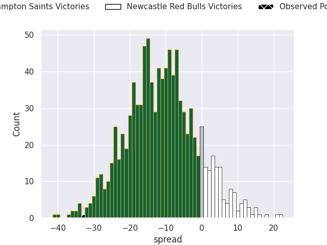
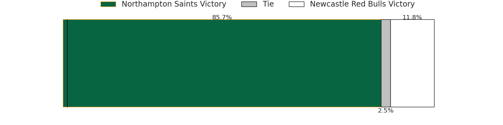

# Northampton Saints V Newcastle Red Bulls on 2026/09/25, 59.0 to 26.0

# Club Level Predictions

Now that the game has been played, lets see how the club predictions did. I predicted Northampton Saints to win by 22.11, and Northampton Saints won by 33.0. That's an absolute error of 10.9 for the margin of victory, while my average absolute error has been 14.8 over the past six months. This prediction was more accurate than 54.5% of my recent predictions.

For the Over/Under model, I predicted a total of 53.5 and we have an actual total of 85.0. That's an absolute error of 31.5 compared to a six month average of 14.8. This prediction was more accurate than 9.4% of my recent predictions.
## Projected Performances - Club Model

## Projected Spreads - Club Model

## Projected Results - Club Model

# Player Level Predictions

With the player model, I predicted Northampton Saints to win by 11.18,  and Northampton Saints won by 33.0. That's an absolute error of 21.8 for the margin of victory, while the average error as been 15.0 for the past six months. So this prediction was more accurate than 18.4% of my recent predictions.
## Projected Performances - Player Model

## Projected Spreads - Player Model

## Projected Results - Player Model

