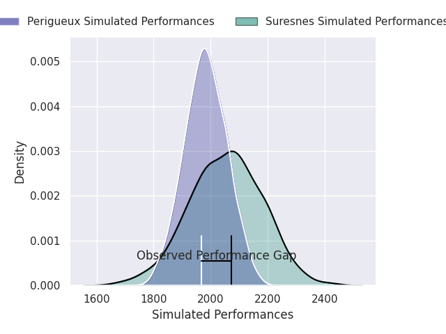
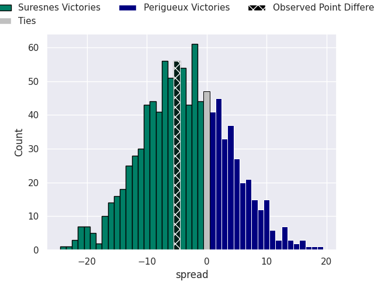

# Suresnes V Périgueux on 2026/09/25, 27.0 to 22.0

# Club Level Predictions

Now that the game has been played, lets see how the club predictions did. I predicted Suresnes to win by 3.53, and Suresnes won by 5.0. That's an absolute error of 1.5 for the margin of victory, while my average absolute error has been 14.8 over the past six months. This prediction was more accurate than 93.0% of my recent predictions.

For the Over/Under model, I predicted a total of 44.5 and we have an actual total of 49.0. That's an absolute error of 4.5 compared to a six month average of 14.8. This prediction was more accurate than 79.8% of my recent predictions.
## Projected Performances - Club Model

## Projected Spreads - Club Model

## Projected Results - Club Model

