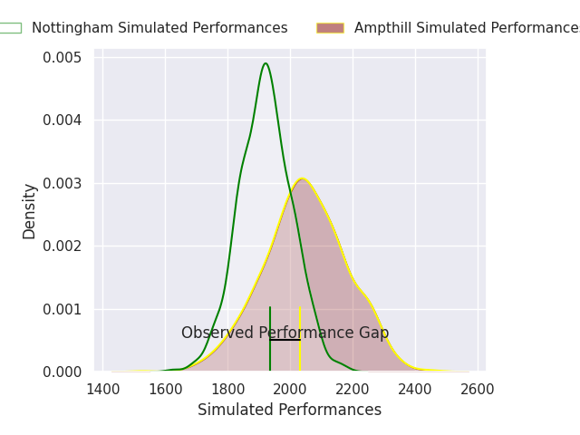
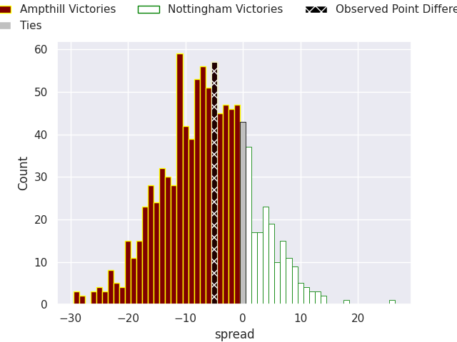

# Ampthill V Nottingham on 2026/09/26, 33.0 to 28.0

# Club Level Predictions

Now that the game has been played, lets see how the club predictions did. I predicted Ampthill to win by 6.33, and Ampthill won by 5.0. That's an absolute error of 1.3 for the margin of victory, while my average absolute error has been 14.8 over the past six months. This prediction was more accurate than 93.8% of my recent predictions.

For the Over/Under model, I predicted a total of 53.5 and we have an actual total of 61.0. That's an absolute error of 7.5 compared to a six month average of 14.8. This prediction was more accurate than 67.5% of my recent predictions.
## Projected Performances - Club Model

## Projected Spreads - Club Model

## Projected Results - Club Model

