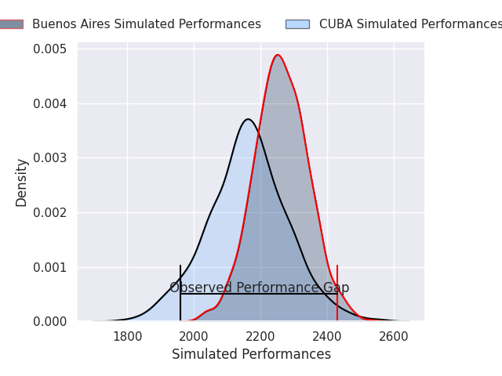
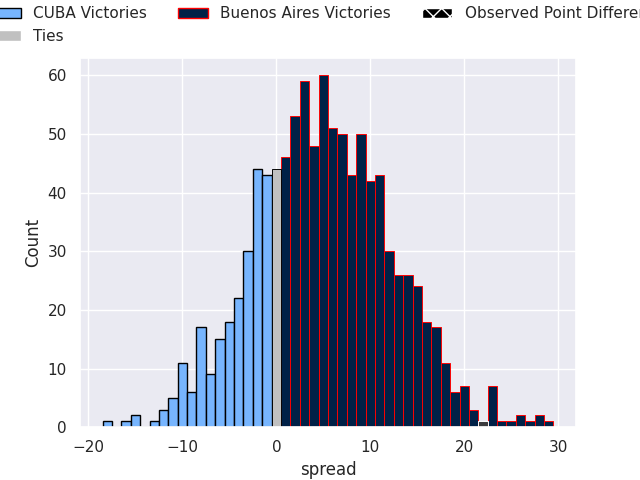

# CUBA V Buenos Aires on 2026/09/26, 29.0 to 51.0

# Club Level Predictions

Now that the game has been played, lets see how the club predictions did. I predicted Buenos Aires to win by 5.03, and Buenos Aires won by 22.0. That's an absolute error of 17.0 for the margin of victory, while my average absolute error has been 14.8 over the past six months. This prediction was more accurate than 35.1% of my recent predictions.

For the Over/Under model, I predicted a total of 53.5 and we have an actual total of 80.0. That's an absolute error of 26.5 compared to a six month average of 14.8. This prediction was more accurate than 15.5% of my recent predictions.
## Projected Performances - Club Model

## Projected Spreads - Club Model

## Projected Results - Club Model

