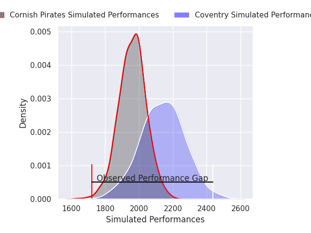
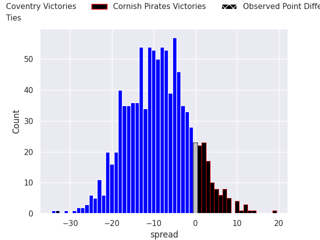

# Coventry V Cornish Pirates on 2026/09/26, 73.0 to 40.0

# Club Level Predictions

Now that the game has been played, lets see how the club predictions did. I predicted Coventry to win by 8.93, and Coventry won by 33.0. That's an absolute error of 24.1 for the margin of victory, while my average absolute error has been 14.8 over the past six months. This prediction was more accurate than 19.4% of my recent predictions.

For the Over/Under model, I predicted a total of 51.5 and we have an actual total of 113.0. That's an absolute error of 61.5 compared to a six month average of 14.8. This prediction was more accurate than 0.2% of my recent predictions.
## Projected Performances - Club Model

## Projected Spreads - Club Model

## Projected Results - Club Model

