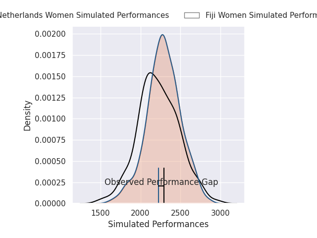
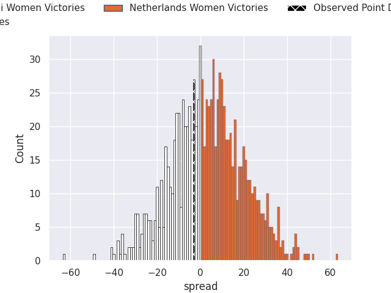

# Fiji Women V Netherlands Women on 2026/09/26, 20.0 to 17.0

# Club Level Predictions

Now that the game has been played, lets see how the club predictions did. I predicted Netherlands Women to win by 3.32, and Fiji Women won by 3.0. That's an absolute error of 6.3 for the margin of victory, while my average absolute error has been 14.8 over the past six months. This prediction was more accurate than 71.0% of my recent predictions.

For the Over/Under model, I predicted a total of 48.5 and we have an actual total of 37.0. That's an absolute error of 11.5 compared to a six month average of 14.8. This prediction was more accurate than 51.8% of my recent predictions.
## Projected Performances - Club Model

## Projected Spreads - Club Model

## Projected Results - Club Model

