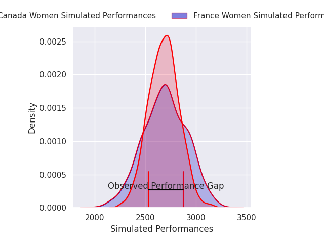
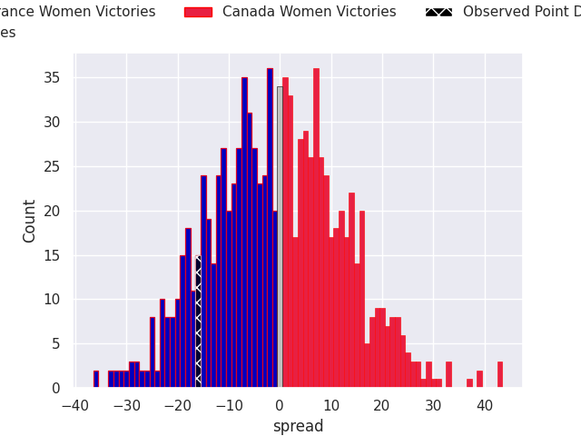
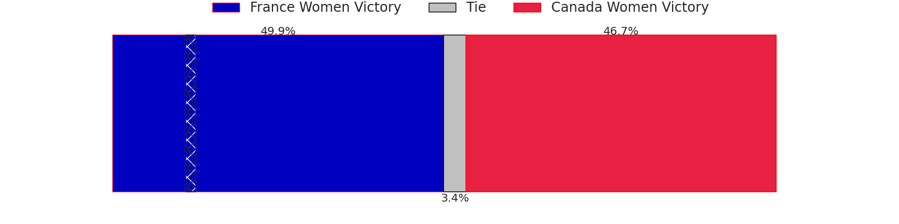

# France Women V Canada Women on 2026/09/26, 21.0 to 5.0

# Club Level Predictions

Now that the game has been played, lets see how the club predictions did. I predicted France Women to win by 0.58, and France Women won by 16.0. That's an absolute error of 15.4 for the margin of victory, while my average absolute error has been 14.8 over the past six months. This prediction was more accurate than 38.9% of my recent predictions.

For the Over/Under model, I predicted a total of 50.5 and we have an actual total of 26.0. That's an absolute error of 24.5 compared to a six month average of 14.8. This prediction was more accurate than 18.9% of my recent predictions.
## Projected Performances - Club Model

## Projected Spreads - Club Model

## Projected Results - Club Model

