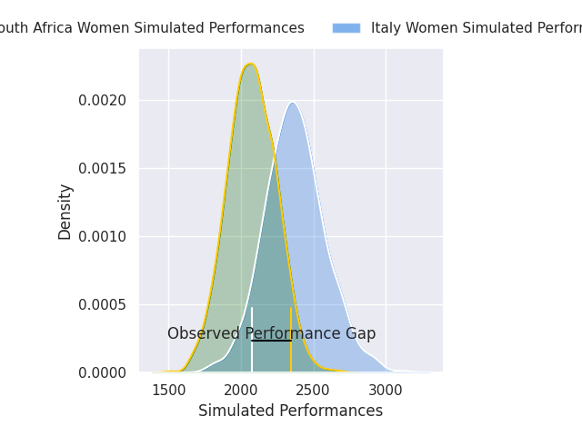
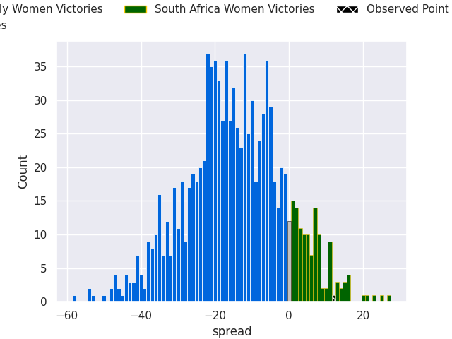

# Italy Women V South Africa Women on 2026/09/26, 29.0 to 41.0

# Club Level Predictions

Now that the game has been played, lets see how the club predictions did. I predicted Italy Women to win by 14.9, and South Africa Women won by 12.0. That's an absolute error of 26.9 for the margin of victory, while my average absolute error has been 14.8 over the past six months. This prediction was more accurate than 15.6% of my recent predictions.

For the Over/Under model, I predicted a total of 48.5 and we have an actual total of 70.0. That's an absolute error of 21.5 compared to a six month average of 14.8. This prediction was more accurate than 23.4% of my recent predictions.
## Projected Performances - Club Model

## Projected Spreads - Club Model

## Projected Results - Club Model

