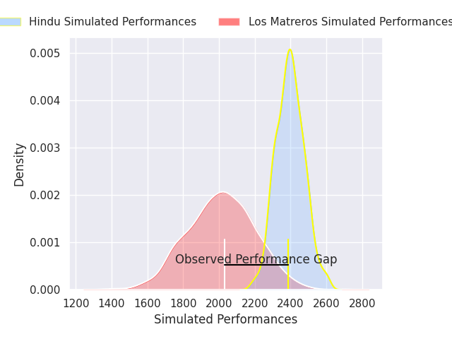
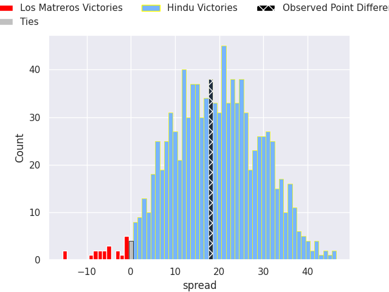

# Los Matreros V Hindu on 2026/09/26, 48.0 to 66.0

# Club Level Predictions

Now that the game has been played, lets see how the club predictions did. I predicted Hindu to win by 19.21, and Hindu won by 18.0. That's an absolute error of 1.2 for the margin of victory, while my average absolute error has been 14.8 over the past six months. This prediction was more accurate than 94.3% of my recent predictions.

For the Over/Under model, I predicted a total of 64.5 and we have an actual total of 114.0. That's an absolute error of 49.5 compared to a six month average of 14.8. This prediction was more accurate than 1.3% of my recent predictions.
## Projected Performances - Club Model

## Projected Spreads - Club Model

## Projected Results - Club Model

