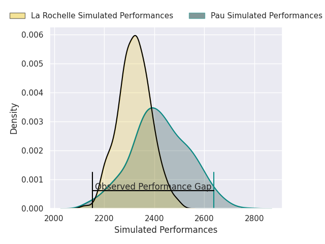
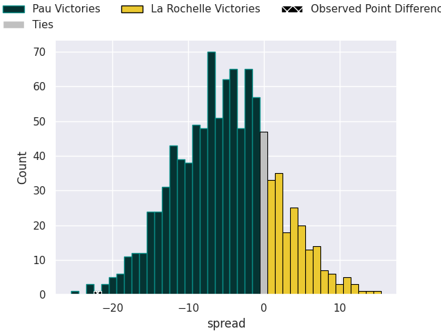
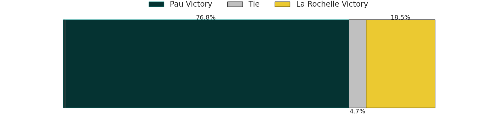
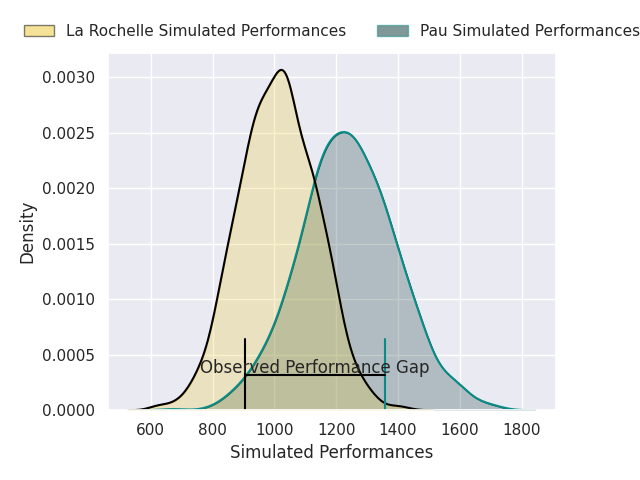
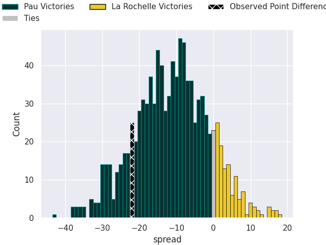
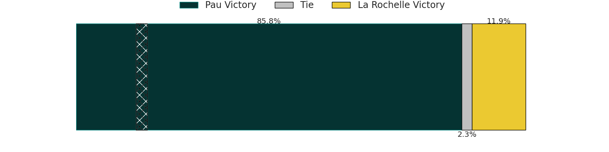

# Pau V La Rochelle on 2026/09/26, 39.0 to 17.0

# Club Level Predictions

Now that the game has been played, lets see how the club predictions did. I predicted Pau to win by 5.13, and Pau won by 22.0. That's an absolute error of 16.9 for the margin of victory, while my average absolute error has been 14.8 over the past six months. This prediction was more accurate than 35.2% of my recent predictions.

For the Over/Under model, I predicted a total of 49.5 and we have an actual total of 56.0. That's an absolute error of 6.5 compared to a six month average of 14.8. This prediction was more accurate than 72.2% of my recent predictions.
## Projected Performances - Club Model

## Projected Spreads - Club Model

## Projected Results - Club Model

# Player Level Predictions

With the player model, I predicted Pau to win by 11.36,  and Pau won by 22.0. That's an absolute error of 10.6 for the margin of victory, while the average error as been 15.0 for the past six months. So this prediction was more accurate than 40.3% of my recent predictions.
## Projected Performances - Player Model

## Projected Spreads - Player Model

## Projected Results - Player Model

