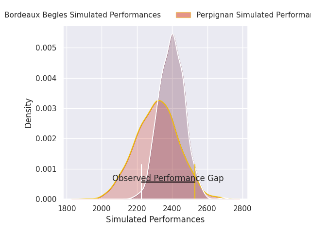
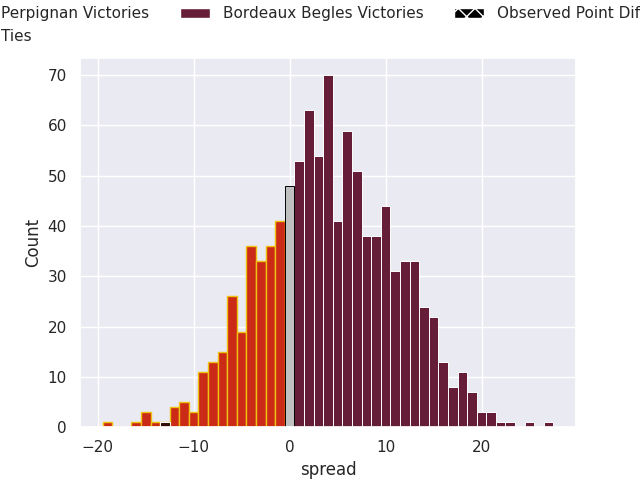
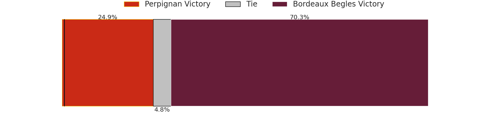

# Perpignan V Bordeaux Begles on 2026/09/26, 38.0 to 25.0

# Club Level Predictions

Now that the game has been played, lets see how the club predictions did. I predicted Bordeaux Begles to win by 4.2, and Perpignan won by 13.0. That's an absolute error of 17.2 for the margin of victory, while my average absolute error has been 14.8 over the past six months. This prediction was more accurate than 34.5% of my recent predictions.

For the Over/Under model, I predicted a total of 50.5 and we have an actual total of 63.0. That's an absolute error of 12.5 compared to a six month average of 14.8. This prediction was more accurate than 48.1% of my recent predictions.
## Projected Performances - Club Model

## Projected Spreads - Club Model

## Projected Results - Club Model

