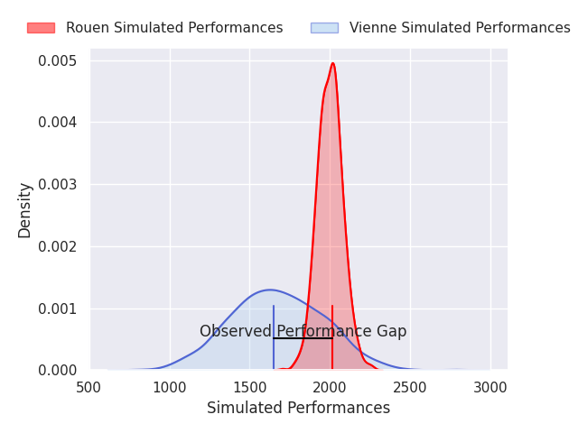
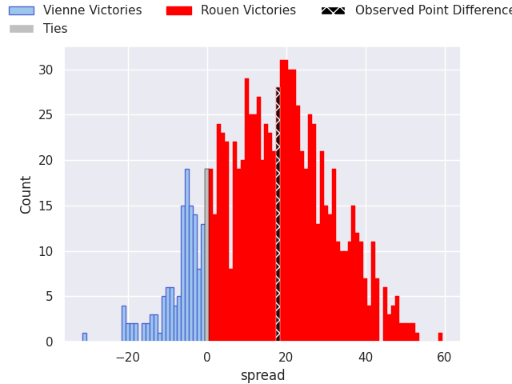

# Vienne V Rouen on 2026/09/26, 18.0 to 36.0

# Club Level Predictions

Now that the game has been played, lets see how the club predictions did. I predicted Rouen to win by 16.29, and Rouen won by 18.0. That's an absolute error of 1.7 for the margin of victory, while my average absolute error has been 14.8 over the past six months. This prediction was more accurate than 91.4% of my recent predictions.

For the Over/Under model, I predicted a total of 42.5 and we have an actual total of 54.0. That's an absolute error of 11.5 compared to a six month average of 14.8. This prediction was more accurate than 51.5% of my recent predictions.
## Projected Performances - Club Model

## Projected Spreads - Club Model

## Projected Results - Club Model

