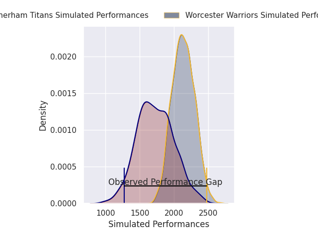
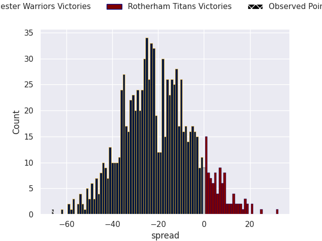

# Worcester Warriors V Rotherham Titans on 2026/09/26, 78.0 to 12.0

# Club Level Predictions

Now that the game has been played, lets see how the club predictions did. I predicted Worcester Warriors to win by 20.25, and Worcester Warriors won by 66.0. That's an absolute error of 45.8 for the margin of victory, while my average absolute error has been 14.8 over the past six months. This prediction was more accurate than 2.6% of my recent predictions.

For the Over/Under model, I predicted a total of 51.5 and we have an actual total of 90.0. That's an absolute error of 38.5 compared to a six month average of 14.8. This prediction was more accurate than 4.5% of my recent predictions.
## Projected Performances - Club Model

## Projected Spreads - Club Model

## Projected Results - Club Model

