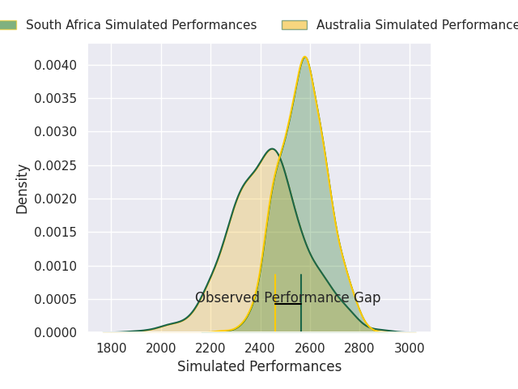
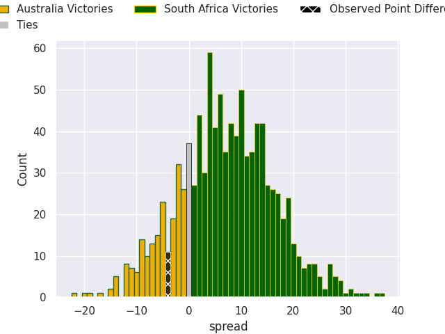
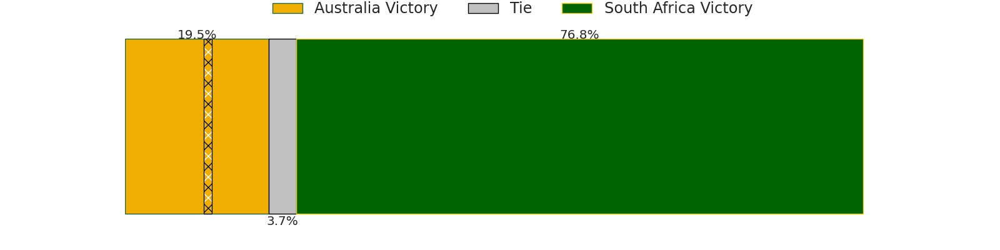
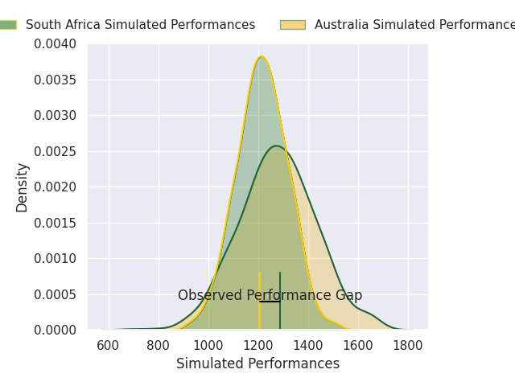
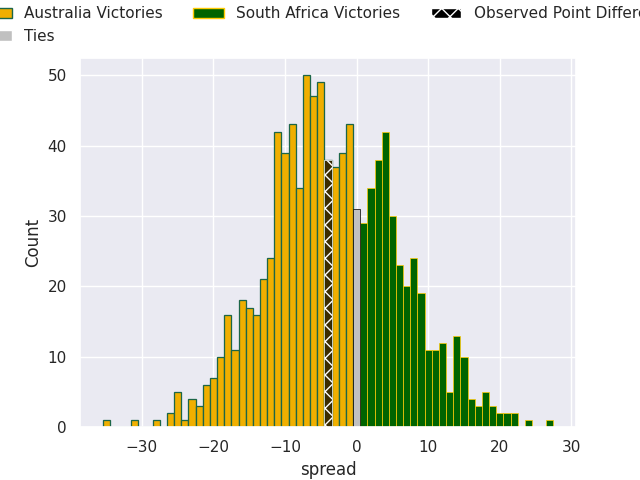
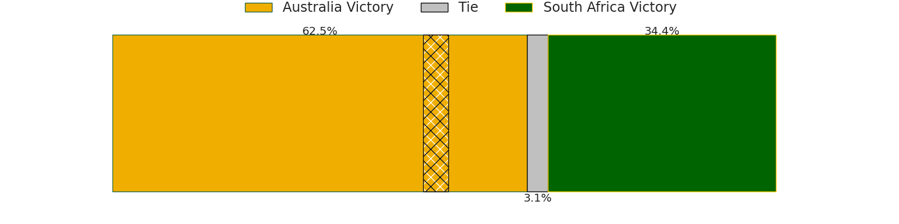

# Australia V South Africa on 2026/09/27, 42.0 to 38.0

# Club Level Predictions

Now that the game has been played, lets see how the club predictions did. I predicted South Africa to win by 7.15, and Australia won by 4.0. That's an absolute error of 11.2 for the margin of victory, while my average absolute error has been 14.8 over the past six months. This prediction was more accurate than 53.6% of my recent predictions.

For the Over/Under model, I predicted a total of 51.5 and we have an actual total of 80.0. That's an absolute error of 28.5 compared to a six month average of 14.8. This prediction was more accurate than 12.3% of my recent predictions.
## Projected Performances - Club Model

## Projected Spreads - Club Model

## Projected Results - Club Model

# Player Level Predictions

With the player model, I predicted Australia to win by 3.1,  and Australia won by 4.0. That's an absolute error of 0.9 for the margin of victory, while the average error as been 15.0 for the past six months. So this prediction was more accurate than 71.8% of my recent predictions.
## Projected Performances - Player Model

## Projected Spreads - Player Model

## Projected Results - Player Model

