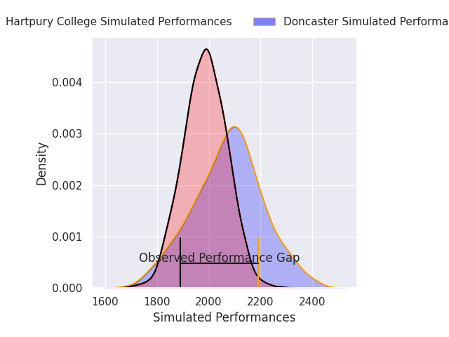
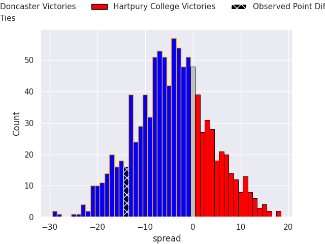

# Doncaster V Hartpury College RFC on 2026/09/27, 29.0 to 15.0

# Club Level Predictions

Now that the game has been played, lets see how the club predictions did. I predicted Doncaster to win by 4.42, and Doncaster won by 14.0. That's an absolute error of 9.6 for the margin of victory, while my average absolute error has been 14.8 over the past six months. This prediction was more accurate than 58.5% of my recent predictions.

For the Over/Under model, I predicted a total of 47.5 and we have an actual total of 44.0. That's an absolute error of 3.5 compared to a six month average of 14.8. This prediction was more accurate than 85.2% of my recent predictions.
## Projected Performances - Club Model

## Projected Spreads - Club Model

## Projected Results - Club Model

