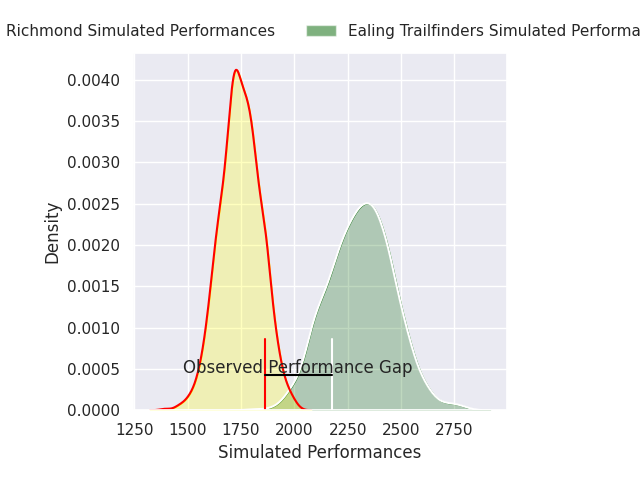
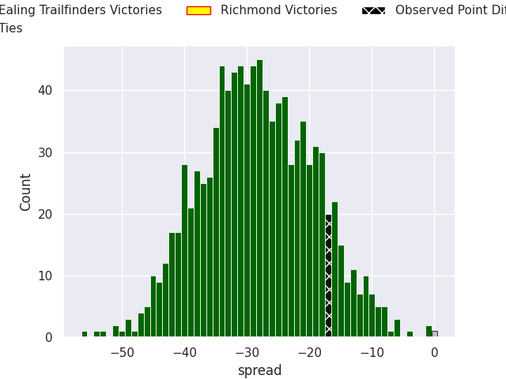

# Ealing Trailfinders V Richmond on 2026/09/27, 36.0 to 19.0

# Club Level Predictions

Now that the game has been played, lets see how the club predictions did. I predicted Ealing Trailfinders to win by 28.25, and Ealing Trailfinders won by 17.0. That's an absolute error of 11.2 for the margin of victory, while my average absolute error has been 14.8 over the past six months. This prediction was more accurate than 53.4% of my recent predictions.

For the Over/Under model, I predicted a total of 52.5 and we have an actual total of 55.0. That's an absolute error of 2.5 compared to a six month average of 14.8. This prediction was more accurate than 88.6% of my recent predictions.
## Projected Performances - Club Model

## Projected Spreads - Club Model

## Projected Results - Club Model

