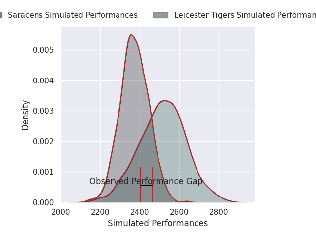
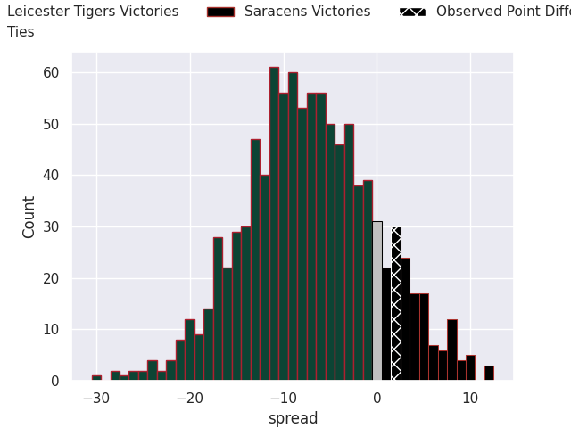
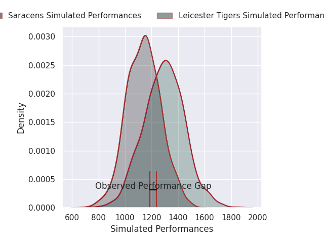
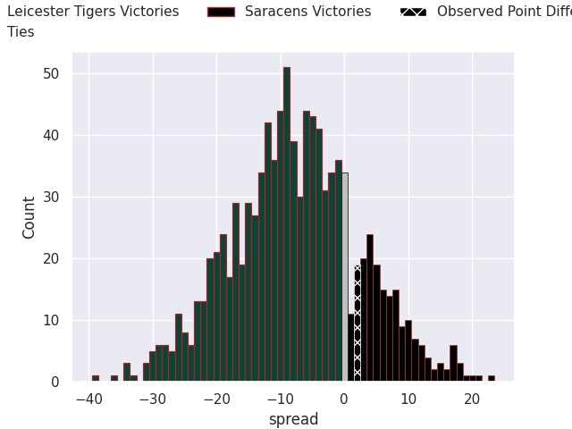

# Leicester Tigers V Saracens on 2026/09/27, 38.0 to 40.0

# Club Level Predictions

Now that the game has been played, lets see how the club predictions did. I predicted Leicester Tigers to win by 7.06, and Saracens won by 2.0. That's an absolute error of 9.1 for the margin of victory, while my average absolute error has been 14.8 over the past six months. This prediction was more accurate than 60.4% of my recent predictions.

For the Over/Under model, I predicted a total of 51.5 and we have an actual total of 78.0. That's an absolute error of 26.5 compared to a six month average of 14.8. This prediction was more accurate than 15.4% of my recent predictions.
## Projected Performances - Club Model

## Projected Spreads - Club Model

## Projected Results - Club Model

# Player Level Predictions

With the player model, I predicted Leicester Tigers to win by 7.63,  and Saracens won by 2.0. That's an absolute error of 9.6 for the margin of victory, while the average error as been 15.0 for the past six months. So this prediction was more accurate than 42.7% of my recent predictions.
## Projected Performances - Player Model

## Projected Spreads - Player Model

## Projected Results - Player Model

