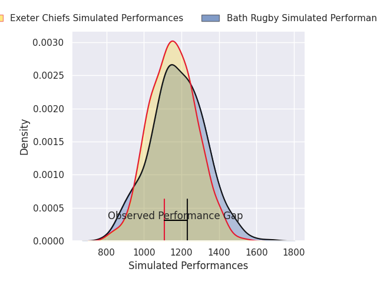
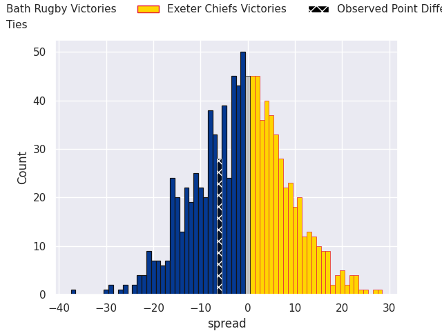

# Bath Rugby V Exeter Chiefs on 2026/10/02, 40.0 to 34.0

# Club Level Predictions

Now that the game has been played, lets see how the club predictions did. I predicted Bath Rugby to win by 5.24, and Bath Rugby won by 6.0. That's an absolute error of 0.8 for the margin of victory, while my average absolute error has been 14.6 over the past six months. This prediction was more accurate than 96.0% of my recent predictions.

For the Over/Under model, I predicted a total of 51.5 and we have an actual total of 74.0. That's an absolute error of 22.5 compared to a six month average of 14.9. This prediction was more accurate than 22.2% of my recent predictions.
## Projected Performances - Club Model

## Projected Spreads - Club Model

## Projected Results - Club Model

# Player Level Predictions

With the player model, I predicted Bath Rugby to win by 1.21,  and Bath Rugby won by 6.0. That's an absolute error of 4.8 for the margin of victory, while the average error as been 14.9 for the past six months. So this prediction was more accurate than 56.8% of my recent predictions.
## Projected Performances - Player Model

## Projected Spreads - Player Model

## Projected Results - Player Model

