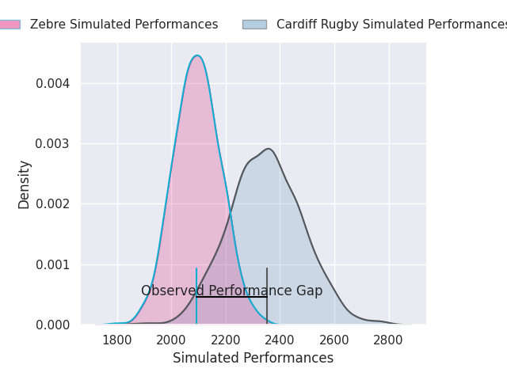
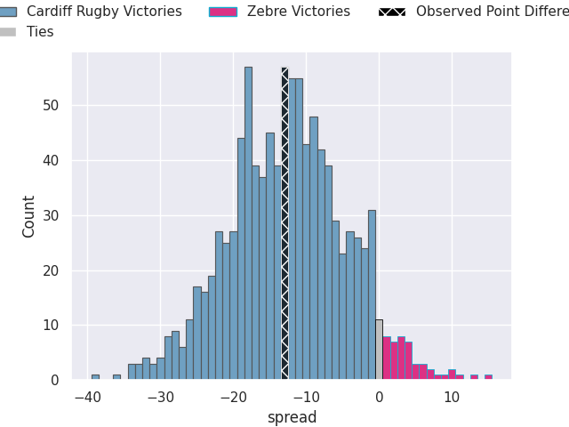
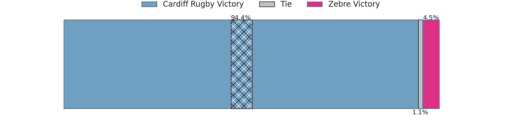

# Cardiff Rugby V Zebre on 2026/10/02, 40.0 to 27.0

# Club Level Predictions

Now that the game has been played, lets see how the club predictions did. I predicted Cardiff Rugby to win by 12.63, and Cardiff Rugby won by 13.0. That's an absolute error of 0.4 for the margin of victory, while my average absolute error has been 14.6 over the past six months. This prediction was more accurate than 98.0% of my recent predictions.

For the Over/Under model, I predicted a total of 44.5 and we have an actual total of 67.0. That's an absolute error of 22.5 compared to a six month average of 14.9. This prediction was more accurate than 22.2% of my recent predictions.
## Projected Performances - Club Model

## Projected Spreads - Club Model

## Projected Results - Club Model

