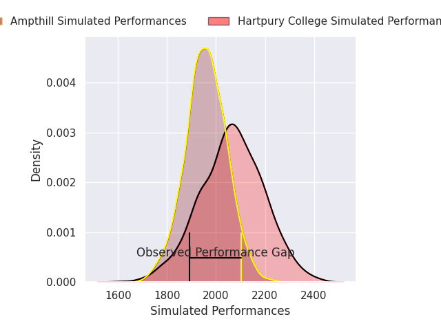
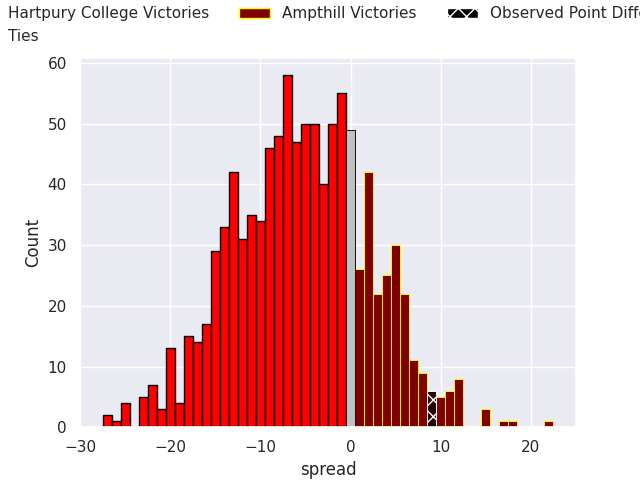

# Hartpury College V Ampthill on 2026/10/02, 24.0 to 33.0

# Club Level Predictions

Now that the game has been played, lets see how the club predictions did. I predicted Hartpury College to win by 5.3, and Ampthill won by 9.0. That's an absolute error of 14.3 for the margin of victory, while my average absolute error has been 14.6 over the past six months. This prediction was more accurate than 41.1% of my recent predictions.

For the Over/Under model, I predicted a total of 50.5 and we have an actual total of 57.0. That's an absolute error of 6.5 compared to a six month average of 14.9. This prediction was more accurate than 73.2% of my recent predictions.
## Projected Performances - Club Model

## Projected Spreads - Club Model

## Projected Results - Club Model

