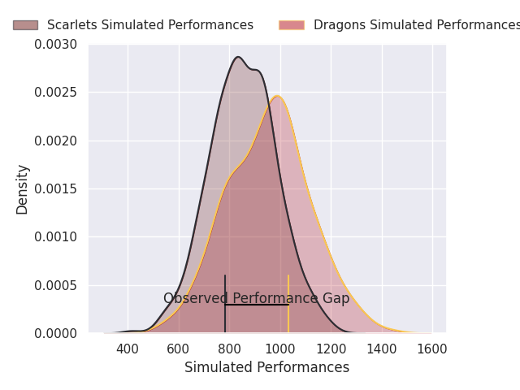
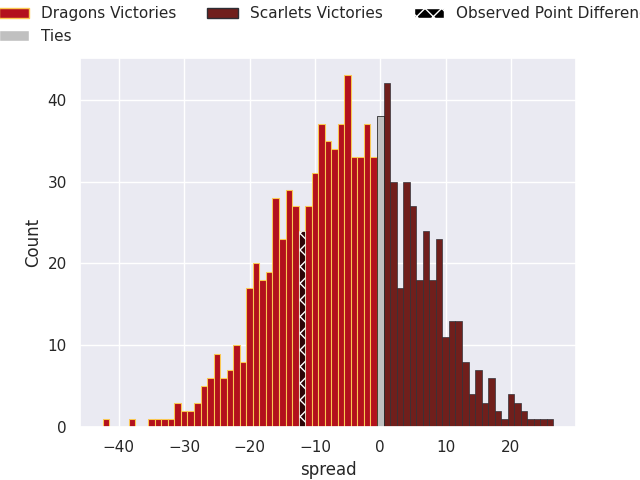

# Dragons V Scarlets on 2026/10/03, 38.0 to 26.0

# Club Level Predictions

Now that the game has been played, lets see how the club predictions did. I predicted Dragons to win by 6.94, and Dragons won by 12.0. That's an absolute error of 5.1 for the margin of victory, while my average absolute error has been 14.6 over the past six months. This prediction was more accurate than 76.1% of my recent predictions.

For the Over/Under model, I predicted a total of 46.5 and we have an actual total of 64.0. That's an absolute error of 17.5 compared to a six month average of 14.9. This prediction was more accurate than 35.0% of my recent predictions.
## Projected Performances - Club Model

## Projected Spreads - Club Model

## Projected Results - Club Model

# Player Level Predictions

With the player model, I predicted Dragons to win by 4.96,  and Dragons won by 12.0. That's an absolute error of 7.0 for the margin of victory, while the average error as been 14.9 for the past six months. So this prediction was more accurate than 49.7% of my recent predictions.
## Projected Performances - Player Model

## Projected Spreads - Player Model

## Projected Results - Player Model

