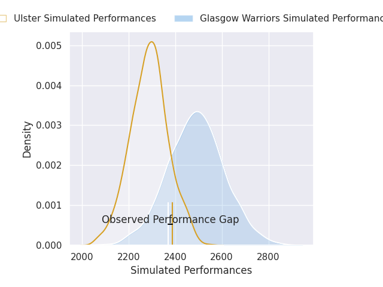
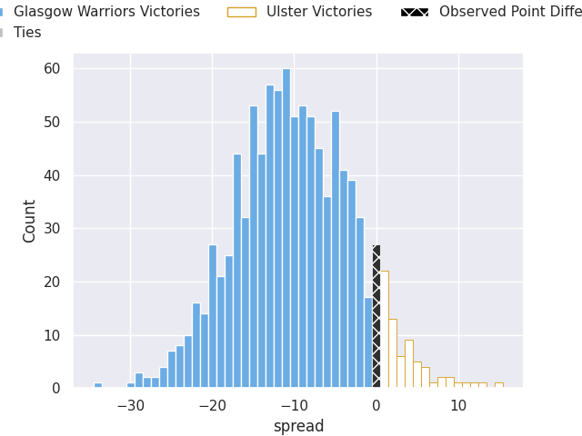
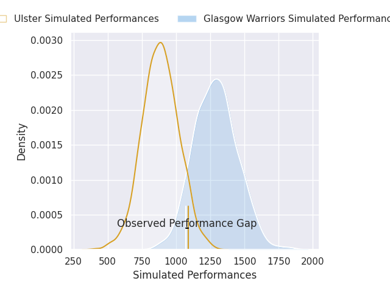
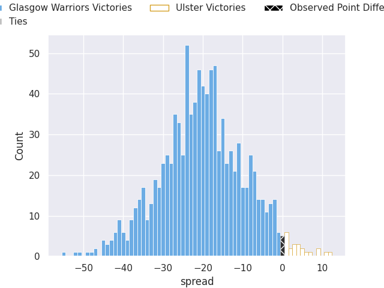

# Glasgow Warriors V Ulster on 2026/10/03, 33.0 to 33.0

# Club Level Predictions

Now that the game has been played, lets see how the club predictions did. I predicted Glasgow Warriors to win by 10.04, and Ulster won by 0.0. That's an absolute error of 10.0 for the margin of victory, while my average absolute error has been 14.6 over the past six months. This prediction was more accurate than 56.0% of my recent predictions.

For the Over/Under model, I predicted a total of 46.5 and we have an actual total of 66.0. That's an absolute error of 19.5 compared to a six month average of 14.9. This prediction was more accurate than 28.5% of my recent predictions.
## Projected Performances - Club Model

## Projected Spreads - Club Model

## Projected Results - Club Model

# Player Level Predictions

With the player model, I predicted Glasgow Warriors to win by 20.17,  and Ulster won by 0.0. That's an absolute error of 20.2 for the margin of victory, while the average error as been 14.9 for the past six months. So this prediction was more accurate than 20.1% of my recent predictions.
## Projected Performances - Player Model

## Projected Spreads - Player Model

## Projected Results - Player Model

