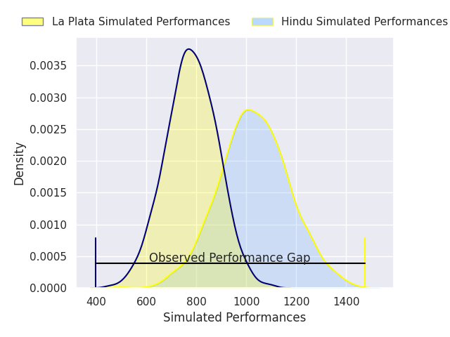
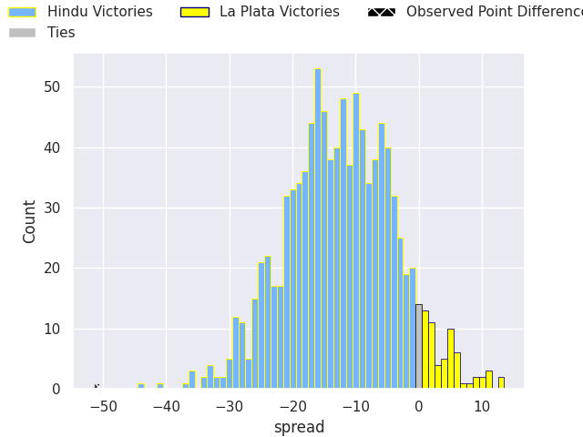
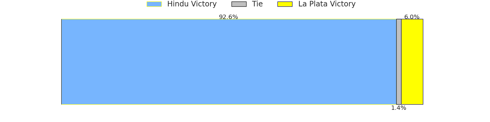

# Hindu V La Plata on 2026/10/03, 63.0 to 12.0

# Club Level Predictions

Now that the game has been played, lets see how the club predictions did. I predicted Hindu to win by 12.72, and Hindu won by 51.0. That's an absolute error of 38.3 for the margin of victory, while my average absolute error has been 14.6 over the past six months. This prediction was more accurate than 5.1% of my recent predictions.

For the Over/Under model, I predicted a total of 51.5 and we have an actual total of 75.0. That's an absolute error of 23.5 compared to a six month average of 14.9. This prediction was more accurate than 20.5% of my recent predictions.
## Projected Performances - Club Model

## Projected Spreads - Club Model

## Projected Results - Club Model

# Player Level Predictions

With the player model, I predicted Hindu to win by 12.53,  and Hindu won by 51.0. That's an absolute error of 38.5 for the margin of victory, while the average error as been 14.9 for the past six months. So this prediction was more accurate than 4.7% of my recent predictions.
## Projected Performances - Player Model

## Projected Spreads - Player Model

## Projected Results - Player Model

