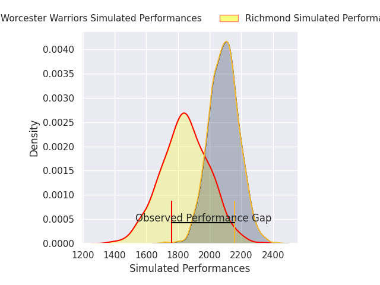
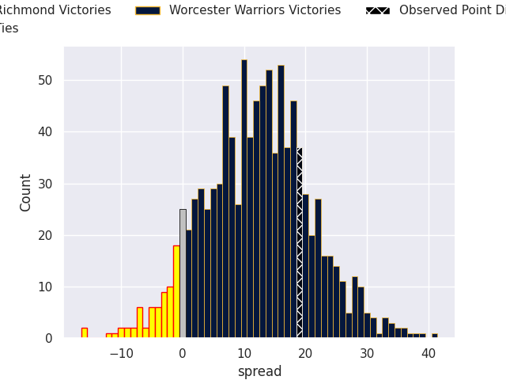

# Richmond V Worcester Warriors on 2026/10/03, 26.0 to 45.0

# Club Level Predictions

Now that the game has been played, lets see how the club predictions did. I predicted Worcester Warriors to win by 12.19, and Worcester Warriors won by 19.0. That's an absolute error of 6.8 for the margin of victory, while my average absolute error has been 14.6 over the past six months. This prediction was more accurate than 68.0% of my recent predictions.

For the Over/Under model, I predicted a total of 47.5 and we have an actual total of 71.0. That's an absolute error of 23.5 compared to a six month average of 14.9. This prediction was more accurate than 20.5% of my recent predictions.
## Projected Performances - Club Model

## Projected Spreads - Club Model

## Projected Results - Club Model

