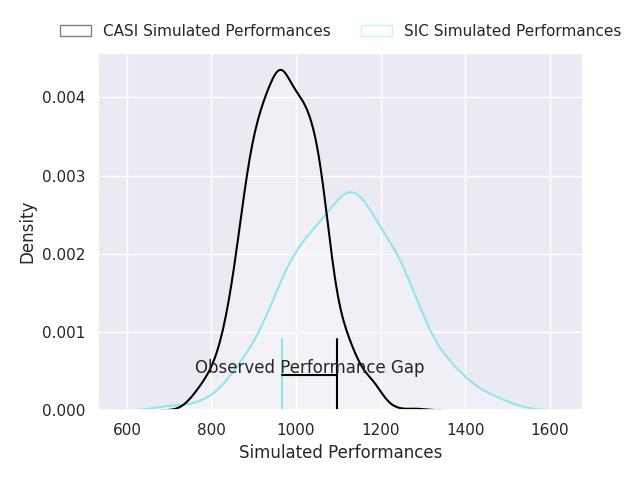
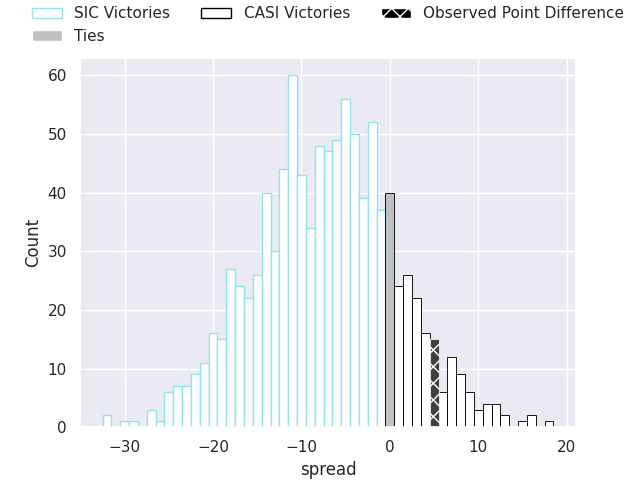
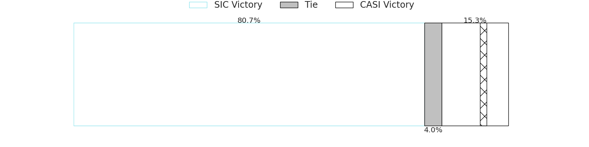

# SIC V CASI on 2026/10/03, 13.0 to 18.0

# Club Level Predictions

Now that the game has been played, lets see how the club predictions did. I predicted SIC to win by 6.8, and CASI won by 5.0. That's an absolute error of 11.8 for the margin of victory, while my average absolute error has been 14.6 over the past six months. This prediction was more accurate than 50.8% of my recent predictions.

For the Over/Under model, I predicted a total of 54.5 and we have an actual total of 31.0. That's an absolute error of 23.5 compared to a six month average of 14.9. This prediction was more accurate than 20.5% of my recent predictions.
## Projected Performances - Club Model

## Projected Spreads - Club Model

## Projected Results - Club Model

# Player Level Predictions

With the player model, I predicted SIC to win by 7.26,  and CASI won by 5.0. That's an absolute error of 12.3 for the margin of victory, while the average error as been 14.9 for the past six months. So this prediction was more accurate than 35.2% of my recent predictions.
## Projected Performances - Player Model

## Projected Spreads - Player Model

## Projected Results - Player Model

