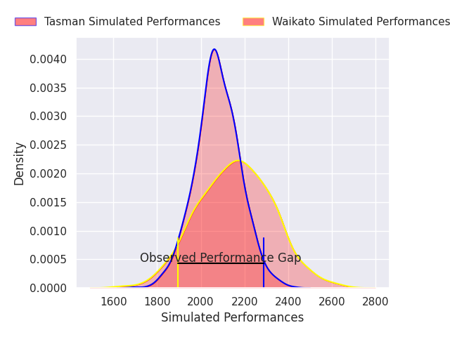
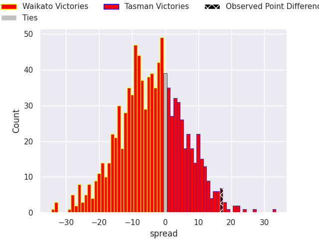

# Waikato V Tasman on 2026/10/03, 33.0 to 50.0

# Club Level Predictions

Now that the game has been played, lets see how the club predictions did. I predicted Waikato to win by 4.06, and Tasman won by 17.0. That's an absolute error of 21.1 for the margin of victory, while my average absolute error has been 14.6 over the past six months. This prediction was more accurate than 23.5% of my recent predictions.

For the Over/Under model, I predicted a total of 52.5 and we have an actual total of 83.0. That's an absolute error of 30.5 compared to a six month average of 14.9. This prediction was more accurate than 10.1% of my recent predictions.
## Projected Performances - Club Model

## Projected Spreads - Club Model

## Projected Results - Club Model

