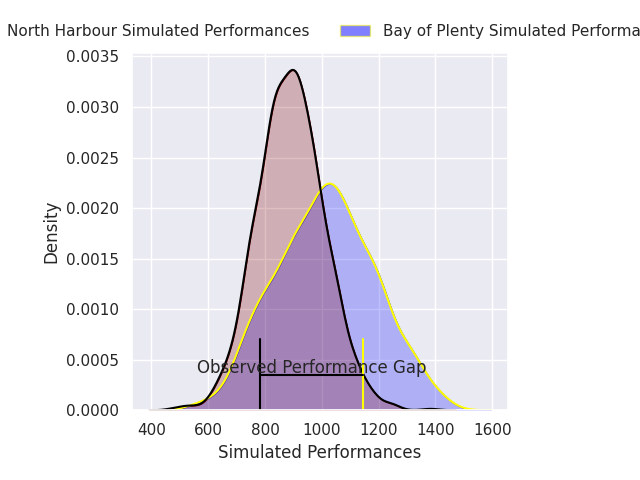
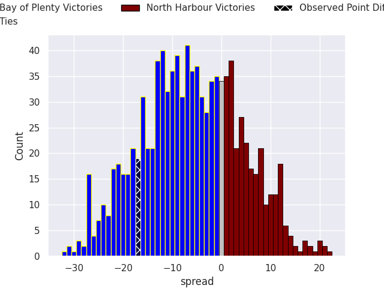
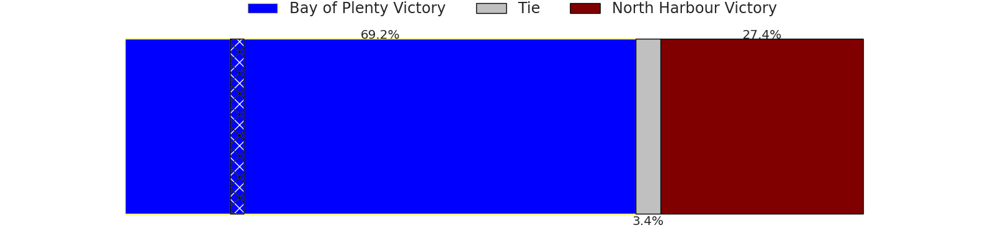

# Bay of Plenty V North Harbour on 2026/10/04, 38.0 to 21.0

# Club Level Predictions

Now that the game has been played, lets see how the club predictions did. I predicted North Harbour to win by 6.96, and Bay of Plenty won by 17.0. That's an absolute error of 24.0 for the margin of victory, while my average absolute error has been 14.6 over the past six months. This prediction was more accurate than 18.7% of my recent predictions.

For the Over/Under model, I predicted a total of 51.5 and we have an actual total of 59.0. That's an absolute error of 7.5 compared to a six month average of 14.9. This prediction was more accurate than 68.4% of my recent predictions.
## Projected Performances - Club Model

## Projected Spreads - Club Model

## Projected Results - Club Model

# Player Level Predictions

With the player model, I predicted Bay of Plenty to win by 6.13,  and Bay of Plenty won by 17.0. That's an absolute error of 10.9 for the margin of victory, while the average error as been 14.9 for the past six months. So this prediction was more accurate than 38.4% of my recent predictions.
## Projected Performances - Player Model

## Projected Spreads - Player Model

## Projected Results - Player Model

